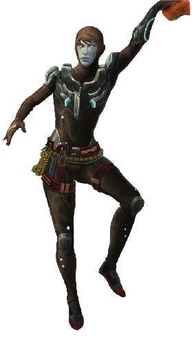
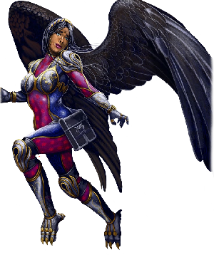
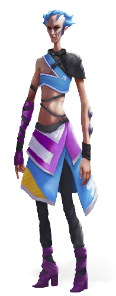
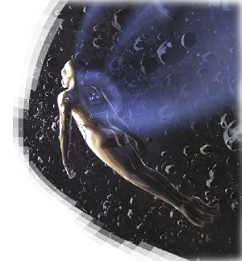
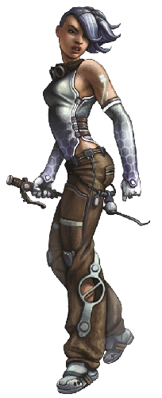
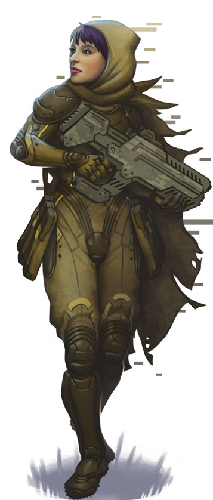

# Biomorphs

<!--sort-->

## Alpiner

Alpiners were common in the early days of the Martian frontier, when temperatures and atmospheric pressure had not yet risen to present levels. Now they are favored by avid rock climbers, those living at high altitudes atop Mars’s shield volcanoes, and outdoor types who must endure more harsh and rugged conditions. Alpiners are also vogue among chic urbanites going for a rough-and-ready look without sleeving the more de classe ruster morph.

<blockquote class="indent stat-list">

### Alpiner

- **Cost:** 4&nbsp;MP • **Avail:** 50 (70 on Mars)

---

- **WT:** 8 • **DUR:** 40 • **DR:** 60
- **Insight** 0, **Moxie** 0, **Vigor** 1, **Flex** 2

---

- **Movement Rate:** Walker 4/20
- **Ware:** Biomods, Cold Tolerance, Cortical Stack, Enhanced Respiration, Grip Pads, Mesh Inserts, Oxygen Reserve, Vacuum Sealing
- **Common Extras:** Direction Sense, Radiation Sense, Respirocytes. Many have the Planned Obsolescence trait.

</blockquote>

| **ALPINER**                                                                                                                                                                    |
| :----------------------------------------------------------------------------------------------------------------------------------------------------------------------------- |
| **Voight-Kampff:** There’s a statistical anomaly in that an unusually high percentage of alpiners go missing in the Martian outback.                                           |
| **Skinwalker:** Sounds like a biased-sample fallacy; alpiner-clad folks are more likely to engage in risky behavior like mountaineering, rock climbing, and hiking, after all. |
| **Voight-Kampff:** Take a look at the areopositioning distribution of the missing alpiners, I think you’ll find it interesting.                                                |

## Aquanaut

Aquanauts are environmentally adapted for underwater activities while still functional on land. Their heart rate slows while submerged, their skin includes a layer of blubber that retains heat, they store oxygen in their muscle tissue, and they do not suffer negative health effects from pressure changes. Additionally, their eyes have nictitating membranes and their corneas adjust to counter underwater refraction. Their hands and feet are webbed and they possess a transgenic swim bladder for controlling buoyancy. They can safely descend to about 200 meters depth (roughly 21 atmospheres of pressure at 1 g); deeper requires the pressure adaptation mod.

<blockquote class="indent stat-list">

### Aquanaut

- **Cost:** 3&nbsp;MP • **Avail:** 20 (90 in aquatic habs)

---

- **WT:** 7 • **DUR:** 35 • **DR:** 53
- **Insight** 0, **Moxie** 0, **Vigor** 2, **Flex** 2

---

- **Movement Rate:** Swim 4/12, Walker 4/20
- **Ware:** Biomods, Cold Tolerance, Cortical Stack, Enhanced Respiration, Gills, Mesh Inserts, Sonar, Swim Bladder
- **Morph Traits:** Exotic Morphology (Level 1), Non-Human Biochemistry (Level 1)
- **Common Extras:** Cryogenic Protection, Oxygen Reserve, Respirocytes, Pressure Adaptation, Toxin Filters

</blockquote>

| **AQUANAUT**                                                                                                                                                                                                                                                                           |
| :------------------------------------------------------------------------------------------------------------------------------------------------------------------------------------------------------------------------------------------------------------------------------------- |
| **Skinwalker:** The base models don’t have the depth range of a selkie or synth, but aquanauts are great whenever you need to function both underwater and on land. It takes some time acclimating to the transition from water- to air-breathing and vice-versa, though.              |
| **Plasmid:** A small hypercorp called ParaLife has made some interesting progress with an aquanaut strain that is completely amphibian: ectothermic, can breathe through their skin, and so on. Drawback is that they’re slimy: specialized glands keep their skin moist out of water. |

## Ariel

The surprising number of transhumans who sleeve in Titan-adapted hulder morphs encouraged designers on Profunda to develop a Titan-adapted flyer. While the sturdy hulder morph is designed for nomadic herders, the ariel morph is designed by people who wish to survive by hunting. Individuals sleeved in the ariel morph can hunt and eat Titanian caribou, but they most often eat the smaller rabbitlike creatures that Profunda designers have also recently designed to live on Titan. Ariel morphs have exotic-looking heads similar to those of hulder morphs, but they also possess sleek and streamlined humanoid bodies with four limbs and a pair of bat-like wings. These morphs have also been used by a few daring transhumans to explore the upper cloud layers of both Saturn and Uranus.

<blockquote class="indent stat-list">

### Ariel

- **Cost:** 4&nbsp;MP • **Avail:** 10 (40 on Titan)

---

- **WT:** 6 • **DUR:** 30 • **DR:** 45
- **Insight** 0, **Moxie** 0, **Vigor** 1, **Flex** 1

---

- **Movement Rate:** Walker 4/12, Winged 8/32
- **Ware:** Biomods, Bioweave, Claws, Cortical Stack, Cryogenic Protection, Direction Sense, Enhanced Hearing, Enhanced Vision, Long-Term Life Support, Mesh Inserts, Oxygen Reserve, Prehensile Feet, T-Ray Emitter, Vacuum Sealing, Wings
- **Morph Traits:** Exotic Morphology (Level 2), Non-Human Biochemistry (Level 2)
- **Common Extras:** Respirocytes

</blockquote>

| **ARIEL**                                                                                                                                                                                                                                                                                                                                                                                           |
| :-------------------------------------------------------------------------------------------------------------------------------------------------------------------------------------------------------------------------------------------------------------------------------------------------------------------------------------------------------------------------------------------------- |
| **Scent.In.Hell:** Here’s your Extreme Camping Morph, or at least the Flying Carnivore variant model. Who the Hell gets wet about roughing it on Titan, anyway?                                                                                                                                                                                                                                     |
| **Psychscaper:** Some people want to experience everything, or maybe they want to feel like they’ve conquered anything nature can throw at them?                                                                                                                                                                                                                                                    |
| **Sava:** Yeah, I know some exhumans that talk that way. I told ‘em to call me when they conquer the surface of the sun.                                                                                                                                                                                                                                                                            |
| **Skinwalker:** While this was one of the weirder sleeving experiences I’ve had, it was certainly interesting. Flying through Titan’s methane clouds, living in the hydrocarbon wilds … it wasn’t right, but the morph felt so smooth that it wasn’t wrong either. Tearing hunks out of cryorabbits to survive actually just felt appropriate. Those Profundan genehackers know what they’re doing. |

## Bouncer

Bouncers are genetically adapted for microgravity. Their legs are more limber and their feet can grasp as well as their hands. They can tolerate the cold temperatures of beehive tunnels and have an oxygen reserve in case they are exposed to vacuum. Bouncers are very common in the outer system and zero-g habitats.

<blockquote class="indent stat-list">

### Bouncer

- **Cost:** 4&nbsp;MP • **Avail:** 60 (80 in micrograv habs)

---

- **WT:** 7 • **DUR:** 35 • **DR:** 53
- **Insight** 1, **Moxie** 0, **Vigor** 1, **Flex** 2

---

- **Movement Rate:** Walker 4/12
- **Ware:** Biomods, Cold Tolerance, Cortical Stack, Grip Pads, Mesh Inserts, Oxygen Reserve, Prehensile Feet
- **Morph Traits:** Limberness (Level 1)

</blockquote>

| **BOUNCER**                                                                                                                                                                                                                                                             |
| :---------------------------------------------------------------------------------------------------------------------------------------------------------------------------------------------------------------------------------------------------------------------- |
| **Sequencer:** Bouncers are one of the more common sleeves out there, especially in the outer system. That means there’s more variants and models than you can kick a moon rock at. My favorites are the ones with tails — that extra grip comes in handy in micrograv. |
| **Plasmid:** If you’re picking up a bouncer, make sure to get one of the genetic lines that incorporated the 3D spatial awareness traits from cetacean neurologies; it really helps you orient and maneuver better.                                                     |
| **Voight-Kampff:** How useless are these in higher grav?                                                                                                                                                                                                                |
| **Skinwalker:** The foot structure impedes your running, but only slightly. On long treks, expect a lot of cramping and blisters.                                                                                                                                       |

## Bruiser

This morph is made to be large, strong, and physically intimidating. Adopted early on by sports performers, it quickly became a favorite among criminal cartels and thugs. At 2.5 meters tall, a bruiser may have difficulty moving comfortably in all but the most open and uncrowded of habitats.

<blockquote class="indent stat-list">

### Bruiser

- **Cost:** 4&nbsp;MP • **Avail:** 30

---

- **WT:** 10 • **DUR:** 50 • **DR:** 75
- **Insight** 0, **Moxie** 0, **Vigor** 4, **Flex** 1

---

- **Movement Rate:** Walker 4/12
- **Ware:** Biomods, Cortical Stack, Mesh Inserts
- **Morph Traits:** Exotic Morphology (Level 1)
- **Common Extras:** Adrenal Surge, Claws, Hardened Skeleton, Medichines. Many also have the Unattractiveness (Level 1) trait.
- **Notes:** Large size

</blockquote>

| **BRUISER**                                                                                                                                               |
| :-------------------------------------------------------------------------------------------------------------------------------------------------------- |
| **Qi:** Bruisers, the morph that lets everyone else know you didn’t get enough bullying in as a kid.                                                      |
| **Parallax:** Meh, bigger they are …                                                                                                                      |
| **mAlice:** That’s funny, because there’s a thriving business in bruisers as vacation morphs for those who simply want to try out the enhanced genitalia. |
| **Eludere:** You want to see some fun action? Go watch the bruiser wrestling rings down on Luna. They can throw each other impressive distances.          |
| **Sequencer:** What’s impressive are the number of limited-edition bruisers based on the genetics of pre-Fall wrestlers and athletes. The market is huge. |
| **Just Mortal:** Can’t see the point of sleevin’ something that’s just going to bang it’s head on every door frame in existence.                          |

## Cloud Skate

Cloud skates are exotic, specialized biomorph designs that push the edge of what is possible. They are designed to survive in the atmospheres of ice giants and gas giants, such as Uranus and Saturn. These morphs are shaped roughly like a tailless stingray with a pair of slender arms. They can soar among the clouds for months on end, their swim bladders providing neutral buoyancy in dense atmospheres, preventing them from sinking below a safe depth.

<blockquote class="indent stat-list">

### Cloud Skate

- **Cost:** 3&nbsp;MP • **Avail:** 10 (40 at Uranus/Jupiter)

---

- **WT:** 7 • **DUR:** 35 • **DR:** 53
- **Insight** 2, **Moxie** 0, **Vigor** 1, **Flex** 0

---

- **Movement Rate:** Walker 2/8, Winged 8/32
- **Ware:** Asymmetric Sleep, Biomods, Cortical Stack, Cryogenic Protection, Direction Sense, Enhanced Vision, Hardened Skeleton, High-G Adaptation, Long-Term Life Support, Mesh Inserts, Pressure Adaptation, Radiation Sense, Swim Bladder, Wings
- **Morph Traits:** Enhanced Behavior (Serenity, Level 2), Exotic Morphology (Level 3), Non-Human Biochemistry (Level 2)
- **Common Extras:** Oxygen Reserve, T-Ray Emitter
- **Notes:** Bonus from Hardened Skeleton already incorporated

</blockquote>

| **CLOUD SKATE**                                                                                                                                                                                                                                                                                                                  |
| :------------------------------------------------------------------------------------------------------------------------------------------------------------------------------------------------------------------------------------------------------------------------------------------------------------------------------- |
| **Nezumi:** You haven’t lived until you’ve skated the atmosphere of a gas giant.                                                                                                                                                                                                                                                 |
| **Chiro:** I can see the attraction. Just not sure I’d want to live there.                                                                                                                                                                                                                                                       |
| **Scent.In.Hell:** There any news on that expedition of extrasolar cloud skaters that went missing?                                                                                                                                                                                                                              |
| **Nova Vida:** Nope. The same group resleeved, went back, and disappeared again. Now it’s a thing, and Gatekeeper has applications for a handful of thrill-seekers that want to skate their way to doom as well. What are the odds that at least one of those groups are sentinels? Sounds like it might be an interesting time. |
| **Ruqinzhe:** Hobnobbing with death-wish socialites while trying not to die? Not so interesting to me.                                                                                                                                                                                                                           |

## Crasher

Crashers are survival morphs — athletic and rugged designs capable of weathering harsh environments over long periods. They are the ideal biomorph for gatecrashing assignments and are popular among first-in teams. Though pricey and harder to acquire compared to other options, gatecrashers traveling to less habitable and dangerous places have found the investment worth it.

<blockquote class="indent stat-list">

### Crasher

- **Cost:** 8&nbsp;MP • **Avail:** 30 (50 at gate habs)

---

- **WT:** 8 • **DUR:** 40 • **DR:** 60
- **Insight** 1, **Moxie** 1, **Vigor** 2, **Flex** 2

---

- **Movement Rate:** Walker 4/20
- **Ware:** Biomods, Circadian Regulation, Cold Tolerance, Cortical Stack, Dermal Armor (+4/+5), Direction Sense, Efficient Metabolism, Enhanced Respiration, Enhanced Vision, Grip Pads, Medichines, Mesh Inserts, Vacuum Sealing
- **Common Extras:** Clean Metabolism, Digestive Symbiotes, Long-Term Life Support, Oxygen Reserve, Respirocytes, Toxin Filters

</blockquote>

| **CRASHER**                                                                                                                                                                                                                                                                                                                                                                                     |
| :---------------------------------------------------------------------------------------------------------------------------------------------------------------------------------------------------------------------------------------------------------------------------------------------------------------------------------------------------------------------------------------------- |
| **Nova Vida:** The price tag on these is high, but it’s a very capable morph with lots of utility outside of gatecrashing ops.                                                                                                                                                                                                                                                                  |
| **Ruqinzhe:** What is this “price tag” you speak of?                                                                                                                                                                                                                                                                                                                                            |
| **Sequencer:** Just be careful what brand name you pick. I know for a fact that certain hypercorps cut corners on the genetics in order to rush out morphs to meet the demand for gatecrashing missions. I’ve seen reports of respiratory failure in atmos well within their safety range and hibernators falling into nonresponsive comas. Skins from Omniflesh have particularly bad reviews. |

## Dvergr

Dvergar (plural of dvergr) are biomorphs designed for comfortable operation in high-gravity environments. They feature a reinforced skeletal structure and sturdier muscle masses. They are easily identified by their slightly squat, thick-necked, tough appearances.

<blockquote class="indent stat-list">

### Dvergr

- **Cost:** 5&nbsp;MP • **Avail:** 20 (60 on high-g exoplanets)

---

- **WT:** 9 • **DUR:** 45 • **DR:** 68
- **Insight** 0, **Moxie** 0, **Vigor** 3, **Flex** 1

---

- **Movement Rate:** Walker 4/20
- **Ware:** Biomods, Cortical Stack, Hardened Skeleton, High-G Adaptation, Mesh Inserts, Muscle Augmentation
- **Notes:** Bonus from Hardened Skeleton already incorporated

</blockquote>

| **DVERGR**                                                                                                                                      |
| :---------------------------------------------------------------------------------------------------------------------------------------------- |
| **Astika:** Definitely a specialty morph. Very limited application, but you’ll be really happy you have it when you need it. Gravity is a drag. |
| **Ammonite:** Also great if you’re a socialite on a LARP cruise and decide to play a dwarf. Or so I hear.                                       |
| **Skinwalker:** Dvergr are just fine in normal, low, or micro grav. Strong, energetic, great circulation.                                       |
| **Scent.In.Hell:** Maybe too good. I’ve heard some models bleed out quickly when injured in low-grav conditions.                                |

## Exalt

Exalts are the common, non-specialized “enhanced human” model. They are genetically upgraded to make them healthier, smarter, and more attractive (based on ever-evolving beauty standards). A modified metabolism keeps them fit and athletic for the duration of an extended lifespan.

<blockquote class="indent stat-list">

### Exalt

- **Cost:** 2&nbsp;MP • **Avail:** 70

---

- **WT:** 7 • **DUR:** 35 • **DR:** 53
- **Insight** 1, **Moxie** 1, **Vigor** 1, **Flex** 0

---

- **Movement Rate:** Walker 4/20
- **Ware:** Biomods, Cortical Stack, Mesh Inserts

</blockquote>

| **EXALT**                                                                                                                                                                                                                 |
| :------------------------------------------------------------------------------------------------------------------------------------------------------------------------------------------------------------------------ |
| **Ammonite:** Remember when these morphs first went into circulation? The hue and cry over “upgraded humans” was a big deal. Seems so quaint now.                                                                         |
| **mAlice:** Ah the good ol’ days. Remember breeding restriction laws? Glad we’ve left the primitive mindsets behind.                                                                                                      |
| **Nezumi:** The great thing about exalts is that they’re reliable, abundant, and fulfill your basic needs without running into heavy alienation or body dysmorphia issues when resleeving. Too many people overlook them. |

## Faust

Developed in secret by a small group of unaffiliated async genehackers, this morph is not a publicly known model. It is only available to individuals who discover a connection to this unnamed, underground async network and then download the template from one of several secret mesh sites. The faust is a modified menton morph. Even under the most thorough scans, it appears to be nothing more than a mildly personalized version of that morph.

<blockquote class="indent stat-list">

### Faust

- **Cost:** 6&nbsp;MP • **Avail:** 5

---

- **WT:** 7 • **DUR:** 35 • **DR:** 53
- **Insight** 3, **Moxie** 4, **Vigor** 0, **Flex** 1

---

- **Movement Rate:** Walker 4/20
- **Ware:** Biomods, Circadian Regulation, Cortical Stack, Mesh Inserts, Mnemonics, Stress Control
- **Common Extras:** Popular add-ons include Drug Glands (Psike-Out, Nofux, TGS, Comfurt), Endocrine Control, Neuromodulation. Many also have the Psi Camouflage and/or Psi Defense traits.

</blockquote>

| **FAUST**                                                                                                                                                                                                                                                   |
| :---------------------------------------------------------------------------------------------------------------------------------------------------------------------------------------------------------------------------------------------------------- |
| **Cacophonous:** I added this one, due to its recent availability through certain black market channels. It’s not in the Lonely Planetoid guide for obvious reasons.                                                                                        |
| **Voight-Kampff:** Has Firewall made any headway into discovering who designed this morph?                                                                                                                                                                  |
| **Qi:** If anyone has, they’re keeping that info within their server.                                                                                                                                                                                       |
| **Plasmid:** There are implications here that concern me. If one can design and distribute a morph based on its compatibility with an exovirus strain, we may well soon see morphs that are compatible — read: more susceptible — to less friendly strains. |
| **Scent.In.Hell:** Watch what you call “friendly.” Not all of us buy into the harmlessness of Watts- MacLeod. The decision to let asyncs operate freely is going to bite us in the hind thorax down the line, mark my words.                                |

## Flat

Flats are baseline unmodified humans, born with all of the natural defects, hereditary diseases, and other genetic mutations that evolution so lovingly applies. Flats are increasingly rare outside bioconservative enclaves — most died off with the rest of humanity during the Fall.

<blockquote class="indent stat-list">

### Flat

- **Cost:** 0&nbsp;MP • **Avail:** 30

---

- **WT:** 6 • **DUR:** 30 • **DR:** 45
- **Insight** 0, **Moxie** 0, **Vigor** 0, **Flex** 0

---

- **Movement Rate:** Walker 4/20
- **Common Extras:** Many have the Genetic Defect trait.

</blockquote>

| **FLAT**                                                                                                                                                                                                                                                                             |
| :----------------------------------------------------------------------------------------------------------------------------------------------------------------------------------------------------------------------------------------------------------------------------------- |
| **Plasmid:** A body like that in which you were born, to which you hoped never to return.                                                                                                                                                                                            |
| **Dante:** Actually, there’s a decent demand from people that want to sleeve something “old-fashioned’ and “original.” I’m pretty sure it started as a Venusian socialite fad.                                                                                                       |
| **Nezumi:** *facepalm* The only sensible part of that is that flats are actually pretty rare outside of Earth orbit, Luna, and the Jovian Republic.                                                                                                                                  |
| **Ammonite:** It gets weirder. I know oligarchs that collect flats. Original, born-on-Earth skins are quickly becoming collector items — especially if they are in mint condition. Interestingly, nonrejuvenated bodies that have aged well are picking up a considerable price tag. |
| **Nova Vida:** I’ve always wondered what happened to older flats. I assumed they were rejuvenated rather than retired, but even then I didn’t expect them to be top hits at the body bank.                                                                                           |
| **Plasmid:** The body banks I know keep a few on hand as out-of-stock last-resort options; there’s always someone who’d rather take a flat than a quality synth. The flats with recurring health problems go at cheap rates to desperate infugees.                                   |

## Freeman

This sleeve hands tyrants the tools to ensure loyalty — or at least obedience — from their citizens. Based on simple splicers, freeman morphs are genetically and psychosurgically modified to be receptive to authority while weakening willpower and “dissident” traits. They are also genetically modified with a protein that makes their neurons sensitive to light. When combined with an optogenetics module, these neurons can be activated and deactivated remotely, enabling a monitoring muse or meshed overseer to control the ego’s behavior. Freeman morphs typically carry a monitor ALI (often a modified fork of the dictator’s muse) that watches over the ego, reports suspicious activity, and can seize physical control in an emergency. In some regimes, citizens are not informed of these implants, enabling the AIs to spy and snitch in secret. These “slave morphs” are decried or outlawed as coercive in many polities, though they are secretly deployed in remote corporate and authoritarian habitats. Surprisingly, some people voluntarily sleeve freeman morphs, preferring to hand responsibility and decision-making over to other parties, such as the Sendero Luminoso Benevolent Dictatorship habitat in the Neptunian Trojans.

<blockquote class="indent stat-list">

### Freeman

- **Cost:** 1&nbsp;MP • **Avail:** 10

---

- **WT:** 6 • **DUR:** 30 • **DR:** 45
- **Insight** 0, **Moxie** 0, **Vigor** 0, **Flex** 1

---

- **Movement Rate:** Walker 4/20
- **Ware:** Biomods, Cortical Stack, Ghostrider Module, Memory Lock, Mesh Inserts, Monitor ALI, Optogenetics Module, Puppet Sock
- **Morph Traits:** Enhanced Behavior (Obedience, Level 2), Restricted Behavior (Non-Conformity) 2, Timidity (Level 2)
- **Common Extras:** Popular add-ons include Drug Glands (Retcon) and Neuromodulation

</blockquote>

| **FREEMAN**                                                                                                                                                       |
| :---------------------------------------------------------------------------------------------------------------------------------------------------------------- |
| **Scent.In.Hell:** Useful for rendition and interrogation scenarios.                                                                                              |
| **Callosum:** Really? We’re condoning the use of slave morphs on ops now?                                                                                         |
| **Scent.In.Hell:** Pull yourself out of high orbit. When you need to extract answers in order to save lives and the clock is ticking, you do what you have to do. |
| **Voight-Kampff:** The transhuman flexibility over ends and means is an amazing thing.                                                                            |
| **Nezumi:** I suppose I’m not surprised that transhumanity invented these, but it still sickens me.                                                               |

## Fury

Furies are combat morphs. These transgenic humans are upgraded for endurance, strength, reflexes, and capacity to handle physical trauma. Behavioral modifications for aggressiveness are offset by gene sequences promoting pack mentalities and cooperation, and they tend to be biologically female.

<blockquote class="indent stat-list">

### Fury

- **Cost:** 6&nbsp;MP • **Avail:** 40

---

- **WT:** 10 • **DUR:** 50 • **DR:** 75
- **Insight** 1, **Moxie** 1, **Vigor** 4, **Flex** 2

---

- **Movement Rate:** Walker 4/20
- **Ware:** Biomods, Bioweave Armor (+2/+3), Claws, Cortical Stack, Enhanced Vision, Mesh Inserts
- **Morph Traits:** Enhanced Behavior (Aggressiveness, Level 2; Cooperation, Level 2)
- **Common Extras:** Neurachem, Hardened Skeleton, Toxin Filters

</blockquote>

| **FURY**                                                                                                                                                                                                           |
| :----------------------------------------------------------------------------------------------------------------------------------------------------------------------------------------------------------------- |
| **Sequencer:** Perhaps one of the most-improved morph designs to date. Spending money on super soldiers never goes out of style.                                                                                   |
| **Plasmid:** Most rehashed, maybe, but combat morphs have a long history. Some of the previous incarnations were abominations, but of course few of those survived the Fall.                                       |
| **Parallax:** When you need to kick ass but don’t want to advertise the fact, furies beat out most other morphs, including synthmorphs. It’s hard to tell one apart from an olympian or any other common biomorph. |

## Futura

Futura morphs were specially crafted for the “Lost Generation” of accelerated-growth children. Adjusted for confidence, self-reliance, and adaptability, futuras were intended to help transhumanity regain its foothold. These programs proved disastrous and the line was discontinued, but some models and various spin-offs remain, viewed by some with distaste and others as collectibles or exotic oddities.

<blockquote class="indent stat-list">

### Futura

- **Cost:** 4&nbsp;MP • **Avail:** 25

---

- **WT:** 7 • **DUR:** 35 • **DR:** 53
- **Insight** 2, **Moxie** 4, **Vigor** 1, **Flex** 0

---

- **Movement Rate:** Walker 4/20
- **Ware:** Biomods, Cortical Stack, Mesh Inserts

</blockquote>

| **FUTURA**                                                                                                                                                                                                                      |
| :------------------------------------------------------------------------------------------------------------------------------------------------------------------------------------------------------------------------------ |
| **Plasmid:** While the original stigma kept these rare, the genetics have been copied and reproduced (and sometimes tweaked) by numerous skincrafters.                                                                          |
| **Callosum:** Want to know a secret? Cognite still produces their original futura models. For “in-house” purposes, of course.                                                                                                   |
| **Cacophonous:** There’s a lot of people that believe futura morphs remain in circulation so that they can be tracked — reasoning being that they hope to catch fugitives from the Lost Generation that are still on the loose. |
| **Skinwalker:** I’ve heard that rumor as well — and also that the ones in circulation are boobytrapped in various ways.                                                                                                         |
| **Black Pharaoh:** I can substantiate one of those rumors. There is at least one Firewall scanner tasked with tracking futura morphs in the wild. It is wise to assume others do as well.                                       |

## Garuda

Found primarily on Luna and similar low-g worlds and habitats, this morph is adapted to fly in Earth-normal air pressure with gravity of 0.2 g or less. Garudas have light frames, with increased lung capacity. Their feathered wings extrude from the back as an extra set of limbs, leaving hands and feet unhindered during flight. Their wings may be folded behind their back or extended to a full wingspan of 3 meters.

<blockquote class="indent stat-list">

### Garuda

- **Cost:** 3&nbsp;MP • **Avail:** 30 (50 on Luna)

---

- **WT:** 6 • **DUR:** 30 • **DR:** 45
- **Insight** 1, **Moxie** 1, **Vigor** 2, **Flex** 1

---

- **Movement Rate:** Walker 4/12, Winged 8/32
- **Ware:** Biomods, Cortical Stack, Mesh Inserts, Prehensile Feet, Wings
- **Morph Traits:** Exotic Morphology (Level 1)

</blockquote>

| **GARUDA**                                                                                                                             |
| :------------------------------------------------------------------------------------------------------------------------------------- |
| **Nezumi:** These are exploding in popularity all over low-grav habs in the Belt and rimward.                                          |
| **Skinwalker:** The wings are clumsy to handle in confined quarters, and I’ve had some uncomfortable back aches after flying too long. |
| **Expat:** A hypercorp called FormeVital has a model that integrate the wings and arms together.                                       |

## Ghost

Ghosts are partially designed for combat applications, but their primary focus is stealth and infiltration. Their genetic profile encourages speed, agility, and reflexes, and their minds are modified for patience and problem-solving.

<blockquote class="indent stat-list">

### Ghost

- **Cost:** 6&nbsp;MP • **Avail:** 40

---

- **WT:** 9 • **DUR:** 45 • **DR:** 68
- **Insight** 2, **Moxie** 1, **Vigor** 3, **Flex** 2

---

- **Movement Rate:** Walker 4/20
- **Ware:** Biomods, Chameleon Skin, Cortical Stack, Grip Pads, Mesh Inserts
- **Morph Traits:** Enhanced Behavior (Patience, Level 2)
- **Common Extras:** Adrenal Surge, Skinflex

</blockquote>

| **GHOST**                                                                                                                                                                                                                                                                                                                                                                                                                                                                                                                                                                                                                                                                                                                                                                                                                                             |
| :---------------------------------------------------------------------------------------------------------------------------------------------------------------------------------------------------------------------------------------------------------------------------------------------------------------------------------------------------------------------------------------------------------------------------------------------------------------------------------------------------------------------------------------------------------------------------------------------------------------------------------------------------------------------------------------------------------------------------------------------------------------------------------------------------------------------------------------------------- |
| **mAlice:** There’s a trick with chameleon skin where you can shift to translucent. It’s great for grossing people out.                                                                                                                                                                                                                                                                                                                                                                                                                                                                                                                                                                                                                                                                                                                               |
| **Ruqinzhe:** Last time I sleeved a ghost, I got a lesson in how less reputable skin joints try to screw you. I reserved in advance, paid up front, and went with a shady body bank to keep my profile low. After sleeving what I thought was a ghost, I had a nasty shock when I was jumped by some punks and the morph didn’t perform as expected. I had a genehacker I know run some scans, turns out I had been given a splicer with aftermarket mods. I took it back to the clinic, where the customer service AI politely told me to fuck off. Turns out that my muse had dropped the ball and contractually I’d agreed to a morph with certain parameters; the morph met those parameters (barely), and they called this special package a “ghost.” It apologized for any confusion but would not offer a refund. Fucking Extropian contracts. |

## Glider

Gliders are tall and thin, with long, strong limbs and a lightweight build. Gliding membranes allow them to soar through the atmosphere in environments with thicker atmospheres and/or lower gravity. They gain altitude by riding thermals (which they see with enhanced vision).

<blockquote class="indent stat-list">

### Glider

- **Cost:** 3&nbsp;MP • **Avail:** 20

---

- **WT:** 6 • **DUR:** 30 • **DR:** 45
- **Insight** 0, **Moxie** 1, **Vigor** 1, **Flex** 1

---

- **Movement Rate:** Walker 4/12, Glider 8/32
- **Ware:** Biomods, Cortical Stack, Enhanced Respiration, Enhanced Vision, Gliding Membranes, Grip Pads, Mesh Inserts, Prehensile Feet
- **Morph Traits:** Exotic Morphology (Level 1), Limberness (Level 1)
- **Common Extras:** Respirocytes

</blockquote>

| **GLIDER**                                                                                                                                       |
| :----------------------------------------------------------------------------------------------------------------------------------------------- |
| **Callosum:** The gliding membranes mean you either need smart clothes or a specialized wardrobe. Regular dumb shirts and pants just don’t work. |

### Venusian Glider Variant

Venusian gliders are designed to survive for many hours in the middle acidic-but-habitable layers of Venus’s atmosphere.

<blockquote class="indent stat-list">

### Venusian Glider

- **Cost:** 3&nbsp;MP • **Avail:** 20 (50 on Venus)

---

- **WT:** 6 • **DUR:** 30 • **DR:** 45
- **Insight** 0, **Moxie** 1, **Vigor** 1, **Flex** 1

---

- **Movement Rate:** Walker 4/12, Glider 8/32
- **Ware:** Biomods, Cortical Stack, Enhanced Respiration, Enhanced Vision, SGliding Membranes, Mesh Inserts, Oxygen Reserve, Vacuum Sealing
- **Morph Traits:** Exotic Morphology (Level 1), Limberness (Level 1)
- **Common Extras:** Respirocytes

</blockquote>

## Grey

Originally created as part of a fad based on 20th-century images of aliens, the grey morph soon became popular with eccentric scientists and engineers. This morph’s slender and weak-looking body stands only 1.5 meters tall, short compared to modern transhumans. Its distinctive large head and eyes strike many transhumans as disturbing.

<blockquote class="indent stat-list">

### Grey

- **Cost:** 2&nbsp;MP • **Avail:** 20

---

- **WT:** 6 • **DUR:** 30 • **DR:** 45
- **Insight** 2, **Moxie** 0, **Vigor** 0, **Flex** 1

---

- **Movement Rate:** Walker 4/20
- **Ware:** Biomods, Circadian Regulation, Clean Metabolism, Cortical Stack, Mesh Inserts, Mnemonics
- **Morph Traits:** Exotic Morphology (Level 1), Unattractiveness (Level 1)

</blockquote>

| **GREY**                                                                                                                                                                                                                   |
| :------------------------------------------------------------------------------------------------------------------------------------------------------------------------------------------------------------------------- |
| **Sequencer:** People seem to think these are chimeric pods. Nope, they’re modified human stock.                                                                                                                           |
| **Astika:** That’s what they want you to think. In truth, they’re crafted from alien genetics rescued from Area 51 during the Fall! Or so the conspiracy forums tell me.                                                   |
| **Plasmid:** Keeping true to the homage, the skincrafters making these shift organs around, chang the blood color, and even include some frivolous “parts” just so that these don’t look so human when they get cut open.  |
| **Nezumi:** There’s a community of people sleeved in greys in the Martian outback that try to live the “true Martian” lifestyle. Weird lot, for sure, but creative — they’ve produced some interesting eerie architecture. |

## Hazer

Hazers are tall but slight morphs adapted for life in Titan’s dome colonies. They cannot survive unprotected in Titan’s frigid methane environment, but they are insulated to handle a bit of cold. Some hazers have angular or elfin features that are viewed as either striking or unsettling.

<blockquote class="indent stat-list">

### Hazer

- **Cost:** 3&nbsp;MP • **Avail:** 40 (80 on Titan)

---

- **WT:** 7 • **DUR:** 35 • **DR:** 53
- **Insight** 1, **Moxie** 2, **Vigor** 0, **Flex** 1

---

- **Movement Rate:** Walker 4/20
- **Ware:** Biomods, Cold Tolerance, Cortical Stack, Mesh Inserts
- **Common Extras:** Enhanced Vision, T-Ray Emitter. Many have the Striking Looks trait.

</blockquote>

| **HAZER**                                                                                                                                                                                                                                                           |
| :------------------------------------------------------------------------------------------------------------------------------------------------------------------------------------------------------------------------------------------------------------------ |
| **Chiro:** You never used to see these outside of Titan, but they’ve been popping up all over the Jovian and Saturnian systems lately. Word is they’re popular on gate ops too.                                                                                     |
| **Qi:** There was an incident with the main microcorp that produces hazers for the Commonwealth. Rumor is they euthanized a whole generation of forced-growth clones and shut down production for two months. Whatever happened, they’re keeping a tight lid on it. |

## Hibernoid

Hibernoids are transgenic-modified humans with heavily altered sleep patterns and metabolic processes. Hibernoids have a decreased need for sleep, requiring only 1–2 hours a day on average. They can also trigger a form of voluntary hibernation, effectively halting their metabolism and need for oxygen. Hibernoids make excellent long-duration space travelers, but these morphs are also favored by personal aides and hypercapitalists with non-stop lifestyles.

<blockquote class="indent stat-list">

### Hibernoid

- **Cost:** 4&nbsp;MP • **Avail:** 70

---

- **WT:** 7 • **DUR:** 35 • **DR:** 53
- **Insight** 1, **Moxie** 1, **Vigor** 0, **Flex** 2

---

- **Movement Rate:** Walker 4/20
- **Ware:** Biomods, Circadian Regulation, Clean Metabolism, Cold Tolerance, Cortical Stack, Hibernation, Mesh Inserts

</blockquote>

| **HIBERNOID**                                                                                                                                                                                                                                                                                                                                                                                                         |
| :-------------------------------------------------------------------------------------------------------------------------------------------------------------------------------------------------------------------------------------------------------------------------------------------------------------------------------------------------------------------------------------------------------------------- |
| **Delta-V:** True fact, my original body was hibernoid. My parents were both flight crew in the early space days, and some of the first to be given hibernoids for their jobs. They liked their morphs so much they purchased breeding rights from their corp. I don’t think they really considered the ramifications of a kid that would sleep only a few hours at a time for weeks, then crash for a week straight. |
| **Callosum:** I imagine that impacted your sleeping rhythms later in life?                                                                                                                                                                                                                                                                                                                                            |
| **Delta-V:** The first time I sleeved a morph without the circadian hacks, I thought it was defective. I still can’t believe it’s normal for people to sleep that much on a daily basis.                                                                                                                                                                                                                              |

## Hulder

Hulder are engineered for survival in the harsh Titanian wilds and methane seas. In silhouette, their bodies resemble a longlegged great auk, though viewed up close, the resemblance to a bird ends. Instead of feathers, hulder have smooth, rubbery charcoal skin covering a thick layer of nano-augmented blubber.

<blockquote class="indent stat-list">

### Hulder

- **Cost:** 4&nbsp;MP • **Avail:** 10 (30 on Titan)

---

- **WT:** 8 • **DUR:** 40 • **DR:** 60
- **Insight** 0, **Moxie** 1, **Vigor** 1, **Flex** 1

---

- **Movement Rate:** Walker 4/20
- **Ware:** Biomods, Bioweave, Cortical Stack, Cryogenic Protection, Direction Sense, Enhanced Hearing, Enhanced Vision, Long-Term Life Support, Mesh Inserts, Oxygen Reserve, Swim Bladder, T-Ray Emitter
- **Morph Traits:** Exotic Morphology (Level 2), Non-Human Biochemistry (Level 2)
- **Common Extras:** Chem Sniffer, Digging Claws

</blockquote>

| **HULDER**                                                                                                                                                                                                    |
| :------------------------------------------------------------------------------------------------------------------------------------------------------------------------------------------------------------ |
| **Chiro:** The original hulder genetics were stolen by a group of exhumans shortly after the Fall. I can only imagine they’re making use of them somewhere.                                                   |
| **Nevermore:** I saw a scum wearing one of these with a custom biosculpt on Extropia a few weeks back. Had a whole pack of swarm cats following him around. Said he was an ego hunter tracking down a bounty. |

## Hyperbright

A research team on Bright created this morph to surpass the menton and push the envelope on intelligence augmentation. Hyperbrights are instantly recognizable by the brightly colored bony crests along their skulls that help to cool their brains. They are also designed for microgravity and so favored in the outer system. Many models, however, are plagued with idiosyncrasies and quirks due their advanced neurochemistry and high metabolism.

<blockquote class="indent stat-list">

### Hyperbright

- **Cost:** 4&nbsp;MP • **Avail:** 20

---

- **WT:** 7 • **DUR:** 35 • **DR:** 53
- **Insight** 5, **Moxie** 1, **Vigor** 0, **Flex** 0

---

- **Movement Rate:** Walker 4/12
- **Ware:** Biomods, Circadian Regulation, Cortical Stack, Grip Pads, Mesh Inserts, Mnemonics, Prehensile Feet
- **Morph Traits:** Exotic Morphology (Level 1), Non-Human Biochemistry (Level 1)
- **Common Extras:** Drug Glands (Comfurt), Endocrine Control, Mind Amp, Multi-Tasking, Neuromodulation, Oracles. Many have the Acumen, Addiction, and/or Fast Metabolism traits.

</blockquote>

| **HYPERBRIGHT**                                                                                                                                                                      |
| :----------------------------------------------------------------------------------------------------------------------------------------------------------------------------------- |
| **Qi:** I wouldn’t mind this morph so much if everyone who sleeved it didn’t become such an insufferable know-it-all.                                                                |
| **Skinwalker:** In my experiences, people sleeving hyperbrights just get kinda ... weird. They definitely careen off into neurodiverse mind spaces and fall into mental black holes. |
| **Callosum:** This is just something we’ll be seeing more of. What we consider neurotypical now is not going to be around much longer.                                               |
| **Just Mortal:** The rumors of humanity’s death are greatly exaggerated.                                                                                                             |

## Imp

Shortly after the Fall, the refugees from Earth who would evolve into the scum faction struggled for resources under cramped conditions. Partying and letting off steam became an essential element of their survival. To complement this lifestyle, scum genehackers crafted morphs with the endurance to handle ragers with copious amounts of sex and drugs. These models became popular across the Solar System, particularly with “party tourists” looking to egocast into a new habitat, go on a week-long bender, and then beam back out.

<blockquote class="indent stat-list">

### Imp

- **Cost:** 5&nbsp;MP • **Avail:** 40 (80 in scum swarms)

---

- **WT:** 7 • **DUR:** 35 • **DR:** 53
- **Insight** 0, **Moxie** 2, **Vigor** 1, **Flex** 1

---

- **Movement Rate:** Walker 4/20
- **Ware:** Biomods, Circadian Regulation, Clean Metabolism, Cortical Stack, Drug Glands (Moderate Complexity drug), Enhanced Pheromones, Mesh Inserts, Scent Alteration
- **Common Extras:** Cyberbrain, Sex Switch, Toxin Filters

</blockquote>

| **IMP**                                                                                                                                                                                                                                                     |
| :---------------------------------------------------------------------------------------------------------------------------------------------------------------------------------------------------------------------------------------------------------- |
| **mAlice:** While I have known people that can party and fuck forever while imped out (myself included), in my experience the tourists and socialites who pop these sleeves just don’t know how to handle their drugs and make a mess of themselves anyway. |
| **Stitch:** I know a gatecrasher who swears by this morph thanks to its ability to handle weird and toxic substances, says it’s saved her ass from dangerous xenoflora a few times.                                                                         |

## Menton

Mentons are genetically modified to increase cognitive abilities, particularly learning ability, creativity, attentiveness, and memory. They are favored by academics, intellectuals, scientists, and engineers.

<blockquote class="indent stat-list">

### Menton

- **Cost:** 4&nbsp;MP • **Avail:** 60

---

- **WT:** 7 • **DUR:** 35 • **DR:** 53
- **Insight** 3, **Moxie** 1, **Vigor** 1, **Flex** 1

---

- **Movement Rate:** Walker 4/20
- **Ware:** Biomods, Cortical Stack, Mesh Inserts, Mnemonics

</blockquote>

| **MENTON**                                                                                                                                                                                        |
| :------------------------------------------------------------------------------------------------------------------------------------------------------------------------------------------------ |
| **Sun Bu’er:** I wore one of these for about a year. I still lost things all the time, misread social cues, and walked into traffic while daydreaming. Smarts are no substitute for common sense. |
| **Psychscaper:** A ten-year study on people who sleeved mentons and then resleeved to a morph without intelligence mods has shown a strong correlation with depression and substance abuse.       |
| **Sequencer:** Once you go brainiac, you can’t go back.                                                                                                                                           |

## Neotenic

Neotenics are transhumans modified to retain a child-like form. They are smaller, more agile, inquisitive, and less resource-depleting, making them ideal for habitat living and spacecraft. Some people find neotenic sleeves distasteful, especially when employed in certain media and sex work capacities, but most are designed to be neuter-gendered.

<blockquote class="indent stat-list">

### Neotenic

- **Cost:** 2&nbsp;MP • **Avail:** 50

---

- **WT:** 6 • **DUR:** 30 • **DR:** 45
- **Insight** 2, **Moxie** 1, **Vigor** 1, **Flex** 0

---

- **Movement Rate:** Walker 4/12
- **Ware:** Biomods, Circadian Regulation, Cortical Stack, Mesh Inserts
- **Morph Traits:** Exotic Morphology (Level 1)
- **Notes:** Small size

</blockquote>

| **NEOTENIC**                                                                                                                                                                |
| :-------------------------------------------------------------------------------------------------------------------------------------------------------------------------- |
| **Psychscaper:** These are illegal in some biocon habs, just like like it’s illegal for adults to sleeve into minor-aged morphs and vice versa.                             |
| **mAlice:** I understand the sex aspect weirds some people out, but it’s easy to get a neotenic that is neuter — in fact, it’s the most common morph to get in neuter form. |
| **Stitch:** I don’t need to be sleeved in a neotenic to be reminded that I’m still a kid at heart.                                                                          |

## Nomad

The nomad biomorph is optimized for operating in desert environments. They incorporate many transgenic traits from camels: thicker eyelashes to keep out sand, a third eyelid to dislodge grit, a complex of arteries and veins for better brain cooling, elongated noses to trap exhaled water vapor, and sometimes hooves. They carry a distributed network of fat tissue that can be relocated around their body to adapt to high or low temperatures. This tissue can be rapidly metabolized for energy and water, allowing them to survive for 1–2 months without food or water.

<blockquote class="indent stat-list">

### Nomad

- **Cost:** 3&nbsp;MP • **Avail:** 20

---

- **WT:** 7 • **DUR:** 35 • **DR:** 53
- **Insight** 0, **Moxie** 0, **Vigor** 1, **Flex** 1

---

- **Movement Rate:** Walker 4/20
- **Ware:** Biomods, Cold Tolerance, Cortical Stack, Direction Sense, Efficient Metabolism, Heat Tolerance, Mesh Inserts
- **Common Extras:** Bodysculpting (Hooves), Respirocytes, Toxin Filters. Many have the Unattractiveness trait.

</blockquote>

| **NOMAD**                                                                                                                                                                                                                                                                                                                                                                  |
| :------------------------------------------------------------------------------------------------------------------------------------------------------------------------------------------------------------------------------------------------------------------------------------------------------------------------------------------------------------------------- |
| **Delta-V:** Ah, the morph of choice for the survivalist wanna-bes. Last time I was on Extropia, I saw dozens of these walking around, sipping drinks in cafes, telling other people how prepared they were for when the end came. The ultimates better step up their game with the remades if they want to keep the market of dingbat apocalypse seekers in their pocket. |
| **Sun Bu’er:** Those of you thinking of picking one up might want to wait. Fortean has the nomad completely hacked and is optimizing it.                                                                                                                                                                                                                                   |

## Observer

Observers are enhanced for perceptive, analytical, and investigative capabilities. They are favored by detectives, journalists, and those with an interest in details, puzzles, and thin-slicing.

<blockquote class="indent stat-list">

### Observer

- **Cost:** 4&nbsp;MP • **Avail:** 40

---

- **WT:** 7 • **DUR:** 35 • **DR:** 53
- **Insight** 2, **Moxie** 2, **Vigor** 0, **Flex** 0

---

- **Movement Rate:** Walker 4/20
- **Ware:** Biomods, Cortical Stack, Enhanced Vision, Oracles, Mesh Inserts, Mnemonics
- **Common Extras:** Enhanced Hearing, Mind Amp, Multi-Tasking, T-Ray Emitter

</blockquote>

| **OBSERVER**                                                                                                                                                  |
| :------------------------------------------------------------------------------------------------------------------------------------------------------------ |
| **Qi:** Quis custodiet ipsos custodes?                                                                                                                        |
| **Psychscaper:** I’d guess it would be whoever is paying them. But the point is well taken; organizations with secrets to keep don’t keep observers on staff. |

## Olympian

Olympians are human upgrades with improved athletic capabilities like endurance, hand-eye coordination, and cardiovascular functions. Olympians are common among athletes, dancers, freerunners, gatecrashers, and soldiers.

<blockquote class="indent stat-list">

### Olympian

- **Cost:** 4&nbsp;MP • **Avail:** 60

---

- **WT:** 8 • **DUR:** 40 • **DR:** 60
- **Insight** 1, **Moxie** 1, **Vigor** 3, **Flex** 1

---

- **Movement Rate:** Walker 4/20
- **Ware:** Biomods, Cortical Stack, Mesh Inserts

</blockquote>

| **OLYMPIAN**                                                                                                                                                                                                                                                                                                                                                                                                                               |
| :----------------------------------------------------------------------------------------------------------------------------------------------------------------------------------------------------------------------------------------------------------------------------------------------------------------------------------------------------------------------------------------------------------------------------------------- |
| **mAlice:** The morph of choice for inner-system athlete wanna-bes and for the rich and connected seeking discreet muscle that still looks good. You go to any upscale vacation spot and the place is crawling with these morphs. A lot of the yahoos who sleeve olympians think they’re much stronger than they are and pull a muscle or rip a tendon.                                                                                    |
| **Parallax:** Skinaesthesia makes a sweet olympian variant with muscle augmentation and bone strengthening. Sure, you can get this done aftermarket, but the custom grow just feels so much sweeter. It also has special subdermal glands that make the skin look all oiled up. These things have gotten a lot of good wordof- mouth in both the legal and illegal fight circuits — they’re big, strong, and look good giving a beat down. |

## Remade

The remade are completely redesigned: humans 2.0. Their cardiovascular system is stronger, their digestive tract sanitized and restructured, and they have been optimized for health, intelligence, and longevity with numerous transgenic mods. They look close to human, but are different in very noticeable and sometimes eerie ways: taller, lack of hair, slightly larger craniums, wider eyes, smaller noses, smaller teeth, and elongated digits. The remade are popular with the Ultimates faction.

<blockquote class="indent stat-list">

### Remade

- **Cost:** 7&nbsp;MP • **Avail:** 30

---

- **WT:** 9 • **DUR:** 45 • **DR:** 68
- **Insight** 2, **Moxie** 2, **Vigor** 2, **Flex** 2

---

- **Movement Rate:** Walker 4/20
- **Ware:** Biomods, Circadian Regulation, Clean Metabolism, Cold Tolerance, Cortical Stack, Enhanced Respiration, Enhanced Vision, Mesh Inserts
- **Morph Traits:** Exotic Morphology (Level 1)

</blockquote>

| **REMADE**                                                                                                                                                                                                                                                                                                                                                                                                                                                                                        |
| :------------------------------------------------------------------------------------------------------------------------------------------------------------------------------------------------------------------------------------------------------------------------------------------------------------------------------------------------------------------------------------------------------------------------------------------------------------------------------------------------ |
| **Scent.In.Hell:** The remade models available on the open market are not the ones currently used by high-ranking Ultimates. Those top dogs use models that are two or three generations ahead of those put into distribution. Those state-of-the-art designs almost never leave the main Ultimate habs, like Xiphos. On certain deployments where the entire group is Ultimates, you may see the next model that is likely to hit the market in a few months, which helps hype the expectations. |
| **Sequencer:** The remade models released by other manufacturers are generally equivalent quality to the current Ultimate stock.                                                                                                                                                                                                                                                                                                                                                                  |
| **Parallax:** Cartels like to snag remades for their top muscle. People see a remade and assume the ego inside is an Ultimate and not to be fucked with.                                                                                                                                                                                                                                                                                                                                          |

## Ring Flyer

Designed for soaring along the rings of Saturn, this exotic spacefaring biomorph is also found skating the magnetic fields of other gas giant, ice giant, and asteroid systems. Easily recognizable with its slender limbs and the round hump of the plasma sail on its back, this morph can survive indefinitely in space, acquiring oxygen, water, and trace organic materials from ring particles, asteroids, and small moons as needed.

<blockquote class="indent stat-list">

### Ring Flyer

- **Cost:** 5&nbsp;MP • **Avail:** 20 (40 around Saturn)

---

- **WT:** 6 • **DUR:** 30 • **DR:** 45
- **Insight** 1, **Moxie** 0, **Vigor** 0, **Flex** 2

---

- **Movement Rate:** Walker 4/12, Plasma Sail 8/40, Thrust Vector (Gas Jet) 4/12
- **Ware:** Asymmetric Sleep, Biomods, Cortical Stack, Cryogenic Protection, Enhanced Vision, Gas-Jet System, Hibernation, Long-Term Life Support, Medichines, Mesh Inserts, Oxygen Reserve, Plasma Sail, Prehensile Feet, Radiation Tolerance, T-Ray Emitter, Vacuum Sealing
- **Morph Traits:** Enhanced Behavior (Introversion, Level 2), Exotic Morphology (Level 2), Non-Human Biochemistry (Level 1)
- **Common Extras:** Respirocytes. Many have the Limberness trait.

</blockquote>

| **RING FLYER**                                                                                                                                                                             |
| :----------------------------------------------------------------------------------------------------------------------------------------------------------------------------------------- |
| **Delta-V:** Plasma sails may be a nifty way to travel, but they’re slow. These morphs are modded for patience and serenity too — soaring through the Black can be mighty boring at times. |

## Ruster

Adapted for survival with minimum gear in the not-fully-terraformed Martian environment, these transgenic morphs feature insulated skin for more effective thermoregulation and respiratory system improvements to require less oxygen and filter carbon dioxide, among other mods.

<blockquote class="indent stat-list">

### Ruster

- **Cost:** 3&nbsp;MP • **Avail:** 70

---

- **WT:** 7 • **DUR:** 35 • **DR:** 53
- **Insight** 0, **Moxie** 1, **Vigor** 1, **Flex** 1

---

- **Movement Rate:** Walker 4/20
- **Ware:** Biomods, Cold Tolerance, Cortical Stack, Enhanced Respiration, Mesh Inserts, Radiation Sense
- **Common Extras:** Many have the Planned Obsolescence trait.

</blockquote>

| **RUSTER**                                                                                                                                                                                                                                                                                                                                                                                                           |
| :------------------------------------------------------------------------------------------------------------------------------------------------------------------------------------------------------------------------------------------------------------------------------------------------------------------------------------------------------------------------------------------------------------------- |
| **Rivet:** A morph only a hypercorp exec could love. The flaws of the ruster are numerous and well documented, but it does do what it’s advertised to do. Could it do it better? Sure, but there’s less profit margin in better. It’s not as though there’s a booming market of Marsacclimated competitor morphs, and while there’s certainly no shortage of synths, most settlers have trouble giving up the flesh. |
| **Plasmid:** The obsolescence built into many of these is easily circumvented by a good genehacker. Lots of Barsoomians out in the sticks have been running around in rusters for four or five years with only standard medical check-ins. Of course, modifying the morph voids the contract, so make sure you’re on good terms with someone who can do an occasional sleeve checkup.                                |

## Salamander

Bio-engineered to survive in the semi-protected vacuum of coronal habitats, salamanders are popular with Solarians who need to adopt a humanoid form. Their skin is thick and hairless, their eyes reflective, with an overall look that is part reptilian, part monkey, and part fey. They lack noses and mouths, communicating wirelessly or via chromatophore patterning.

<blockquote class="indent stat-list">

### Salamander

- **Cost:** 4&nbsp;MP • **Avail:** 10 (50 around Sol)

---

- **WT:** 7 • **DUR:** 35 • **DR:** 53
- **Insight** 1, **Moxie** 0, **Vigor** 1, **Flex** 1

---

- **Movement Rate:** Walker 4/12, Thrust Vector (Gas Jet) 4/12
- **Ware:** Anti-Glare, Biomods, Chameleon Skin, Cortical Stack, Enhanced Vision, Gas-Jet System, Heat Tolerance, Medichines, Mesh Inserts, Oxygen Reserve, Prehensile Feet, Radiation Tolerance, Vacuum Sealing
- **Morph Traits:** Exotic Morphology (Level 2), Non-Human Biochemistry (Level 2)

</blockquote>

| **SALAMANDER**                                                                                                                                                               |
| :--------------------------------------------------------------------------------------------------------------------------------------------------------------------------- |
| **Zebulon:** There’s a new Solarian trend of people sleeving into salamanders and a solar survival suit and, I kid you not, riding on the backs of surya through the corona. |

## Selkie

Selkies are similar to aquanauts with heavy splices of seal traits. Their legs are fused into a pair of hind flippers for powerful swimming. On land, they can stand but have difficulty moving, as they must flop, roll, or hop like a seal, but they are sometimes sleeved in micrograv habs. They are adapted for the lack of air, deep cold, and crushing pressure of subcrustal oceans.

<blockquote class="indent stat-list">

### Selkie

- **Cost:** 3&nbsp;MP • **Avail:** 20 (70 in aquatic habs)

---

- **WT:** 8 • **DUR:** 40 • **DR:** 60
- **Insight** 0, **Moxie** 0, **Vigor** 2, **Flex** 2

---

- **Movement Rate:** Swim 4/20, Walker 4/12
- **Ware:** Biomods, Cortical Stack, Cryogenic Protection, Enhanced Respiration, Gills, Mesh Inserts, Pressure Adaptation, Sonar, Swim Bladder
- **Morph Traits:** Exotic Morphology (Level 2), Non-Human Biochemistry (Level 2)
- **Common Extras:** Enhanced Hearing, Enhanced Vision, Oxygen Reserve, Toxin Filters

</blockquote>

| **SELKIE**                                                                                                                                                                                              |
| :------------------------------------------------------------------------------------------------------------------------------------------------------------------------------------------------------ |
| **Nevermore:** There’s getting used to the morph, then there’s getting used to the environment the morph operates in. I found out the hard way I am not wired for deep sea excursions. It’s oppressive. |
| **Nezumi:** I keep hearing rumors that someone has hacked a mermaid variant, complete with drop-dead looks and pheromones, of course.                                                                   |
| **Eludere:** Sounds like something you’d find in a scum swarm somewhere.                                                                                                                                |

## Splicer

Splicers are genefixed humans. Their genome cleansed of hereditary diseases and optimized for looks and health, but not otherwise substantially upgraded. Splicers make up the majority of transhumanity.

<blockquote class="indent stat-list">

### Splicer

- **Cost:** 1&nbsp;MP • **Avail:** 90

---

- **WT:** 6 • **DUR:** 30 • **DR:** 45
- **Insight** 0, **Moxie** 0, **Vigor** 0, **Flex** 1

---

- **Movement Rate:** Walker 4/20
- **Ware:** Biomods, Cortical Stack, Mesh Inserts

</blockquote>

| **SPLICER**                                                                                                                                    |
| :--------------------------------------------------------------------------------------------------------------------------------------------- |
| **Sequencer:** Cheap and ever popular. Despite the lack of enhancements, splicers don’t seem like they’ll be going out of style any time soon. |
| **Just Mortal:** Let’s hope that stays true.                                                                                                   |

## Surya

Despite the extreme temperatures of the solar corona, the plasma in that part of the sun’s atmosphere is incredibly diffuse, meaning actual heat transfer is quite low, making it survivable with the right protections. Suryas blur the line between biomorph and synthmorph and push the envelope of synthetic biology in order to survive in this hostile environment. Named for a Hindu sun deity, suryas reach lengths of ten meters or more and rely heavily on both whale and extremophile genetics. Their skin is a metamaterial that provides an almost perfect reflection of the sun’s spectral output and enables radiative cooling. They “surf ” the solar winds using powerful magnetic fields that also shield from radiation, plasma, and heat. Strong bones and connective tissues protect against the crushing solar gravity while medichines repair tissue damaged by radiation and convert hydrogen ions into water. Surya rely on lasers and chromatophore signaling using wavelengths not flooded by the sun’s emissions to communicate.

A lateral line organ allows them to “hear” the low-frequency vibrations that resonate through the corona’s plasma, which is both useful for limited “whale song” short-range communication and helpful for predicting and avoiding flares and other solar weather.

<blockquote class="indent stat-list">

### Surya

- **Cost:** 9&nbsp;MP • **Avail:** 5 (30 at Sol)

---

- **WT:** 12 • **DUR:** 60 • **DR:** 90
- **Insight** 0, **Moxie** 0, **Vigor** 1, **Flex** 3

---

- **Movement Rate:** Magnetic Generator 8/40, Swim 8/40
- **Ware:** Anti-Glare, Asymmetric Sleep, Biomods, Chameleon Skin, Cortical Stack, Enhanced Hearing, Enhanced Vision, Heat Tolerance, Laser Link (Medium), Long-Term Life Support, Magnetic Generator, Medichines, Mesh Inserts, Oxygen Reserve, Refractive Coating, Vacuum Sealing
- **Morph Traits:** Exotic Morphology (Level 3), Non-Human Biochemistry (Level 2)
- **Notes:** Very Large size

</blockquote>

| **SURYA**                                                                                                                                                                                                                                                                                                               |
| :---------------------------------------------------------------------------------------------------------------------------------------------------------------------------------------------------------------------------------------------------------------------------------------------------------------------- |
| **Sun Bu’er:** Part whale, part extremophile, part magnetic bottle. You don’t get much weirder.                                                                                                                                                                                                                         |
| **Cymascopist:** Surya tend to stick together in pods, but that’s not just because of the neo-cetacean cultural influence among the Solarians. They actually group together for more efficient cooling, using their magnetic fields to eject heated plasma and create a refrigerating low-pressure zone around the pod. |

### Nishakara Variant

Nishakara, named after the Hindu “night maker” lunar deity who sprang from the sea, are the generic non-coronal “space whale” variants of surya. Similar to ring flyers, they soar the solar winds and electromagnetic fields of large planetary systems.

<blockquote class="indent stat-list">

### Nishakara

- **Cost:** 6&nbsp;MP • **Avail:** 5 (20 at Saturn)

---

- **WT:** 12 • **DUR:** 60 • **DR:** 90
- **Insight** 0, **Moxie** 0, **Vigor** 1, **Flex** 2

---

- **Movement Rate:** Magnetic Generator 8/40, Swim 8/40
- **Ware:** Biomods, Cortical Stack, Cryogenic Protection, Enhanced Vision, Long-Term Life Support, Magnetic Generator, Medichines, Mesh Inserts, Oxygen Reserve, Vacuum Sealing
- **Morph Traits:** Exotic Morphology (Level 3), Non-Human Biochemistry (Level 2)
- **Common Extras:** Hibernation. Many have the Enhanced Behavior (Introversion, Level 2) trait.
- **Notes:** Very Large size

</blockquote>

## Sylph

Sylph morphs are ideal for media icons, elite socialites, XP stars, models, and narcissists. Sylph gene sequences are tailored for distinctive good looks, ethereal and elfin features, and slim and lithe bodies. Their metabolism has also been sanitized to eliminate unpleasant bodily odors and their pheromones adjusted for universal appeal.

<blockquote class="indent stat-list">

### Sylph

- **Cost:** 4&nbsp;MP • **Avail:** 60

---

- **WT:** 6 • **DUR:** 30 • **DR:** 45
- **Insight** 1, **Moxie** 3, **Vigor** 1, **Flex** 1

---

- **Movement Rate:** Walker 4/20
- **Ware:** Biomods, Clean Metabolism, Cortical Stack, Enhanced Pheromones, Mesh Inserts
- **Common Extras:** Many have the Striking Looks trait.

</blockquote>

| **SYLPH**                                                                                                                                                                                                                      |
| :----------------------------------------------------------------------------------------------------------------------------------------------------------------------------------------------------------------------------- |
| **Cacophonous:** In autonomist circles, sylphs were considered superficial and egotistical at first. Those attitudes have mostly passed, but you still find them in some places.                                               |
| **Ammonite:** There’s plenty of sylph stigma in socialite circles, of all places. It’s the sort of morph the clueless and uncultured sleeve into for society functions, not realizing that off-the-rack is still off-the-rack. |
| **Lovelace:** It’s a good thing we’ve evolved as a species past such classist notions of taste.                                                                                                                                |

## Theseus

Theseus morphs are designed to protect against the dangers of biohazards and hostile environments, from alien worlds to TITAN quarantine zones to habitats lost during the Fall. They are favored by scavengers, gatecrashers, zone stalkers, and specialists investigating exsurgent or TITAN activity.

<blockquote class="indent stat-list">

### Theseus

- **Cost:** 7&nbsp;MP • **Avail:** 20 (40 at gate habs)

---

- **WT:** 7 • **DUR:** 35 • **DR:** 53
- **Insight** 1, **Moxie** 3, **Vigor** 1, **Flex** 0

---

- **Movement Rate:** Walker 4/20
- **Ware:** Biomods, Cortical Stack, Emergency Farcaster, Medichines, Mesh Inserts, Nanophages, Oxygen Reserve, Stress Control, Toxin Filters, Vacuum Sealing
- **Common Extras:** Bioweave, Cold Tolerance, Enhanced Vision, Failsafe, Radiation Sense, Respirocytes, T-Ray Emitter

</blockquote>

| **THESEUS**                                                                                                                                         |
| :-------------------------------------------------------------------------------------------------------------------------------------------------- |
| **Stitch:** I get sentinels asking for this morph every time they go on a new op. Theseus’s don’t grow on trees, though; they’re still pretty rare. |
| **Cacophonous:** Maybe Firewall should initiate a project to propagate more of them.                                                                |

<!--sort-end-->

