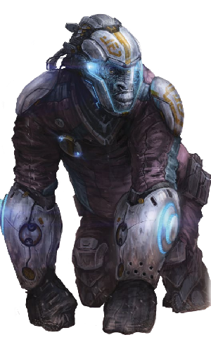

# Uplift Biomorphs

<!--sort-->

## Neo-Avian

Neo-avians include ravens, crows, and gray parrots uplifted to human-level intelligence. Their physical sizes are much larger than their non-uplifted cousins (to the size of a human child), with larger heads for their increased brain size. Numerous transgenic modifications have been made to their wings, allowing them to retain limited flight capabilities at 1&nbsp;g, but giving them a more bat-like physiology so they can bend and fold better and adding primitive digits for basic tool manipulation. Their toes are also more articulated and now accompanied with an opposable thumb. Neo-avians have adapted well to microgravity environments, and are favored for their small size and reduced resource use.

<blockquote class="indent stat-list">

### Neo-Avian

- **Cost:** 0&nbsp;MP • **Avail:** 50

---

- **WT:** 5 • **DUR:** 25 • **DR:** 38
- **Insight** 2, **Moxie** 1, **Vigor** 0, **Flex** 0

---

- **Movement Rate:** Walker 2/8, Winged 8/40
- **Ware:** Biomods, Claws, Cortical Stack, Direction Sense, Enhanced Vision, Mesh Inserts, Prehensile Feet, Wings
- **Morph Traits:** Exotic Morphology (Level 3), Non-Human Biochemistry (Level 2)
- **Notes:** Beak/Claw Attack (DV 2d6), Small size

</blockquote>

| **NEO-AVIAN**                                                                                                                                                                                                                                                                    |
| :------------------------------------------------------------------------------------------------------------------------------------------------------------------------------------------------------------------------------------------------------------------------------- |
| **Skinwalker:** I sleeved a neo-parrot skin once. I lost track of the number of times I was hit with “bird brain” slurs. It really gave me a new perspective on what uplifts have to put up with.                                                                                |
| **Nevermore:** A lot of tourists take a neo-avian sleeve, thinking they’re going to experience the life-long dream most humans seem to have of flying. Then they crash into a wall five or six times, realize they have no knack for it, and go back to their featherless forms. |

## Neo-Beluga

Neo-belugas are the smallest and most numerous of the surviving whale uplifts, ranging from 3 to 5.5 meters in length. They are white-skinned with no dorsal ridge, toothed, and have the distinction of being the only whales that can swim backwards. They can safely descend to about 1,000 meters at 1&nbsp;g; deeper requires the pressure adaptation mod.

<blockquote class="indent stat-list">

### Neo-Beluga

- **Cost:** 3&nbsp;MP • **Avail:** 10 (30 in aquatic habs)

---

- **WT:** 9 • **DUR:** 45 • **DR:** 68
- **Insight** 1, **Moxie** 1, **Vigor** 1, **Flex** 1

---

- **Movement Rate:** Swim 4/20
- **Ware:** Asymmetric Sleep, Biomods, Cold Tolerance, Cortical Stack, Enhanced Hearing, Enhanced Respiration, Gills, Mesh Inserts, Sonar
- **Morph Traits:** Exotic Morphology (Level 2), Lack of Manipulators, Lack of Smell, Non-Human Biochemistry (Level 1)
- **Common Extras:** Cyberarms, Extra Limbs
- **Notes:** Large size

</blockquote>

| **NEO-BELUGA**                                                                                                                                                                                                                                                         |
| :--------------------------------------------------------------------------------------------------------------------------------------------------------------------------------------------------------------------------------------------------------------------- |
| **Skinwalker:** My biggest issue with this morph was getting used to swallowing things whole, without chewing them.                                                                                                                                                    |
| **Cymascopist:** Look for the price tag on these morphs to shoot up soon. Somatek has seen steadily declining profits on it since roll-out, and there’s just not a large enough population of uplifted belugas to make it worth their while to develop new iterations. |
| **Pivo:** There’s a group of neo-beluga uplifts looking to buy out Somatek’s genetic IP just to open source it all.                                                                                                                                                    |

## Neo-Bonobo/Neo-Chimp

Like other neo-hominids, uplifted bonobo and chimpanzee morphs feature enhanced intelligence and bipedal frames. Their long arms and prehensile feet are a boon for climbing and maneuvering in microgravity environments. They retain the body hair of their forebears, though it is a common cultural practice to dye, stylize, or otherwise manipulate it. Transgenic vocal systems allow them to speak as humans do.

<blockquote class="indent stat-list">

### Neo-Bonobo/Neo-Chimp

- **Cost:** 1&nbsp;MP • **Avail:** 50

---

- **WT:** 6 • **DUR:** 30 • **DR:** 45
- **Insight** 0, **Moxie** 2, **Vigor** 1, **Flex** 0

---

- **Movement Rate:** Walker 4/12
- **Ware:** Biomods, Cortical Stack, Enhanced Smell, Mesh Inserts, Prehensile Feet
- **Morph Traits:** Exotic Morphology (Level 1) Non-Human Biochemistry (Level 1)

</blockquote>

| **NEO-BONOBO/CHIMP**                                                                                                                                                                                                                                                                                                                                                            |
| :------------------------------------------------------------------------------------------------------------------------------------------------------------------------------------------------------------------------------------------------------------------------------------------------------------------------------------------------------------------------------ |
| **Callosum:** Even though some body banks lump the neo-hominid species together, it’s worth knowing that they don’t all feel the same.                                                                                                                                                                                                                                          |
| **Skinwalker:** Bonobo neural architecture and natural hormonal levels are not for the inexperienced. If you’re new to the morph, you may want to request the special cocktail of hormones that brings their responses more in line with human norms. If you think you want to go “full bonobo,” then step down off the inhibitors over a period of days; don’t go cold turkey. |

## Neo-Dolphin

Dolphin uplifts are very physiologically similar to baseline dolphins. Most range in size from 2 to 4 meters. They are torpedo-shaped fast swimmers, with conical teeth, long snouts, and blow holes. They can safely dive to about 1,000 meters at 1&nbsp;g.

<blockquote class="indent stat-list">

### Neo-Dolphin

- **Cost:** 2&nbsp;MP • **Avail:** 10 (50 in aquatic habs)

---

- **WT:** 8 • **DUR:** 40 • **DR:** 60
- **Insight** 0, **Moxie** 1, **Vigor** 1, **Flex** 1

---

- **Movement Rate:** Swim 8/40
- **Ware:** Asymmetric Sleep, Biomods, Cold Tolerance, Cortical Stack, Enhanced Hearing, Enhanced Respiration, Gills, Mesh Inserts, Sonar
- **Morph Traits:** Exotic Morphology (Level 2), Lack of Manipulators, Lack of Smell, Non-Human Biochemistry (Level 1)
- **Common Extras:** Cyberarms, Extra Limbs
- **Notes:** Large size

</blockquote>

| **NEO-DOLPHIN**                                                                                                                                                                                                                        |
| :------------------------------------------------------------------------------------------------------------------------------------------------------------------------------------------------------------------------------------- |
| **Plasmid:** Some dolphin strains incorporate a vertebrae hack taken from belugas that allows them to turn their heads laterally, so they can look behind them without needing to turn their body.                                     |
| **Cymascopist:** Among certain uplift criminal crews, a popular modification is to get further reinforcement on the entire head and neck area to allow for better ramming.                                                             |
| **Pivo:** Ah that explains it, I thought my group had been hit by some sort of experimental pod or synth cetacean on an op recently. We thought there was no way a biomorph could hit that hard. These guys were moving way fast, too. |

## Neo-Gorilla

Neo-gorillas benefit from enhanced cognition and upright stances like other neo-hominids, though they are not as adept at climbing. They stand roughly as tall as humans and have stronger and larger frames.

<blockquote class="indent stat-list">

### Neo-Gorilla

- **Cost:** 3&nbsp;MP • **Avail:** 40

---

- **WT:** 9 • **DUR:** 45 • **DR:** 68
- **Insight** 0, **Moxie** 0, **Vigor** 3, **Flex** 1

---

- **Movement Rate:** Walker 4/12
- **Ware:** Biomods, Cortical Stack, Enhanced Smell, Mesh Inserts, Prehensile Feet
- **Morph Traits:** Exotic Morphology (Level 1), Non-Human Biochemistry (Level 1)

</blockquote>

| **NEO-GORILLA**                                                                                                                                                                                                                                        |
| :----------------------------------------------------------------------------------------------------------------------------------------------------------------------------------------------------------------------------------------------------- |
| **Moxie Harper:** The prevalence of gorillas in certain pop culture products has made this a popular morph among those that want to project a certain air of toughness and, dare I say, badassery without having to go synth.                          |
| **Cacophonous:** Uplifted homs in general, and particularly uplifted gorillas, have been dealing with the backlash of these media depictions. A lot of people see neo-gorillas and automatically think they’re thugs or mobbed up with some syndicate. |

## Neo-Neanderthal

This morph is derived from fossilized Neanderthal DNA, uplifted and enhanced to transhuman equivalence. Neanderthal morphs appear muscular with a heavy bone structure, distinctively long skulls, heavy brow ridges, and weak chins. Pale complexions and red hair are common features.

<blockquote class="indent stat-list">

### Neo-Neanderthal

- **Cost:** 2&nbsp;MP • **Avail:** 35

---

- **WT:** 7 • **DUR:** 35 • **DR:** 53
- **Insight** 0, **Moxie** 1, **Vigor** 2, **Flex** 1

---

- **Movement Rate:** Walker 4/20
- **Ware:** Biomods, Cortical Stack, Mesh Inserts
- **Morph Traits:** Non-Human Biochemistry (Level 1)

</blockquote>

| **NEO-NEANDERTHAL**                                                                                                                                                                                                                                                                                                        |
| :------------------------------------------------------------------------------------------------------------------------------------------------------------------------------------------------------------------------------------------------------------------------------------------------------------------------- |
| **Cacophonous:** First person to make a lowbrow joke gets cut.                                                                                                                                                                                                                                                             |
| **Shark-Souled:** There’s a small but efficient neo-neanderthal terrorist outfit that has bombed several body banks that offered neanderthal morphs to nonneanderthals. They argue that as a species, they should be in control of their own genetics. They’ve even gone so far as “repossessing” morphs that were in use. |

## Neo-Octopus

Colloquially known as “octomorphs,” these uplifted octopus sleeves are quite useful in zero-gravity environments. They retain eight arms, their chameleon ability to change skin color, ink sacs, and a sharp beak. They also have increased brain mass and longevity, can breathe both air and water, and lack a skeletal structure so they can squeeze through tight spaces. Octomorphs typically crawl along in zero gravity using their arm suckers and expelling air for propulsion; in low gravity they walk on two of their arms. Their eyes have been enhanced with color vision, provide a 360-degree field of vision, and rotationally adjust to keep the slitshaped pupil aligned with “up.” A transgenic vocal system allows them to speak.

<blockquote class="indent stat-list">

### Neo-Octopus

- **Cost:** 3&nbsp;MP • **Avail:** 35

---

- **WT:** 6 • **DUR:** 30 • **DR:** 45
- **Insight** 1, **Moxie** 1, **Vigor** 1, **Flex** 2

---

- **Movement Rate:** Swim 4/20, Thrust Vector (Gas Jet) 4/12, Walker 2/8
- **Ware:** 360-Degree Vision, Biomods, Chameleon Skin, Cortical Stack, Gills, Mesh Inserts, Polarization Vision
- **Morph Traits:** Exotic Morphology (Level 3), Limberness (Level 2), Non-Human Biochemistry (Level 2)
- **Notes:** 8 prehensile arms, Beak Attack (DV 1d10), Ink Attack (use Athletics, blinding, 5-meter uniform area-effect in water and micrograv)

</blockquote>

| **NEO-OCTOPUS**                                                                                                                                                                                                                                                                              |
| :------------------------------------------------------------------------------------------------------------------------------------------------------------------------------------------------------------------------------------------------------------------------------------------- |
| **Pivo:** The best part about watching humans sleeve into octomorphs is how weirded out you get about the arms having minds of their own. Human limbs seem dumb and lifeless by comparison.                                                                                                  |
| **Ruqinzhe:** For non-octopi, it can take a while to get used to, but these things are excellent for infiltration ops. You’d be surprised how many facilities gear their security towards humanoid-sized intruders or synthetics. There are usually lots of places an octomorph can exploit. |
| **Sun Bu’er:** There’s a group of exhuman uplifts who like to engulf their victims with scary octomorphs: bone plates, hooks on the arms, tailored toxin production, and custom smart-material beaks that deform to allow them to squeeze into very, very small places.                      |

## Neo-Orangutan

Neo-orangutans have the same uplifted features as their neo-hominid cousins. Compared to humans, their legs are shorter and arms longer. Neo-orangutans tend to be more solitary than social.

<blockquote class="indent stat-list">

### Neo-Orangutan

- **Cost:** 3&nbsp;MP • **Avail:** 35

---

- **WT:** 7 • **DUR:** 35 • **DR:** 53
- **Insight** 1, **Moxie** 1, **Vigor** 2, **Flex** 0

---

- **Movement Rate:** Walker 4/12
- **Ware:** Biomods, Cortical Stack, Enhanced Smell, Mesh Inserts, Prehensile Feet
- **Morph Traits:** Exotic Morphology (Level 1), Limberness (Level 1), Non-Human Biochemistry (Level 1)
- **Notes:** Reach (+10)

</blockquote>

| **NEO-ORANGUTAN**                                                                                                                                                                                                                                                                                                                                                         |
| :------------------------------------------------------------------------------------------------------------------------------------------------------------------------------------------------------------------------------------------------------------------------------------------------------------------------------------------------------------------------ |
| **Sun Bu’er:** Orangs often get overlooked. Truth is, all the neo-orang uplifts I’ve ever known are totally mellow people. Having sleeved an orang on a skeleton-crew mining op once, I can see why. The morph is just so smooth and easy, the closest I can come to it in my splicer is when I’m doing tai chi; it just flows. You’re powerful but not obvious about it. |

## Neo-Orca

Though colloquially referred to as killer whales, orcas are actually members of the dolphin family. They range from 5 to 8 meters in length, have distinct black-andwhite coloration, and bit with powerful jaws. Males also have larger and more triangular pectoral fins. They can safely dive to about 1,000 meters at 1&nbsp;g.

<blockquote class="indent stat-list">

### Neo-Orca

- **Cost:** 4&nbsp;MP • **Avail:** 10 (30 in aquatic habs)

---

- **WT:** 10 • **DUR:** 50 • **DR:** 75
- **Insight** 1, **Moxie** 0, **Vigor** 3, **Flex** 1

---

- **Movement Rate:** Swim 8/40
- **Ware:** Asymmetric Sleep, Biomods, Cold Tolerance, Cortical Stack, Enhanced Hearing, Enhanced Respiration, Gills, Mesh Inserts, Sonar
- **Morph Traits:** Exotic Morphology (Level 3), Lack of Manipulators, Lack of Smell, Non-Human Biochemistry (Level 1)
- **Common Extras:** Cyberarms, Extra Limbs
- **Notes:** Very Large size, Bite Attack (DV 3d10 +5)

</blockquote>

| **NEO-ORCA**                                                                                                                                                                                                                                                          |
| :-------------------------------------------------------------------------------------------------------------------------------------------------------------------------------------------------------------------------------------------------------------------- |
| **Shark-Souled:** Having seen the variants available for other uplift morphs, a lot of neo-orcas are clamoring for something more updated. There’s nothing wrong with the neo-orca morph per se, but there’s only so much dermal plating and enhanced muscles can do. |
| **Cacophonous:** By “a lot of neo-orcas,” you mean Rising Tide, yes? They’re not satisfied with a multi-ton biological killing machine anymore?                                                                                                                       |
| **Shark-Souled:** Not just Rising Tide, though this is an issue they’ve been using to garner new recruits. In fact, a lot of uplifted cetaceans feel we’ve gotten the short end of the stick when it comes to morph variety.                                          |
| **Cymascopist:** She’s not wrong, other than the surya most of our options are just genetweaked versions of the originals. The neo-orcas are just being a little more assertive about it than the rest of us.                                                         |

## Neo-Pig

Uplifted pig morphs are bipedal and feature transgenic hands, feet, and vocal systems. They tend to be slightly shorter than the average transhuman but much stockier. Males grow tusks from their lower jaws.

<blockquote class="indent stat-list">

### Neo-Pig

- **Cost:** 1&nbsp;MP • **Avail:** 30

---

- **WT:** 7 • **DUR:** 35 • **DR:** 53
- **Insight** 0, **Moxie** 1, **Vigor** 1, **Flex** 1

---

- **Movement Rate:** Walker 4/20
- **Ware:** Biomods, Cortical Stack, Mesh Inserts
- **Morph Traits:** Exotic Morphology (Level 1), Non-Human Biochemistry (Level 1)
- **Common Extras:** Many have the Impaired Balance trait.

</blockquote>

| **NEO-PIG**                                                                                                                                                                                                                                                                                                                                                                                                                                |
| :----------------------------------------------------------------------------------------------------------------------------------------------------------------------------------------------------------------------------------------------------------------------------------------------------------------------------------------------------------------------------------------------------------------------------------------- |
| **Plasmid:** Since someone always asks: yes, some models still have the corkscrew genitalia. Others don’t. If that’s the sort of thing that interests you/squicks you out, I suggest asking first.                                                                                                                                                                                                                                         |
| **Skinwalker:** Another solid morph but, ugh, so many bad bacon jokes.                                                                                                                                                                                                                                                                                                                                                                     |
| **Qi:** Speaking of neo-pigs and jokes, an anarchist collective that goes by the name Blackhawk Pharm recently hacked an entire order of replacement morphs for a Direct Action VIP security squad, replacing all of their olympians with neo-pigs. They didn’t have the time to arrange for new morphs, and the vid of them protecting their clients went viral and became a scandal in certain social circles. Y’know, the bigoted kind. |

## Neo-Porpoise

Neo-porpoises are smaller but very similar to neo-dolphins, with blunter snouts, and are much like their baseline relatives. They range from 1.5 to 2.5 meters in length. They can safely dive to about 1,000 meters at 1&nbsp;g.

<blockquote class="indent stat-list">

### Neo-Porpoise

- **Cost:** 1&nbsp;MP • **Avail:** 10 (50 in aquatic habs)

---

- **WT:** 7 • **DUR:** 35 • **DR:** 53
- **Insight** 0, **Moxie** 1, **Vigor** 1, **Flex** 0

---

- **Movement Rate:** Swim 8/40
- **Ware:** Asymmetric Sleep, Biomods, Cold Tolerance, Cortical Stack, Enhanced Hearing, Enhanced Respiration, Gills, Mesh Inserts, Sonar
- **Morph Traits:** Exotic Morphology (Level 2), Lack of Manipulators, Lack of Smell, Non-Human Biochemistry (Level 1)
- **Common Extras:** Cyberarms, Extra Limbs
- **Notes:** Some are Large size

</blockquote>

| **NEO-PORPOISE**                                                                                                                                                                                                                                                                                                                                                                                                                                                                                      |
| :---------------------------------------------------------------------------------------------------------------------------------------------------------------------------------------------------------------------------------------------------------------------------------------------------------------------------------------------------------------------------------------------------------------------------------------------------------------------------------------------------- |
| **Shark-Souled:** Fast and small, just add chameleon skin for the perfect aquatic scout. Manufacturers have started making smaller models to meet the demand for both security and for sporting enthusiasts who enjoy the ability to dart among undersea obstacles.                                                                                                                                                                                                                                   |
| **Cymascopist:** Your comment highlights an issue for many uplifts. For us these morphs are our most natural bodies. Ideally, we’d like them to be a fusion of what we have evolved into and modern functionality. But uplifts, particularly cetaceans, are such a minority of the market that we get edged out in favor of the demands of big-budget military contractors and tourists. What this means is that we often end up with morphs that are not optimized for us, but rather for homo saps. |

## Neo-Whale

Less than several hundred neo-whale morphs exist, and the majority remain occupied by their original egos. They are primarily found on Ceres and Atlantica. They are derived from humpback, blue, and sperm whale genetic stock. Humpbacks and blues are baleen whales and require large amounts of krill to survive. Sperm whales are toothed, feeding on fish and squid. They can safely dive to about 3,000 meters at 1&nbsp;g.

<blockquote class="indent stat-list">

### Neo-Whale

- **Cost:** 5&nbsp;MP • **Avail:** 5 (10 in aquatic habs)

---

- **WT:** 12 • **DUR:** 60 • **DR:** 90
- **Insight** 1, **Moxie** 2, **Vigor** 2, **Flex** 2

---

- **Movement Rate:** Swim 8/40
- **Ware:** Asymmetric Sleep, Biomods, Cold Tolerance, Cortical Stack, Enhanced Hearing, Enhanced Respiration, Gills, Mesh Inserts, Sonar
- **Morph Traits:** Exotic Morphology (Level 3), Lack of Manipulators, Lack of Smell, Non-Human Biochemistry (Level 1)
- **Common Extras:** Cyberarms, Extra Limbs
- **Notes:** Very Large size, Bite Attack (DV 4d10 +5)

</blockquote>

| **NEO-WHALE**                                                                                                                                                                                                                                                                |
| :--------------------------------------------------------------------------------------------------------------------------------------------------------------------------------------------------------------------------------------------------------------------------- |
| **Skinwalker:** It’s a rare privilege to take a swim in one of these. Anyone had a chance?                                                                                                                                                                                   |
| **Ruqinzhe:** I have. I won a bet in an online gambling tournament where my opponent had put his morph on the table. Turns out I beat a neo-whale. I didn’t have the heart to tell him I cheated, so I simply took it for a spin for a week before giving it back. Majestic. |

<!--sort-end-->

