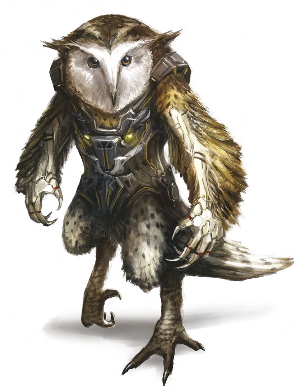
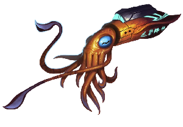
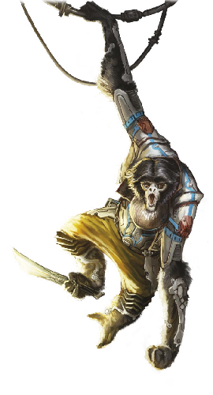

# Pod Biomorphs

<!--sort-->

## Augur

Augurs were designed to incorporate biological androids into teaching, instruction, lab work, and administrative positions. They are now offered as cheaper alternatives to mentons.

<blockquote class="indent stat-list">

### Augur

- **Cost:** 3&nbsp;MP • **Avail:** 60

---

- **WT:** 7 • **DUR:** 35 • **DR:** 53
- **Insight** 3, **Moxie** 0, **Vigor** 0, **Flex** 0

---

- **Movement Rate:** Walker 4/20
- **Ware:** Access Jacks, Biomods, Cortical Stack, Cyberbrain, Mesh Inserts, Mnemonics, Puppet Sock

</blockquote>

| **AUGUR**                                                                                                         |
| :---------------------------------------------------------------------------------------------------------------- |
| **Volta:** Augurs, for when your corporate masters want you smart as a menton, but as easily controlled as a bot. |
| **Psychscaper:** That’s why so many of these models also come with built-in behavioral mods.                      |

## Ayah

Ayahs are designed for nurse, caretaking, and personal attendant functions. Hyperelites prefer AGI servants sleeved into ayahs, especially in polities where AGIs have few, if any, legal rights. Ayahs are predominately female. Enhanced olfactory capabilities are used to monitor the health and emotional state of their wards, as well as alert them to potential environmental dangers. Their ability to withstand temperature extremes and survive without air for short periods helps them protect and rescue their charges in an emergency, such as a hull breach or a fire.

<blockquote class="indent stat-list">

### Ayah

- **Cost:** 3&nbsp;MP • **Avail:** 70

---

- **WT:** 7 • **DUR:** 35 • **DR:** 53
- **Insight** 0, **Moxie** 2, **Vigor** 0, **Flex** 1

---

- **Movement Rate:** Walker 4/20
- **Ware:** Access Jacks, Biomods, Clean Metabolism, Cold Tolerance, Cortical Stack, Cyberbrain, Enhanced Smell, Mesh Inserts, Mnemonics, Oxygen Reserve, Puppet Sock
- **Morph Traits:** Enhanced Behavior (Attentive, Level 2), Enhanced Behavior (Protective, Level 2)
- **Common Extras:** Enhanced Hearing, Enhanced Vision, Heat Tolerance, Utilimod, Vacuum Sealing. Many have the Composure and/or Empathy traits.

</blockquote>

| **AYAH**                                                                                                                                                                                                                                                                 |
| :----------------------------------------------------------------------------------------------------------------------------------------------------------------------------------------------------------------------------------------------------------------------- |
| **Eludere:** This is a great morph to sleeve if you want to come across as safe and innocuous. No one suspects an ayah — until you’ve had one try to feed your head into the kitchen disassembler.                                                                       |
| **Ammonite:** AI-piloted defender ayahs are very common inside the mansions of the ultrarich, usually heavily loaded with intriguing aftermarket add-ons. Don’t be surprised if there’s also an infomorph on hand to drop in and take it over when alarms start ringing. |
| **Nezumi:** I know a commune out near Neptune where the males all sleeve male ayahs and the women wear furies, just to tweak the gender dynamics.                                                                                                                        |

### Defender Variant

Ayahs are sometimes modified with protective ware and weapons to act as a last line of defense against potential attackers.

<blockquote class="indent stat-list">

### Defender

- **Cost:** 6&nbsp;MP • **Avail:** 30

---

- **WT:** 8 • **DUR:** 40 • **DR:** 60
- **Insight** 0, **Moxie** 2, **Vigor** 1, **Flex** 1

---

- **Movement Rate:** Walker 4/20
- **Ware:** Access Jacks, Adrenal Surge, Biomods, Bioweave, Clean Metabolism, Cold Tolerance, Cortical Stack, Cyberbrain, Eelware, Enhanced Smell, Hardened Skeleton, Mesh Inserts, Mnemonics, Oxygen Reserve, Pain Regulator, Puppet Sock
- **Morph Traits:** Enhanced Behavior (Attentive, Level 2), Enhanced Behavior (Protective, Level 2)
- **Common Extras:** Enhanced Hearing, Enhanced Vision, Hand Laser, Muscle Augmentation, Vacuum Sealing
- **Notes:** Bonuses from hardened skeleton already incorporated.

</blockquote>

## Basic Pod

These original general-purpose models are designed to keep the buyer/user dependent on the manufacturer.

<blockquote class="indent stat-list">

### Basic Pod

- **Cost:** 1&nbsp;MP • **Avail:** 80

---

- **WT:** 6 • **DUR:** 30 • **DR:** 45
- **Insight** 0, **Moxie** 0, **Vigor** 1, **Flex** 0

---

- **Movement Rate:** Walker 4/20
- **Ware:** Access Jacks, Biomods, Cortical Stack, Cyberbrain, Mesh Inserts, Mnemonics, Puppet Sock
- **Morph Traits:** Planned Obsolescence

</blockquote>

| **BASIC POD**                                                                                                                                                                                                                                                                               |
| :------------------------------------------------------------------------------------------------------------------------------------------------------------------------------------------------------------------------------------------------------------------------------------------ |
| **Expat:** I know the pre-Fall models had limited lifespans just as a precaution, to keep the AIs in line. That still the case?                                                                                                                                                             |
| **Skinwalker:** Yes. Some of these basics are as bad as mass-market case morphs or low-grade rusters. Planned obsolescence is common. Buyer beware.                                                                                                                                         |
| **Qi:** It’s worse than that. It’s common practice among inner-system pod manufacturers to equip their models with free chemical dependencies. They know pods are the next thing above a synthmorph for indentures looking to buy out, and they do everything they can to keep them hooked. |

## Chickcharnie

The genehackers at the extrasolar Fortean hab modeled this morph on a terrifying mythological bird using genetics from the extinct Tyto Pollens, a large pre-Columbian flightless ground owl. The chickcharnie is popular with neo-avians who prefer a more humanoid stature, though it is flightless except in very low grav environments and microgravity. Its wing design incorporates a functional set of clawed hands.

<blockquote class="indent stat-list">

### Chickcharnie

- **Cost:** 2&nbsp;MP • **Avail:** 20

---

- **WT:** 7 • **DUR:** 35 • **DR:** 53
- **Insight** 1, **Moxie** 0, **Vigor** 2, **Flex** 0

---

- **Movement Rate:** Walker 4/12, Winged 8/32 (low/microgravity only)
- **Ware:** Access Jacks, Biomods, Claws, Cortical Stack, Cyberbrain, Direction Sense, Enhanced Vision, Mesh Inserts, Mnemonics, Polarization Vision, Prehensile Feet, Puppet Sock, Wings
- **Morph Traits:** Exotic Morphology (Level 2), Non-Human Biochemistry (Level 2)
- **Notes:** Beak/Claw Attack (DV 2d6)

</blockquote>

| **CHICKCHARNIE**                                                                                                                                                                                                                    |
| :---------------------------------------------------------------------------------------------------------------------------------------------------------------------------------------------------------------------------------- |
| **Skinwalker:** These are unfortunately hard to find.                                                                                                                                                                               |
| **Sequencer:** That hasn’t gone unnoticed. I know a couple of Extropian bodycraft houses that plan to release their own models next year. One of them has an interesting variant called the “owlbear.” I’m not sure I want to know. |
| **Just Mortal:** What I don’t get is, why does this appeal to neo-avians? Sure, it’s a bird, but you lose the wings.                                                                                                                |
| **Nevermore:** Ever tried to tie a knot with your tongue? Yeah, sometimes a good pair of hands is worth the trade-off.                                                                                                              |

## Critter

Critter pods encompass a vast variety of morphs based on animal genetics, chimeric blends, or humanoids biosculpted to an animalistic form. Originally marketed as distinctive AI-operated pets, they’ve since become a popular and widespread choice of sleeve. Critters come in every conceivable species and hybrid, from cats to snakes to lizardhyena hybrids. They are available as quadrupeds, bipeds, and other body plans. The bastet, a composite of wild cat species that resembles a tawny panther or lion, often with intricate fur patterns based on Egyptian hieroglyphs, is currently popular in the inner system.

<blockquote class="indent stat-list">

### Critter (Humanoid Mammalian Beast)

- **Cost:** 3&nbsp;MP • **Avail:** 60

---

- **WT:** 7 • **DUR:** 35 • **DR:** 53
- **Insight** 0, **Moxie** 1, **Vigor** 1, **Flex** 0

---

- **Movement Rate:** Walker 4/20
- **Ware:** Access Jacks, Biomods, Chameleon Skin, Claws, Cortical Stack, Cyberbrain, Enhanced Hearing, Enhanced Smell, Mesh Inserts, Mnemonics, Prehensile Tail, Puppet Sock
- **Morph Traits:** Exotic Morphology (Level 1), Non-Human Biochemistry (Level 1)
- **Common Extras:** Bodysculpting, Prehensile Feet, Skin Pocket, Scent Alteration
- **Notes:** Depending on the morph’s design and genetics, different levels of the Exotic Morphology and Non-Human Biochemistry traits and different Movement Rates may apply.

</blockquote>

<blockquote class="indent stat-list">

### Critter (Quadruped Hybrid)

- **Cost:** 2&nbsp;MP • **Avail:** 40

---

- **WT:** 7 • **DUR:** 35 • **DR:** 53
- **Insight** 0, **Moxie** 1, **Vigor** 1, **Flex** 0

---

- **Movement Rate:** Walker 8/32
- **Ware:** Access Jacks, Biomods, Chameleon Skin, Claws, Cortical Stack, Cyberbrain, Enhanced Hearing, Enhanced Smell, Mesh Inserts, Mnemonics, Prehensile Tail, Puppet Sock
- **Morph Traits:** Exotic Morphology (Level 2), Non-Human Biochemistry (Level 2)
- **Common Extras:** Bodysculpting, Cyberlimb, Digging Claws, Enhanced Vision, Scent Alteration. Many have the Lacks Manipulators trait.
- **Notes:** Depending on the morph’s design and genetics, different levels of the Exotic Morphology and Non-Human Biochemistry traits and different Movement Rates may apply.

</blockquote>

<blockquote class="indent stat-list">

### Critter (Small Mammal)

- **Cost:** 2&nbsp;MP • **Avail:** 30

---

- **WT:** 5 • **DUR:** 25 • **DR:** 38
- **Insight** 0, **Moxie** 1, **Vigor** 1, **Flex** 0

---

- **Movement Rate:** Walker 4/12
- **Ware:** Access Jacks, Biomods, Chameleon Skin, Claws, Cortical Stack, Cyberbrain, Enhanced Hearing, Enhanced Smell, Grip Pads, Mesh Inserts, Mnemonics, Prehensile Feet, Prehensile Tail, Puppet Sock
- **Morph Traits:** Exotic Morphology (Level 2), Non-Human Biochemistry (Level 1)
- **Common Extras:** Enhanced Vision, Gliding Membrane, Scent Alteration, Wings
- **Notes:** Small size. Depending on the morph’s design and genetics, different levels of the Exotic Morphology and Non-Human Biochemistry traits and different Movement Rates may apply.

</blockquote>

| **CRITTER**                                                                                                                                                                                                                                          |
| :--------------------------------------------------------------------------------------------------------------------------------------------------------------------------------------------------------------------------------------------------- |
| **Skinwalker:** Critters are exceptionally popular. There are thousands of different models out there.                                                                                                                                               |
| **Sequencer:** These are very hit-or-miss, craftsmanship-wise. Some have serious health issues due to ... let’s just call it improper genework. Others are held together more by cybernetics than anything. Don’t buy one as a long-term commitment. |
| **Plasmid:** Ah, but some are works of chimerical art. I’m still impressed by the sequencing on some of the lizardmammal hybrids.                                                                                                                    |
| **Dante:** I know an Extropian outfit that specializes in critters designed to emulate various smart animal breeds. Great for looking innocuous... unless you’re in a biocon hab.                                                                    |

## Digger

Diggers are worker pods customized for archeological and construction work. They are used for surface surveys, excavation, and general physical labor by xenoarcheological and colony infrastructure teams. Their hands are modified digging claws, adapted from the genetics of hole-digging creatures like moles and aardvarks, though still flexible and useful for grasping and fine manipulation.

<blockquote class="indent stat-list">

### Digger

- **Cost:** 4&nbsp;MP • **Avail:** 20 (40 in gate habs)

---

- **WT:** 7 • **DUR:** 35 • **DR:** 53
- **Insight** 0, **Moxie** 0, **Vigor** 2, **Flex** 0

---

- **Movement Rate:** Walker 4/20
- **Ware:** Access Jacks, Biomods, Cortical Stack, Cyberbrain, Digging Claws, Mesh Inserts, Mnemonics, Muscle Augmentation, Puppet Sock, Utilimod
- **Common Extras:** Cold Tolerance, Enhanced Respiration, Enhanced Vision, Vacuum Sealing

</blockquote>

| **DIGGER**                                                                                                                                                                            |
| :------------------------------------------------------------------------------------------------------------------------------------------------------------------------------------ |
| **Skinwalker:** The giant hands are surprisingly dexterous, but forget wearing anything but smart gloves.                                                                             |
| **Sequencer:** A number of diggers have polydactyl hands, meaning they have an extra thumb. Makes it easier to hold on to things.                                                     |
| **Nova Vida:** If you’re actually using this morph for tunnel exploration/ excavation, get a model with the mole hemoglobin protein — it lets you survive in low oxygen environments. |

## Flying Squid

Capitalizing on the popularity of octomorphs, this stylized squid is designed for speed in both aquatic and microgravity environments. It can suck either water or air into a cavity in its mantle and then expel it out a siphon for fast, jet-like propulsion.

<blockquote class="indent stat-list">

### Flying Squid

- **Cost:** 5&nbsp;MP • **Avail:** 30

---

- **WT:** 8 • **DUR:** 40 • **DR:** 60
- **Insight** 1, **Moxie** 0, **Vigor** 2, **Flex** 0

---

- **Movement Rate:** Swim 8/32, Thrust Vector (Gas Jet) 4/12
- **Ware:** 360-Degree Vision, Access Jacks, Biomods, Chameleon Skin, Cortical Stack, Cryogenic Protection, Cyberbrain, Gills, Grip Pads, Mesh Inserts, Mnemonics, Polarization Vision, Pressure Adaptation, Puppet Sock
- **Morph Traits:** Exotic Morphology (Level 3), Limberness (Level 2), Non-Human Biochemistry (Level 2)
- **Common Extras:** 8 prehensile arms, 2 prehensile tentacles, Beak Attack (DV 1d10), Ink Attack (use Athletics; blinding, 5-meter uniform area-effect in water and micrograv)

</blockquote>

| **FLYING SQUID**                                                                                                                                                                                                                                                                                               |
| :------------------------------------------------------------------------------------------------------------------------------------------------------------------------------------------------------------------------------------------------------------------------------------------------------------- |
| **Delta-V:** Quite an interesting ride, but useless in any non-aquatic environment with gravity.                                                                                                                                                                                                               |
| **Pivo:** You hear about that situation on Atlantica? A certain neo-whale there ate a couple of folks sleeved in flying squid morphs. They claimed they couldn’t tell ‘em apart from their nonsapient squid feedstock. Word on the waves is that some sort of black market deal went sour.                     |
| **Expat:** I know some reclaimers who came across a group of flying squid morphs while doing recon on Earth, looking for a deep sea sanctuary. The squid scattered before they could make contact. Interesting thing is: these morphs were first designed after the Fall. So why are they showing up on Earth? |

## Hypergibbon

Gibbons are not a candidate for uplift due to their primitive brain anatomy, but they make excellent pods with the addition of a cyberbrain. Many primate uplifts choose hypergibbons when they need something small like a neotenic. Built from siamang genestock, the largest of the lesser apes, hypergibbons stand about 1 meter tall, weigh 15 kilograms, and typically have black fur and skin (although bodysculpting permits many variations). They have inflatable throat sacks that allow melodious calls that carry great distances. Their wrists feature a ball-and-socket joint and also naturally dislocate to enable easier swinging by the arms.

<blockquote class="indent stat-list">

### Hypergibbon

- **Cost:** 2&nbsp;MP • **Avail:** 40

---

- **WT:** 5 • **DUR:** 25 • **DR:** 38
- **Insight** 0, **Moxie** 1, **Vigor** 2, **Flex** 0

---

- **Movement Rate:** Brachiate 8/32, Walker 4/12
- **Ware:** Access Jacks, Biomods, Brachiating Adaptation, Cortical Stack, Cyberbrain, Grip Pads, Mesh Inserts, Mnemonics, Prehensile Feet, Puppet Sock
- **Morph Traits:** Exotic Morphology (Level 2), Limberness (Level 2), Non-Human Biochemistry (Level 1)
- **Notes:** Small size

</blockquote>

| **HYPERGIBBON**                                                                                                                                                                |
| :----------------------------------------------------------------------------------------------------------------------------------------------------------------------------- |
| **Chiro:** I kind of want to fork some children and sleeve them in hypergibbons, but that’d probably be introducing a new x-risk.                                              |
| **Skinwalker:** I keep a couple of hypergibbon sleeves around for my forks. They’re very handy for home projects — they can get into anything, and their energy is infectious. |

## Novacrab

Bioengineered from coconut crab and spider crab stock and grown to a larger (human) size, novacrabs are ideal for hazardous work environments as well as vacworker, police, or bodyguard duties. They climb and handle microgravity well and can withstand a wide range of atmospheric pressure (and sudden pressure changes) from vacuum to deep sea. They are equipped with ten 2-meter long legs, massive claws, chitinous armor, compound eyes (with human-equivalent image resolution), gills, dexterous manipulatory digits on their fifth set of limbs, and transgenic vocal cords.

<blockquote class="indent stat-list">

### Novacrab

- **Cost:** 4&nbsp;MP • **Avail:** 50

---

- **WT:** 9 • **DUR:** 45 • **DR:** 68
- **Insight** 0, **Moxie** 0, **Vigor** 3, **Flex** 0

---

- **Movement Rate:** Walker 4/20
- **Ware:** Access Jacks, Biomods, Carapace Armor (+6/+7), Cold Tolerance, Cortical Stack, Cyberbrain, Enhanced Respiration, Gills, Mesh Inserts, Mnemonics, Oxygen Reserve, Puppet Sock, Vacuum Sealing
- **Morph Traits:** Exotic Morphology (Level 3), Non-Human Biochemistry (Level 2)
- **Notes:** Claw Attack (DV 2d10)

</blockquote>

| **NOVACRAB**                                                                                         |
| :--------------------------------------------------------------------------------------------------- |
| **Expat:** These things squick me out when they eat.                                                 |
| **Just Mortal:** The question everyone wants to know is: how do their legs taste?                    |
| **Sun Bu’er:** An exhuman I once spoke to told me they were “delicious, but not as good as splicer.” |

## Pleasure Pod

Pleasure pods are faux humans intended for intimate entertainment purposes and indulgent hedonism. Their biology includes extra nerve clusters in their erogenous zones, fine motor control over certain muscle groups, enhanced pheromones, sanitized metabolisms, and the capability to purr. They are capable of switching between multiple sex configurations and are often enhanced in other areas.

<blockquote class="indent stat-list">

### Pleasure Pod

- **Cost:** 4&nbsp;MP • **Avail:** 70

---

- **WT:** 6 • **DUR:** 30 • **DR:** 45
- **Insight** 0, **Moxie** 3, **Vigor** 0, **Flex** 0

---

- **Movement Rate:** Walker 4/20
- **Ware:** Access Jacks, Biomods, Clean Metabolism, Cortical Stack, Cyberbrain, Enhanced Pheromones, Mesh Inserts, Mnemonics, Puppet Sock, Scent Alteration, Sex Switch
- **Common Extras:** Many have the Striking Looks or Addiction traits.

</blockquote>

| **PLEASURE POD**                                                                                                                                                                                                                 |
| :------------------------------------------------------------------------------------------------------------------------------------------------------------------------------------------------------------------------------- |
| **Rivet:** The morph scoring highest in mesh graffiti mentions for ten years running.                                                                                                                                            |
| **mAlice:** It’s a challenge keeping up with everevolving street slang for these morphs. Some of my favorite current contenders: tripod, fleshpod, bokkie, doll, Ken/Barbie, moffie, p-date, trick, AC/DC, squirter, and mı¯mı¯. |
| **Nezumi:** Now that that is out of the way; these morphs aren’t just for sex workers. I know of one brinker community that raises their kids in pleasure pods so they can be raised with a more fluid gender identity.          |

## Ripwing

Developed by the genehackers of Fortean, ripwings are neogenetic avian chimeras, incorporating completely novel genes with traits from a range of flying creatures, including prehistoric pterosaurs. Larger and sturdier than standard neo-avian morphs, ripwings are popular with avian uplifts who want a more robust form and gatecrashers looking for a quick and stealthy flyer for recon missions. Ripwings take advantage of the _chiroptera_ genestock used to give the first avian uplifts functional hands. Instead of feathers, they feature tough leathery skin or even scales. Most ripwings have a uniform matte black skin coloration, though they are able to change color at will.

<blockquote class="indent stat-list">

### Ripwing

- **Cost:** 4&nbsp;MP • **Avail:** 20 (30 in gate habs)

---

- **WT:** 7 • **DUR:** 35 • **DR:** 53
- **Insight** 2, **Moxie** 0, **Vigor** 2, **Flex** 1

---

- **Movement Rate:** Walker 4/12, Winged 8/32
- **Ware:** Access Jacks, Biomods, Claws, Chameleon Skin, Cortical Stack, Cyberbrain, Direction Sense, Enhanced Vision, Mesh Inserts, Mnemonics, Polarization Vision, Prehensile Feet, Puppet Sock, Wings
- **Morph Traits:** Exotic Morphology (Level 3), Non-Human Biochemistry (Level 2)
- **Notes:** Beak/Claw Attack (DV 2d6)

</blockquote>

| **RIPWING**                                                                                                                                                                                                                                                                                                                   |
| :---------------------------------------------------------------------------------------------------------------------------------------------------------------------------------------------------------------------------------------------------------------------------------------------------------------------------- |
| **Nevermore:** I’ve seen more and more young neo-avian uplifts sleeving into ripwings. While the old biomorphs certainly feel better, the ripwing has a certain durability to it that lets you get away with more mistakes and a rougher approach to life. If I were four or five years younger, I’d probably get one myself. |
| **Cymascopist:** Aren’t you only sixteen?                                                                                                                                                                                                                                                                                     |
| **Nevermore:** I’m an old sixteen.                                                                                                                                                                                                                                                                                            |
| **Nova Vida:** A lot of crashers like these too, they blend better than the synthetic kites and are smaller and more maneuverable than most of the bigger flying morphs. Native fauna don’t tend to react as violently to ripwings.                                                                                           |

## Samsa

The samsa is an intimidating, two-meter-tall, four-armed, four-legged, humanoid insect. An unsettling sight to many transhumans, it was the first attempt to create a combat pod with a terrifying appearance. They are most commonly used by rimward mercenaries and enforcers. Their armored carapace provides protection and the extra limbs allow them to carry multiple weapons.

<blockquote class="indent stat-list">

### Samsa

- **Cost:** 5&nbsp;MP • **Avail:** 20 (30 in the outer rim)

---

- **WT:** 9 • **DUR:** 45 • **DR:** 68
- **Insight** 0, **Moxie** 0, **Vigor** 3, **Flex** 2

---

- **Movement Rate:** Walker 4/20
- **Ware:** 360-Degree Vision, Access Jacks, Biomods, Carapace Armor, Claws, Chameleon Skin, Cortical Stack, Cyberbrain, Enhanced Hearing, Enhanced Vision, Grip Pads, Mesh Inserts, Mnemonics, Puppet Sock
- **Morph Traits:** Exotic Morphology (Level 3), Non-Human Biochemistry (Level 2)
- **Common Extras:** Hardened Skeleton, Muscle Augmentation, Neurachem. Many have the Unattractiveness trait.
- **Notes:** 4 arms, 4 legs

</blockquote>

| **SAMSA**                                                                                                                                                                                                                                                                                                                                                                                                                                                                                                                                                                              |
| :------------------------------------------------------------------------------------------------------------------------------------------------------------------------------------------------------------------------------------------------------------------------------------------------------------------------------------------------------------------------------------------------------------------------------------------------------------------------------------------------------------------------------------------------------------------------------------- |
| **Just Mortal:** These things are just fucking disgusting.                                                                                                                                                                                                                                                                                                                                                                                                                                                                                                                             |
| **Callosum:** The synaptic programming in some samsa cyberbrain models is a bit rough, if you ask me. In particular, the extra limbs are not always designed to be operated independently; sometimes they mirror the primary limbs. This is allegedly a “feature” for users who aren’t acclimated to multilimb body plans, but it can be a real pain when you need to concentrate to move your appendages independently. Plus, it means a good brainhacker can trigger this mirroring behavior if they compromise your security. Not so good when you’re in the middle of a firefight. |
| **Pivo:** I can’t speak for all neo-octopi, but you can definitely tell some of these models were designed for native two-arms, two-leg users. Like Callosum said, they really aren’t optimized to make the best use of those secondary arms.                                                                                                                                                                                                                                                                                                                                          |

## Security Pod

Security pods were originally manufactured as mass-produced AI-operated soldiers for joint peacekeeping missions and enclave border/security roles. Many were co-opted by the TITANs during the Fall, so they fell out of favor for many years, but a demand for cheap mercenary morphs has revived interest.

<blockquote class="indent stat-list">

### Security Pod

- **Cost:** 5&nbsp;MP • **Avail:** 60

---

- **WT:** 7 • **DUR:** 35 • **DR:** 53
- **Insight** 1, **Moxie** 0, **Vigor** 2, **Flex** 1

---

- **Movement Rate:** Walker 4/20
- **Ware:** Access Jacks, Biomods, Bioweave Armor (+2/+3), Claws, Cortical Stack, Cyberbrain, Eelware, Enhanced Hearing, Enhanced Vision, Mesh Inserts, Mnemonics, Puppet Sock
- **Common Extras:** Adrenal Surge, T-Ray Emitter

</blockquote>

| **SECURITY POD**                                                                                                                                                                                                                                                                                                                                                                                                                                                                                                                                                     |
| :------------------------------------------------------------------------------------------------------------------------------------------------------------------------------------------------------------------------------------------------------------------------------------------------------------------------------------------------------------------------------------------------------------------------------------------------------------------------------------------------------------------------------------------------------------------- |
| **Parallax:** Ah, the good old toy soldiers fielded by so many pre-Fall militaries and then exploited by the TITANs during the Fall. I guess you can’t really fault the old Earth governments too much, they seemed like a good deal. They were loyal, durable, looked near enough to human that people didn’t complain too much, followed orders, and even sometimes had actual human egos in them. They lost popularity, of course, after the TITANs took over legions of sec pods and used them to commit all sorts of atrocities, but they’re making a comeback. |
| **Rivet:** Some people think these were always under direct TITAN control. Not true. It was common for them just to reprogram the ALIs. So be careful about any sec pods you find lingering in long-lost habs.                                                                                                                                                                                                                                                                                                                                                       |

### Space Marine Variant

Space marines are optimized for orbital
skirmishes, boarding actions, suppressing
worker revolts, and other microgav ops.

<blockquote class="indent stat-list">

### Space Marine

- **Cost:** 6&nbsp;MP • **Avail:** 50

---

- **WT:** 7 • **DUR:** 35 • **DR:** 53
- **Insight** 1, **Moxie** 0, **Vigor** 2, **Flex** 1

---

- **Movement Rate:** Walker 4/20
- **Ware:** Access Jacks, Biomods, Bioweave Armor (+2/+3), Claws, Cold Tolerance, Cortical Stack, Cyberbrain, Eelware, Enhanced Hearing, Enhanced Vision, Mesh Inserts, Mnemonics, Oxygen Reserve, Prehensile Feet, Puppet Sock, Vacuum Sealing

</blockquote>

## Shaper

Shapers are designed for infiltration and disguise. They lack the seamlines common to pods and incorporate ware that allows them to alter their appearance. Favored by spies and criminals, they are illegal in many habitats.

<blockquote class="indent stat-list">

### Shaper

- **Cost:** 5&nbsp;MP • **Avail:** 40

---

- **WT:** 7 • **DUR:** 35 • **DR:** 53
- **Insight** 1, **Moxie** 2, **Vigor** 0, **Flex** 0

---

- **Movement Rate:** Walker 4/20
- **Ware:** Access Jacks, Biomods, Chameleon Skin, Cortical Stack, Cyberbrain, Mesh Inserts, Mnemonics, Nanotat ID Flux, Puppet Sock, Sex Switch, Skinflex

</blockquote>

| **SHAPER**                                                                                                                                                                         |
| :--------------------------------------------------------------------------------------------------------------------------------------------------------------------------------- |
| **Ruqinzhe:** Some variants come with a gaitmasking feature is a nice touch, but it tightens and loosens muscles in ways that feel quite unnatural and takes some getting used to. |

## Traceur

These athletic pods were first designed pre-Fall to incorporate androids into sports with biological humans. Now they are mass produced as an alternative to olympian morphs.

<blockquote class="indent stat-list">

### Traceur

- **Cost:** 3&nbsp;MP • **Avail:** 50

---

- **WT:** 7 • **DUR:** 35 • **DR:** 53
- **Insight** 0, **Moxie** 0, **Vigor** 3, **Flex** 0

---

- **Movement Rate:** Walker 4/20
- **Ware:** Access Jacks, Biomods, Cortical Stack, Cyberbrain, Mesh Inserts, Mnemonics, Puppet Sock
- **Common Extras:** Adrenal Surge, Grip Pads, Muscle Augmentation. Many have the Limberness trait.

</blockquote>

| **TRACEUR**                                                                                                                                                                                                                               |
| :---------------------------------------------------------------------------------------------------------------------------------------------------------------------------------------------------------------------------------------- |
| **Lovelace:** The black-market sales pitches for the “athleticism” of these morphs are quite often hilarious.                                                                                                                             |
| **Expat:** I sleeved one of these last time I went to the Belt; it was the only option on short notice. Turned out the morph looked uncannily like my mother. It really weirded me out. I couldn’t even look in the mirror after a while. |

## Vac Pod

Optimized for working in vacuum and micrograv environments, this pod is preferred in situations where novacrabs or synths suffer from prejudice.

<blockquote class="indent stat-list">

### Vac Pod

- **Cost:** 4&nbsp;MP • **Avail:** 50

---

- **WT:** 7 • **DUR:** 35 • **DR:** 53
- **Insight** 0, **Moxie** 0, **Vigor** 1, **Flex** 1

---

- **Movement Rate:** Walker 4/12
- **Ware:** Access Jacks, Biomods, Cryogenic Protection, Cortical Stack, Cyberbrain, Mesh Inserts, Mnemonics, Oxygen Reserve, Prehensile Feet, Puppet Sock, Vacuum Sealing
- **Morph Traits:** Limberness (Level 1)
- **Common Extras:** Grip Pads, Magnetic System, Utilimod

</blockquote>

| **VAC POD**                                                                                                                                                                                                                            |
| :------------------------------------------------------------------------------------------------------------------------------------------------------------------------------------------------------------------------------------- |
| **Expat:** More than many other pods, vac pod models tend to suffer from cookie-cutter looks. I’ve worked several ship construction jobs where it was extremely challenging to visually tell some of the pod-sleeved vacworkers apart. |

## Worker Pod

Heavily feature in menial-labor jobs that involve interaction with other transhumans.

<blockquote class="indent stat-list">

### Worker Pod

- **Cost:** 3&nbsp;MP • **Avail:** 70

---

- **WT:** 7 • **DUR:** 35 • **DR:** 53
- **Insight** 0, **Moxie** 0, **Vigor** 2, **Flex** 1

---

- **Movement Rate:** Walker 4/20
- **Ware:** Access Jacks, Biomods, Cortical Stack, Cyberbrain, Mesh Inserts, Mnemonics, Puppet Sock

</blockquote>

| **WORKER POD**                                                                                                                                                                                                                  |
| :------------------------------------------------------------------------------------------------------------------------------------------------------------------------------------------------------------------------------ |
| **Nezumi:** Despite being pods, these are often favored as cheap morphs over synths. They’re especially popular with criminal and radical groups whose members identify as working class.                                       |
| **Ammonite:** There’s a shadow war going on between two inner-system pod production houses: Replicant and Ota Lifeworks. It’s grown from patent infringement to black ops and tailored viruses targeting each other’s products. |

<!--sort-end-->

