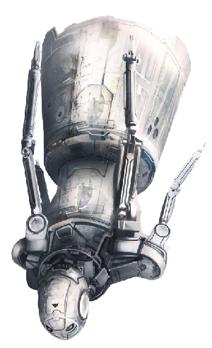
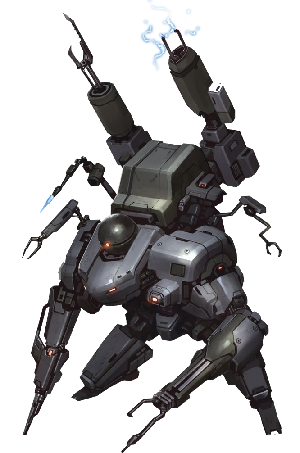
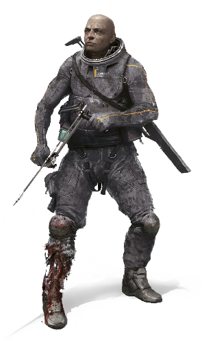

# Synthmorphs

<!--sort-->

## Arachnoid

Arachnoid shells mimic the shapes of spiders, termites, ants, beetles, and other arthropods. Three or four sets of pneumatic limbs are capable of rotating around their meter-long torso, and an additional set of manipulator arms near the head enables fine manipulation and tool use. Arachnoids move by walking, hopping, extending omnidirectional mini-wheels for skating movement, or by retracting their limbs and maneuvering with vectored-air thrusters in microgravity.

<blockquote class="indent stat-list">

### Arachnoid

- **Cost:** 6&nbsp;MP • **Avail:** 40

---

- **WT:** 11 • **DUR:** 55 • **DR:** 110
- **Insight** 1, **Moxie** 0, **Vigor** 3, **Flex** 0

---

- **Movement Rate:** Hopper 4/12, Thrust Vector (Gas Jet) 8/40, Walker 4/20, Wheeled 8/40
- **Ware:** Access Jacks, Cortical Stack, Cyberbrain, Lidar, Magnetic System, Mesh Inserts, Mnemonics, Pneumatics, Puppet Sock, Retracting Limbs
- **Morph Traits:** Exotic Morphology (Level 3)
- **Notes:** Medium Frame (Armor 8/6)

</blockquote>

| **ARACHNOID**                                                                                                                                                                          |
| :------------------------------------------------------------------------------------------------------------------------------------------------------------------------------------- |
| **Lovelace:** These things fly like a rock in zero g. Don’t expect to get down a hallway without a few dents.                                                                          |
| **Delta-V:** Or, you could learn to handle free fall, flatlander.                                                                                                                      |
| **Rivet:** Forget the thrusters. These morphs climb and jump surprisingly well. The wheels are omnidirectional and can even angle to handle slopes or serious curves.                  |
| **Stitch:** There are a lot of arachnoid models out there imitating different arthropod forms: spiders, termites, ants, beetles, etc. You name it, someone’s done a chassis mod of it. |
| **Eludere:** I’ve seen more than a few of these modified with hidden compartments to carry contraband, swarmanoids, or even neotenics.                                                 |

### Arachnikoma Variant

Arachnikoma’s are vehicle-sized arachnoids, with a hinged-top capsule/compartment large enough to carry a medium-sized transhuman or cargo.

<blockquote class="indent stat-list">

### Arachnikoma

- **Cost:** 9&nbsp;MP • **Avail:** 30

---

- **WT:** 13 • **DUR:** 65 • **DR:** 130
- **Insight** 1, **Moxie** 0, **Vigor** 4, **Flex** 0

---

- **Movement Rate:** Hopper 4/12, Thrust Vector (Gas Jet) 8/40, Walker 4/20, Wheeled 8/40
- **Ware:** Access Jacks, Cortical Stack, Cyberbrain, Lidar, Magnetic System, Mesh Inserts, Mnemonics, Pneumatics, Puppet Sock, Retracting Limbs
- **Morph Traits:** Exotic Morphology (Level 3)
- **Notes:** Heavy Frame (Armor 12/10), Large size

</blockquote>

## Biocore

The biocore is a synthmorph with a biological brain. This design is favored by those who wish to enjoy the advantages of sleeving in a synthmorph without the risk of brainhacking or who simply dislike the idea of using a cyberbrain. It is popular with asyncs, as they retain their psi abilities. Some models feature a stylized but transparent braincase, to show off the biocore’s main feature, but others appear to be ordinary synthmorphs from the outside; only a detailed physical examination can determine that it actually contains a living brain.

<blockquote class="indent stat-list">

### Biocore

- **Cost:** 3&nbsp;MP • **Avail:** 30

---

- **WT:** 7 • **DUR:** 35 • **DR:** 70
- **Insight** 1, **Moxie** 0, **Vigor** 0, **Flex** 2

---

- **Movement Rate:** Walker 4/20
- **Ware:** Brain Box, Cortical Stack, Lidar, Mesh Inserts, Puppet Sock
- **Morph Traits:** Exotic Morphology (Level 1)
- **Notes:** Light Frame (Armor 6/4)

</blockquote>

| **BIOCORE**                                                                                                                                                                                                                                                                                                                                      |
| :----------------------------------------------------------------------------------------------------------------------------------------------------------------------------------------------------------------------------------------------------------------------------------------------------------------------------------------------- |
| **Ammonite:** Yes, I really want to be soulgazing into your grey matter over coffee. Thanks for that. It’s only marginally better than that scum “artist,” Vagface.                                                                                                                                                                              |
| **Rivet:** Coreporeal produces a few biocore shells that look just like common synths on the outside.                                                                                                                                                                                                                                            |
| **Stitch:** It’s sometimes worth dragging along the old lobes if you’re worried someone’s aiming to root your headcase.                                                                                                                                                                                                                          |
| **Ruqinzhe:** Our team’s async tried this. She liked it — a bit too much. Said it made her feel “free,” like her mind was liberated to wander the cosmos. The episodes of her talking to herself went up a notch or three, and ever since she’s been infatuated with the idea of switching over to gatecrashing ops. I’m inclined to let her go. |

## Case

Cases are mass-produced robotic shells, an affordable resleeving option for the poor, though of notoriously poor quality. They are available in many varieties to suit a client’s taste. Most case morphs are anthropomorphic, with a thin framework body standing just shorter than an average human.

<blockquote class="indent stat-list">

### Case

- **Cost:** 0&nbsp;MP • **Avail:** 100

---

- **WT:** 5 • **DUR:** 25 • **DR:** 50
- **Insight** 0, **Moxie** 0, **Vigor** 0, **Flex** 0

---

- **Movement Rate:** Walker 4/12
- **Ware:** Access Jacks, Cortical Stack, Cyberbrain, Lidar, Mesh Inserts, Mnemonics, Puppet Sock
- **Morph Traits:** Exotic Morphology (Level 1), Inherent Flaws
- **Notes:** Light Frame (Armor 6/4)

</blockquote>

| **CASE**                                                                                                                                                                                                                                                    |
| :---------------------------------------------------------------------------------------------------------------------------------------------------------------------------------------------------------------------------------------------------------- |
| **Ammonite:** Here we are, the ghetto beater of morph options. Sometimes, you make do with what you can … and then you evacuate right out next chance you get.                                                                                              |
| **Qi:** There’s a reason more and more infugees and indentures are preferring to stay virtual.                                                                                                                                                              |
| **Rivet:** The steady rise in anti-case hate crimes on Luna and Mars doesn’t help.                                                                                                                                                                          |
| **Stitch:** Have you all seen the new case designs sponsored by the Autonomist Alliance? Better quality, not much more expensive. Most of the designs are open-sourced too. I know a few Barsoomian maker labs on Mars that are churning them out.          |
| **Red Rover:** They need to keep careful. Oversight has been clamping down on these lately, citing the usual copyright infringement bullshit. They burned out a maker base in Elysium just last night. Literally. Nothing but a flaming crater left behind. |

## Cetus

Named after a mythological sea monster, the cetus was designed to operate in the extreme pressure and cold of deep seas as well as the atmospheric portion of habitats. It is a favored morph in the subcrustal oceans of Ceres and Europa.

<blockquote class="indent stat-list">

### Cetus

- **Cost:** 6&nbsp;MP • **Avail:** 20 (70 in aquatic habs)

---

- **WT:** 8 • **DUR:** 40 • **DR:** 80
- **Insight** 0, **Moxie** 0, **Vigor** 2, **Flex** 1

---

- **Movement Rate:** Submarine 8/32, Walker 4/20
- **Ware:** 360° Vision, Access Jacks, Cortical Stack, Cryogenic Protection, Cyberbrain, Direction Sense, Enhanced Hearing, Enhanced Vision, Extra Limbs (1 pair), Lidar, Mesh Inserts, Mnemonics, Puppet Sock, Pressure Adaptation, Sonar
- **Morph Traits:** Exotic Morphology (Level 3)
- **Notes:** Medium Frame (Armor 8/6), 4 arms, 4 legs

</blockquote>

| **CETUS**                                                                                                                                                         |
| :---------------------------------------------------------------------------------------------------------------------------------------------------------------- |
| **Shark-Souled:** Careful what brand you choose. Europan Dynamics did a recall of their cetus models last month after a few too many succumbed to high pressures. |
| **Ruqinzhe:** Pretty sure that was a sabotage campaign by Belt Bot Industries. Guess who they’re backed by?                                                       |
| **Pivo:** Let me guess. The Hidden Concern?                                                                                                                       |
| **Ruqinzhe:** Spot on.                                                                                                                                            |

## Cloud Skimmer

This streamlined synthmorph is designed for exploring the atmospheres of gas giants, but its internal rocket also allows it to operate in vacuum. It can travel to and from a ship in orbit around a gas giant into the planet’s atmosphere on its own. The morph is a flattened oval that can extend up to four flexible arms. A series of gas sacs and turbofans allows it to maneuver as a microlight within atmosphere.

<blockquote class="indent stat-list">

### Cloud Skimmer

- **Cost:** 7&nbsp;MP • **Avail:** 20 (40 in the outer system)

---

- **WT:** 8 • **DUR:** 40 • **DR:** 80
- **Insight** 1, **Moxie** 0, **Vigor** 0, **Flex** 2

---

- **Movement Rate:** Microlight 8/32, Thrust Vector (Rocket) 8/40
- **Ware:** Access Jacks, Cortical Stack, Cryogenic Protection, Cyberbrain, Direction Sense, Enhanced Vision, Extra Limbs (1 pair), Laser Link (Medium), Mesh Inserts, Mnemonics, Puppet Sock, Pressure Adaptation, Radar, Retracting Limbs, Thermogenic Protection
- **Morph Traits:** Exotic Morphology (Level 3)
- **Notes:** Heavy Frame (Armor 12/10), 4 arms

</blockquote>

| **CLOUD SKIMMER**                                                                                                                                 |
| :------------------------------------------------------------------------------------------------------------------------------------------------ |
| **Stitch:** Interesting that the main producers of these are small Neptunian skimmer minifac studios.                                             |
| **Pegasus:** That hasn’t stopped certain Jovian corps from copying the designs. They only care about IP infringement when others steal from them. |

## Courier

Couriers were made to soar between the many moons and habitats in the Saturnian system. They are shaped like a multi-armed chess piece, with a humanoid head and torso atop a conical metallic-hydrogen rocket. With an acceleration of up to 0.25 g, couriers can take off and land on all moons and other small bodies in the Solar System (though entering an atmosphere such as Titan’s requires heat shielding). Since propellant storage is limited, an integrated plasma sail provides alternative thrust.

<blockquote class="indent stat-list">

### Courier

- **Cost:** 7&nbsp;MP • **Avail:** 30 (60 in the outer system)

---

- **WT:** 7 • **DUR:** 35 • **DR:** 70
- **Insight** 1, **Moxie** 0, **Vigor** 0, **Flex** 2

---

- **Movement Rate:** Plasma Sail 8/40, Thrust Vector (Rocket) 8/40
- **Ware:** Access Jacks, Cortical Stack, Cryogenic Protection, Cyberbrain, Direction Sense, Enhanced Vision, Extra Limbs (1 pair), Laser Link (Medium), Mesh Inserts, Mnemonics, Plasma Sail, Puppet Sock, Radar, Retracting Limbs
- **Common Extras:** Radiation Tolerance, Thermogenic Protection
- **Notes:** Medium Frame (Armor 8/6), 4 arms

</blockquote>

| **COURIER**                                                                                                                                                                                                             |
| :---------------------------------------------------------------------------------------------------------------------------------------------------------------------------------------------------------------------- |
| **Nezumi:** Ring flyer courier culture is pretty interesting. Despite spending so much time isolated and alone, they really watch out for each other. It’s a very tight-knit group, hard to penetrate.                  |
| **Delta-V:** I know someone who rode one of these from the Belt to Mars. Pointed himself in the right direction, burned half his fuel, and rode out the rest. For months. Good thing he got his nav calculations right. |
| **Ruqinzhe:** Sounds like a useful way to do a long-range stealth approach.                                                                                                                                             |

## Daitya

This massive anthropomorphic mech is used for construction work, moving giant objects, and similar heavy industrial projects. It stands just under three meters and weighs almost one ton in Earth gravity.

<blockquote class="indent stat-list">

### Daitya

- **Cost:** 13&nbsp;MP • **Avail:** 30

---

- **WT:** 15 • **DUR:** 75 • **DR:** 150
- **Insight** 0, **Moxie** 0, **Vigor** 3, **Flex** 3

---

- **Movement Rate:** Walker 4/20
- **Ware:** Access Jacks, Cortical Stack, Cyberbrain, Digging Claws, Disassembly Tools (mounted), Hardened Skeleton, Industrial Armor (+6/+4), Lidar, Mesh Inserts, Mnemonics, Muscle Augmentation, Pneumatics, Puppet Sock, Radar, Utilimod, Weapon Mounts (2 static, 2 articulated)
- **Morph Traits:** Exotic Morphology (Level 3)
- **Notes:** Heavy Frame (Armor 12/10; 18/14 with industrial armor), Large size. Bonuses from Hardened Skeleton already incorporated.

</blockquote>

| **DAITYA**                                                                                                                                                                                                                                                                                        |
| :------------------------------------------------------------------------------------------------------------------------------------------------------------------------------------------------------------------------------------------------------------------------------------------------ |
| **Nova Vida:** You know what this shell is great for? Gatecrashing ops, as long as subtlety isn’t required.                                                                                                                                                                                       |
| **Rivet:** There are a lot of daitya variants out there, covering all your mech needs. Not all of them are anthropomorphic, either.                                                                                                                                                               |
| **Sava:** You know what you won’t find on an average cylinder or mining colony? A tank. But you will find a daitya, and for certain ops, this can be the next best thing — and they’re much easier to explain away. Great if you have a day or two to fab up some weapons and armor up the frame. |

### Combat Mech Variant

This modified version of the daitya is deployed for combat purposes.

<blockquote class="indent stat-list">

### Combat Mech

- **Cost:** 21&nbsp;MP • **Avail:** 5

---

- **WT:** 16 • **DUR:** 80 • **DR:** 160
- **Insight** 0, **Moxie** 0, **Vigor** 3, **Flex** 3

---

- **Movement Rate:** Walker 4/20
- **Ware:** Access Jacks, Anti-Glare, Cortical Stack, Cyberbrain, Freezer (mounted), Heavy Combat Armor (+16/+14), Lidar, Mesh Inserts, Mnemonics, Muscle Augmentation, Particle Beam Bolter, Puppet Sock, Radar, Radar Absorbent, Railgun Machine Gun (mounted), Structural Enhancement, Stunner (mounted), Weapon Mounts (2 static, 2 articulated)
- **Morph Traits:** Exotic Morphology (Level 3)
- **Notes:** Heavy Frame (Armor 12/10; 28/24 with heavy combat armor), Large size. Bonuses from Structural Enhancement already incorporated.

</blockquote>

## Dragonfly

The dragonfly takes the shape of a meter-long flexible shell with eight wings, four manipulator limbs, and a prehensile tail. Capable of near-silent flight in Earth gravity, dragonfly bots fare even better in microgravity. Their wings operate independently and can rotate, allowing for graceful maneuvering, hovering, and tight turns.

<blockquote class="indent stat-list">

### Dragonfly

- **Cost:** 1&nbsp;MP • **Avail:** 70

---

- **WT:** 5 • **DUR:** 25 • **DR:** 50
- **Insight** 1, **Moxie** 0, **Vigor** 1, **Flex** 0

---

- **Movement Rate:** Walker 2/8, Winged 8/32
- **Ware:** Access Jacks, Cortical Stack, Cyberbrain, Mesh Inserts, Mnemonics, Puppet Sock, Prehensile Tail, Radar, Wings
- **Morph Traits:** Exotic Morphology (Level 3)
- **Notes:** Light Frame (Armor 6/4), Small size

</blockquote>

| **DRAGONFLY**                                                                                                                                                                                                                                                                                                |
| :----------------------------------------------------------------------------------------------------------------------------------------------------------------------------------------------------------------------------------------------------------------------------------------------------------- |
| **Rivet:** The wing design is an excellent example of biomimicry. Each wing can operate independently and rotate on its axis, meaning this morph is capable of hovering, sudden bursts of acceleration, hairpin turns at any speed, and so on. It takes some practice getting used to the full capabilities. |
| **Nevermore:** I’ve heard a few neo-avians talk about having difficulty coping with the different flight mechanics.                                                                                                                                                                                          |
| **Eludere:** These things are a lot quieter than you’d expect. Good for surveillance and stealth ops.                                                                                                                                                                                                        |

## Fenrir

Named for the monstrous wolf of Norse legend, the fenrir is one of the most imposing combat morphs ever developed, akin to a squat, quadrupedal tank. Manufactured for the armed forces of the Hyoden city-state on Callisto, black-market blueprints and copies have inevitably turned up elsewhere. Of special note is that the fenrir is designed to be operated by up to six egos simultaneously, each handling different weapon systems and operational functions in tandem.

<blockquote class="indent stat-list">

### Fenrir

- **Cost:** 20&nbsp;MP • **Avail:** 1 (5 on Callisto)

---

- **WT:** 20 • **DUR:** 100 • **DR:** 200
- **Insight** 0, **Moxie** 0, **Vigor** 4, **Flex** 2

---

- **Movement Rate:** Thrust Vector (Gas Jet) 4/12, Walker 4/20
- **Ware:** 360-Degree Vision, Access Jacks, Anti-Glare, Battle Laser (mounted), Cortical Stack, Cyberbrain, Enhanced Vision, Freezer (mounted), Ghostrider Modules (5), Heavy Combat Armor (+16/+14), Mesh Inserts, Microwave Agonizer (mounted), Mnemonics, Multi-Ego Controls, Radar, Railgun Sniper Rifle (mounted), Seeker Rifle (mounted), Structural Enhancement, Torch (mounted), T-Ray Emitter, Weapon Mounts (3 Articulated, 3 Internal Articulated)
- **Morph Traits:** Exotic Morphology (Level 3)
- **Notes:** Heavy Frame (Armor 12/10; 28/24 with Heavy Combat Armor), Large size. Bonuses from Structural Enhancement already incorporated.

</blockquote>

| **FENRIR**                                                                                                      |
| :-------------------------------------------------------------------------------------------------------------- |
| **Cacophonous:** Another that didn’t make the regular guide …                                                   |
| **Parallax:** For those missions when nothing less than total slaughter will do.                                |
| **Sustenatrix:** If your mission gets that bad, someone wasn’t doing their job.                                 |
| **Qi:** Last I checked, transhumans still made mistakes. Let’s just hope our enemies do too.                    |
| **Sava:** Unfortunately, when you really need a morph like this on an op, you are unlikely to have one on hand. |
| **Ruqinzhe:** You haven’t met my router. I’m pretty sure she’s prepared for a supernova.                        |

## Flexbot

Flexbots are modular and customizable, each composed of one or more modules that interlock in various shapes and configurations. Individual modules are specialized towards specific functions and also capable of transforming into a variety of shapes and mechanisms. They have 4 limbs in their default configurations. Independent modules are only the size of a large dog, but multiple flexbots can join together for larger mass operations, even taking on heavy-duty tasks such as demolition, excavation, manufacturing, construction, or robotics assembly. Flexbots can also incorporate any robot with Modular Design ware as modules.

All flexbot modules have the following stats, plus the stats for their module type (with the exception of conjurers, who use only their module stats):

<blockquote class="indent stat-list">

### All Flexbots (Except Conjurers)

- **Movement Rate:** Thrust Vector (Gas Jet) 8/40, Walker 4/12
- **Ware:** Access Jacks, Cortical Stack, Cyberbrain, Lidar, Mesh Inserts, Mnemonics, Modular Design, Puppet Sock, Shape Adjusting
- **Morph Traits:** Exotic Morphology (Level 3)
- **Notes:** Light Frame (Armor 6/4), Small size

</blockquote>

| **FLEXBOTS**                                                                                                                                                                                                                                                                                                                                                                                                               |
| :------------------------------------------------------------------------------------------------------------------------------------------------------------------------------------------------------------------------------------------------------------------------------------------------------------------------------------------------------------------------------------------------------------------------- |
| **Stitch:** Before you go crazy ordering different modules, be warned that different manufacturers don’t always play well together. Each flexbot manufacturer wants you to use their modules only, so they quite often incorporate proprietary design elements that mean they won’t work so great — or at all — with modules of another make, including any you nanofab yourself. So, read the fine print and the reviews. |
| **Pivo:** Annoying, yes, but not a deal breaker. Just make sure you or someone on your team knows a little robotics and programming and you should be fine. Of course, you’ll void the warranty, but when it’s a choice between a warranty and my life, my life wins every time.                                                                                                                                           |

<!--sort-->

### Apiary Module

Apiary modules are carriers for nanoswarm hives.

<blockquote class="indent stat-list">

- **Cost:** 3&nbsp;MP • **Avail:** 50

---

- **WT:** 4 • **DUR:** 20 • **DR:** 40
- **Insight** 0, **Moxie** 0, **Vigor** 0, **Flex** 0

---

- **Ware:** Cleaner Swarm Hive, Fixer Swarm Hive, Guardian Swarm Hive, Engineer Swarm Hive, Nanoscopic Vision
- **Common Shape Adjustments:** Fractal Digits, Nanodetector, Tool Kit
- **Notes:** Hives may be switched for others of equivalent GP.

</blockquote>

### Aviary Module

Aviary modules are bot carriers. While any bot can be integrated as a flexbot module, aviaries provide a protective enclosure for the bots and a hive to keep them repaired. They can hold 1 small bot or 5 very small bots. for nanoswarm hives.

<blockquote class="indent stat-list">

- **Cost:** 2&nbsp;MP • **Avail:** 50

---

- **WT:** 4 • **DUR:** 20 • **DR:** 40
- **Insight** 0, **Moxie** 0, **Vigor** 0, **Flex** 1

---

- **Ware:** Drone Rig, Fixer Swarm Hive

</blockquote>

### Bard Module

Bard modules are for equipped for communications and social and media events.

<blockquote class="indent stat-list">

- **Cost:** 3&nbsp;MP • **Avail:** 50

---

- **WT:** 4 • **DUR:** 20 • **DR:** 40
- **Insight** 0, **Moxie** 1, **Vigor** 0, **Flex** 0

---

- **Ware:** Laser Link (Small), Miniature Radio Farcaster, Radio Booster, QE Comm, Qubit Reservoir
- **Common Shape Adjustments:** Chameleon Skin, Holographic Projector, Mission Recorder, White Noise Machine

</blockquote>

### Cleric Module

Clerics are for emergency medical services.

<blockquote class="indent stat-list">

- **Cost:** 2&nbsp;MP • **Avail:** 50

---

- **WT:** 4 • **DUR:** 20 • **DR:** 40
- **Insight** 0, **Moxie** 0, **Vigor** 0, **Flex** 1

---

- **Ware:** Ego Bridge, Healing Spray Hive, Med Scanner
- **Common Shape Adjustments:** Specimen Container, Toolkit (Medicine: Paramedic), Utilimod
- **Notes:** The hive can fabricate another dose of healing spray every 2 hours.

</blockquote>

### Conjurer Module

Mini-swarmanoid that attaches to a flexbot.

<blockquote class="indent stat-list">

- **Cost:** 1&nbsp;MP • **Avail:** 50

---

- **WT:** — • **DUR:** 25 • **DR:** 40
- **Insight** 1, **Moxie** 0, **Vigor** 0, **Flex** 0

---

- **Movement Rate:** Hopper 4/12, Rotor 4/20, Walker 2/8
- **Ware:** 360-Degree Vision, Access Jacks, Cortical Stack, Cyberbrain, Lidar, Mesh Inserts, Mnemonics, Modular Design, Puppet Sock, Skinlink
- **Morph Traits:** Exotic Morphology (Level 3)
- **Notes:** Swarm attack (DV 1d6, ignores armor, blinding), comes with specialized conjurer hive, follows rules for [swarms](../../../16/20-nanoswarms-and-microswarms.md). Conjurer swarms do not affect a flexbot’s gestalt Movement Rate; when not disconnected they ride along on other modules.

</blockquote>

### Crafter Module

Crafters are engineer modules, specialized in construction and fabrication.

<blockquote class="indent stat-list">

- **Cost:** 2&nbsp;MP • **Avail:** 60

---

- **WT:** 4 • **DUR:** 20 • **DR:** 40
- **Insight** 1, **Moxie** 0, **Vigor** 0, **Flex** 0

---

- **Ware:** Engineer Swarm Hive, Fixer Swarm Hive
- **Common Shape Adjustments:** Enhanced Vision, Disassembly Tools, Fractal Digits, Nanoscopic Vision, Tool Kit, T-Ray Emitter, and Utilitool

</blockquote>

### Fighter Module

These modules are combat-oriented.

<blockquote class="indent stat-list">

- **Cost:** 3&nbsp;MP • **Avail:** 60

---

- **WT:** 6 • **DUR:** 30 • **DR:** 60
- **Insight** 0, **Moxie** 0, **Vigor** 1, **Flex** 0

---

- **Ware:** Pneumatics, Weapon Mount (2)
- **Common Shape Adjustments:** Enhanced Vision, Light Combat Armor, Radar, T-Ray Emitter, and ranged weapons

</blockquote>

### Rogue Module

Rogues are optimized for stealth and covert activities.

<blockquote class="indent stat-list">

- **Cost:** 2&nbsp;MP • **Avail:** 60

---

- **WT:** 4 • **DUR:** 20 • **DR:** 40
- **Insight** 0, **Moxie** 0, **Vigor** 1, **Flex** 0

---

- **Ware:** Chameleon Skin, Radar Absorbent
- **Common Shape Adjustments:** Dazzler, Enhanced Vision, Fiber Eye, Fractal Digits, Magnetic System, Nanoscopic Vision, T-Ray Emitter, Weapon Mount

</blockquote>

### Wizard Module

Wizard modules specialize in infosec and communications tasks.

<blockquote class="indent stat-list">

- **Cost:** 2&nbsp;MP • **Avail:** 60

---

- **WT:** 4 • **DUR:** 20 • **DR:** 40
- **Insight** 1, **Moxie** 0, **Vigor** 0, **Flex** 0

---

- **Ware:** Radio Booster, Sniffer App, Tracker App
- **Common Shape Adjustments:** Electrical Sense, Enhanced Vision, Laser Link, Nanodetector, Skinlink, Utilitool

</blockquote>

<!--sort-end-->

## Galatea

This high-end shell was designed to increase the appeal and social acceptance of synthmorphs. Galateas look expensive and their mental architecture is crafted to enhance the wearer’s personality and charm. Though many media icons have embraced this morph’s novelty, biochauvinists still view it as a monstrosity.

<blockquote class="indent stat-list">

### Galatea

- **Cost:** 5&nbsp;MP • **Avail:** 50

---

- **WT:** 8 • **DUR:** 40 • **DR:** 80
- **Insight** 1, **Moxie** 2, **Vigor** 1, **Flex** 1

---

- **Movement Rate:** Walker 4/20
- **Ware:** Access Jacks, Cortical Stack, Chameleon Skin, Cyberbrain, Enhanced Hearing, Lidar, Mesh Inserts, Mnemonics, Puppet Sock
- **Morph Traits:** Exotic Morphology (Level 1)
- **Notes:** Light Frame (Armor 6/4)

</blockquote>

| **GALATEA**                                                                                                                                                                                                                                                                                |
| :----------------------------------------------------------------------------------------------------------------------------------------------------------------------------------------------------------------------------------------------------------------------------------------- |
| **Callosum:** They’re making serious headway with cyberbrain architecture these days. The coding on these neural shells is top-notch.                                                                                                                                                      |
| **Ammonite:** I’m even seeing these in socialite circles.                                                                                                                                                                                                                                  |
| **mAlice:** No matter how much cred you wired out, biochauvinists are still going to view anyone wearing metal as a monstrosity.                                                                                                                                                           |
| **Cacophonous:** I support making synthmorphs more accepted, but the cost on these is still far too high. They’re light years beyond the reach of infugees and indentures. Until we have quality, non-stigmatized, affordable shells, all we’re doing here is replicating class divisions. |

### Golem Variant

For those who need to sleeve into a synth, but who want to appear biomorph, the golem is a solid choice.

<blockquote class="indent stat-list">

### Golem

- **Cost:** 6&nbsp;MP • **Avail:** 40

---

- **WT:** 8 • **DUR:** 40 • **DR:** 80
- **Insight** 1, **Moxie** 3, **Vigor** 1, **Flex** 1

---

- **Movement Rate:** Walker 4/20
- **Ware:** Access Jacks, Chameleon Skin, Cortical Stack, Cyberbrain, Enhanced Hearing, Lidar, Mesh Inserts, Mnemonics, Puppet Sock, Synthetic Mask
- **Morph Traits:** Exotic Morphology (Level 1)
- **Notes:** Medium Frame (Armor 8/6)

</blockquote>

## Gargoyle

This anthroform mobile sensor unit is designed for media, freelance journalists, forensics teams, investigators, and anyone who is regularly required to document a situation thoroughly. Gargoyles stand taller than average transhumans for better viewing. Much of their exterior surface is covered in quantum-dot camera displays.

<blockquote class="indent stat-list">

### Gargoyle

- **Cost:** 5&nbsp;MP • **Avail:** 60

---

- **WT:** 6 • **DUR:** 30 • **DR:** 60
- **Insight** 2, **Moxie** 0, **Vigor** 0, **Flex** 1

---

- **Movement Rate:** Walker 4/20
- **Ware:** 360-Degree Vision, Access Jacks, Anti-Glare, Chem Sniffer, Cortical Stack, Cyberbrain, Enhanced Hearing, Enhanced Smell, Enhanced Vision, Lidar, Mesh Inserts, Mnemonics, Oracles, Puppet Sock, Radar, T-Ray Emitter
- **Morph Traits:** Exotic Morphology (Level 2)
- **Notes:** Light Frame (Armor 6/4)

</blockquote>

| **GARGOYLE**                                                                                                                                                                                                                                                                                                              |
| :------------------------------------------------------------------------------------------------------------------------------------------------------------------------------------------------------------------------------------------------------------------------------------------------------------------------ |
| **Nova Vida:** These are commonly sent on sponsored gatecrashing ops, stuffed with ALIs that snitch back to corporate.                                                                                                                                                                                                    |
| **Parallax:** Actual egos aren’t much better. We were forced to bring a gargoyle tag-along on an op, and they were worse than useless. They had been tasked to “observe only” — meaning they couldn’t be bothered to even pass the ammo. Their training was shit, too — gave away our position on more than one occasion. |

## Griefer

Griefers are disposable morphs used by trolls, vandals, and terrorists to spread chaos, harass people, antagonize the authorities, and worse. Griefers have embedded sound and holographic display systems to make their presence known. They are often equipped with hacking tools and other subversive ware, from graffiti implements and mounted sprayers to nanoswarm hives or even explosives, according to their specific purpose. Most importantly, they are built without cortical stacks, so if they are destroyed, the ego cannot be interrogated through psychosurgery. Griefers are illegal in many habitats, especially in the Planetary Consortium, but DRM-free blueprints are easy to find in many darknets, thus making them a persistent annoyance across the Solar System. A few habitats have passed laws mandating that destroying a griefer is not considered murder, assault, or even destruction of property.

<blockquote class="indent stat-list">

### Griefer

- **Cost:** 0&nbsp;MP • **Avail:** 70

---

- **WT:** 4 • **DUR:** 20 • **DR:** 40
- **Insight** 0, **Moxie** 0, **Vigor** 0, **Flex** 0

---

- **Movement Rate:** Walker 4/12
- **Ware:** Access Jacks, Auto-Erase, Cyberbrain, Holographic Projector, Lidar, Magnetic System, Mesh Inserts, Mnemonics, Puppet Sock
- **Morph Traits:** Exotic Morphology (Level 1), Inherent Flaws
- **Notes:** Light Frame (Armor 6/4)

</blockquote>

| **GRIEFER**                                                                                                                                                                                                                                                                                                                     |
| :------------------------------------------------------------------------------------------------------------------------------------------------------------------------------------------------------------------------------------------------------------------------------------------------------------------------------ |
| **Ammonite:** I am consistently amazed at the degree to which trolls will go. There’s an oligarch on Luna who pissed someone off either before or during the Fall. He has literally been stalked by griefers every day for the past decade. He’s given up trying to track the source, and his staff just destroy them on sight. |
| **Callosum:** Aphrodite Prime on Venus has had some issues lately with griefer flash mobs. Expect Morningstar to ban these soon.                                                                                                                                                                                                |
| **Nezumi:** I know a scum swarm that runs a griefer obstacle course on a different asteroid every year. Very few survive the traps, snipers, and general mayhem.                                                                                                                                                                |

## Guard

Guards are disguised with a synthetic mask to blend in with biomorphs, for those people uncomfortable with dragging around hulking synthmorphs as security personnel. At a casual glance, most will take them for olympians or furies. Their enhanced senses and built-in weaponry make them effective bodyguards.

<blockquote class="indent stat-list">

### Guard

- **Cost:** 8&nbsp;MP • **Avail:** 50

---

- **WT:** 9 • **DUR:** 45 • **DR:** 90
- **Insight** 1, **Moxie** 0, **Vigor** 3, **Flex** 1

---

- **Movement Rate:** Walker 4/12
- **Ware:** Access Jacks, Chem Sniffer, Claws, Cortical Stack, Cyberbrain, Enhanced Vision, Hand Laser, Lidar, Mesh Inserts, Mnemonics, Puppet Sock, Synthetic Mask, T-Ray Emitter
- **Morph Traits:** Exotic Morphology (Level 1)
- **Notes:** Medium Frame (Armor 8/6)

</blockquote>

| **GUARD**                                                                                                                                                                                                                                                                                                                                                                     |
| :---------------------------------------------------------------------------------------------------------------------------------------------------------------------------------------------------------------------------------------------------------------------------------------------------------------------------------------------------------------------------- |
| **Eludere:** Last op I was on, we had to arrange a private conversation with a triad boss. His three sylph companions turned out to be guards who put up a lot more of a fight than we expected. Our quiet snatch job turned into a shredded club and loads of collateral damage. Had to resleeve two of my team. Lesson learned: scan those bodyguards thoroughly next time. |
| **Pivo:** The trick to spotting a shell with a synthetic mask is to really take a look at the thermal signature. On a close analysis, you’ll find hot and cold spots that deviate from standard biomorph sigs. They did a pretty great job getting it right on these guard morphs, though it depends on the manufacturer and model.                                           |

### Prime Variant

Used by top-of-the-line security personnel and wealthy and powerful people.

<blockquote class="indent stat-list">

### Prime

- **Cost:** 10&nbsp;MP • **Avail:** 30

---

- **WT:** 9 • **DUR:** 45 • **DR:** 90
- **Insight** 1, **Moxie** 0, **Vigor** 3, **Flex** 1

---

- **Movement Rate:** Walker 4/12
- **Ware:** Access Jacks, Chem Sniffer, Claws, Cortical Stack, Cyberbrain, Enhanced Vision, Guardian Nanoswarm Hive, Hand Laser, Lidar, Mesh Inserts, Microwave Agonizer (mounted), Mnemonics, Puppet Sock, Synthetic Mask, T-Ray Emitter, Weapon Mount (Internal, Static)
- **Morph Traits:** Exotic Morphology (Level 1)
- **Notes:** Heavy Frame (Armor 12/10)

</blockquote>

## Kite

Kites use their shape-adjusting composition primarily to configure into the optimal form for flight given local atmospheric conditions. Their default form is a turbofan-driven winged anthroform, light enough to fly and hover in thin atmospheres and heavy gravity. Other forms they can take include a compact and streamlined ionic mode (ideal for high speeds or maneuvering in hurricane-force winds), a butterfly- shape with extended wings (for gliding or tethered effortless station-keeping), or a winged shape to emulate local aerial life, among other options.

<blockquote class="indent stat-list">

### Kite

- **Cost:** 2&nbsp;MP • **Avail:** 40 (70 in gate habs)

---

- **WT:** 4 • **DUR:** 20 • **DR:** 40
- **Insight** 1, **Moxie** 0, **Vigor** 0, **Flex** 1

---

- **Movement Rate:** Walker 4/12; Choose One: Ionic 8/40, Microlight 8/32, Thrust Vector (Turbofan) 8/40, Winged 8/32
- **Ware:** Access Jacks, Cortical Stack, Cyberbrain, Direction Sense, Enhanced Vision, Lidar, Mesh Inserts, Mnemonics, Puppet Sock, Radar, Shape Adjusting, T-Ray Emitter
- **Morph Traits:** Exotic Morphology (Level 3)
- **Notes:** Light Frame (Armor 6/4), Small size. Changing mobility systems takes 1d6 mins.

</blockquote>

| **KITE**                                                                                                                                                                                          |
| :------------------------------------------------------------------------------------------------------------------------------------------------------------------------------------------------ |
| **Nova Vida:** Having kites in the group has saved a gatecrashing op I’ve been on more than once. Never underestimate the value of eyes in the sky.                                               |
| **Rivet:** Their light weight and small size are a disadvantage in high-speed atmospheres. They just get tossed around like ping-pong balls. If the winds are serious, take the ultra kite model. |

### Fierce Kite Variant

This slightly more durable model is equipped to carry armaments and for stealth purposes, making it popular with spies, thieves, and discreet bodyguards.

<blockquote class="indent stat-list">

### Fierce Kite

- **Cost:** 4&nbsp;MP • **Avail:** 30 (60 in gate habs)

---

- **WT:** 5 • **DUR:** 25 • **DR:** 50
- **Insight** 1, **Moxie** 0, **Vigor** 0, **Flex** 1

---

- **Movement Rate:** Walker 4/12; Choose One: Ionic 8/40, Microlight 8/32, Thrust Vector (Turbofan) 8/40, Winged 8/32
- **Ware:** Access Jacks, Cortical Stack, Cyberbrain, Direction Sense, Enhanced Hearing, Enhanced Vision, Lidar, Mesh Inserts, Mnemonics, Puppet Sock, Radar, Shape Adjusting, Stealth Coating, T-Ray Emitter, Weapon Mounts (2, Internal and Articulated)
- **Morph Traits:** Exotic Morphology (Level 3)
- **Notes:** Light Frame (Armor 6/4), Small size. Changing mobility systems takes 1d6 minutes.

</blockquote>

### Ultra Kite Variant

Ultra kites are larger humanoid-sized versions of kites. They have difficulty achieving lift in heavier gravity, so they are primarily designated for low-grav and micrograv environments.

<blockquote class="indent stat-list">

### Ultra Kite

- **Cost:** 4&nbsp;MP • **Avail:** 30 (40 in gate habs)

---

- **WT:** 7 • **DUR:** 35 • **DR:** 70
- **Insight** 1, **Moxie** 0, **Vigor** 0, **Flex** 1

---

- **Movement Rate:** Walker 4/12; Choose One: Ionic 8/40, Microlight 8/32, Thrust Vector (Turbofan) 8/40, Winged 8/32
- **Ware:** Access Jacks, Cortical Stack, Cyberbrain, Direction Sense, Enhanced Vision, Lidar, Mesh Inserts, Mnemonics, Puppet Sock, Radar, Shape Adjusting, T-Ray Emitter
- **Morph Traits:** Exotic Morphology (Level 3)
- **Notes:** Medium Frame (Armor 8/6), Changing mobility systems takes 1d6 minutes.

</blockquote>

## Mimic

With the ability to alter shape and appearance, a mimic can disguise itself as almost any small household object, such as a briefcase, cleaning robot, furnishing, or appliance. It can also fit through small spaces and hide itself with great ease, making it ideal for infiltration and sabotage missions. In its basic form, with its limbs retracted, this morph is a simple head-sized cube. With its limbs at full extension, it can stand up to two meters tall and reach two meters away.

<blockquote class="indent stat-list">

### Mimic

- **Cost:** 4&nbsp;MP • **Avail:** 30

---

- **WT:** 5 • **DUR:** 25 • **DR:** 50
- **Insight** 0, **Moxie** 1, **Vigor** 0, **Flex** 2

---

- **Movement Rate:** Walker 4/20
- **Ware:** Access Jacks, Chameleon Skin, Cortical Stack, Cyberbrain, Enhanced Vision, Grip Pads, Lidar, Mesh Inserts, Mnemonics, Puppet Sock, Shape Adjusting, Retracting Limbs, Skinflex, Telescoping Limbs, T-Ray Emitter
- **Morph Traits:** Enhanced Behavior (Patience, Level 2), Exotic Morphology (Level 3)
- **Notes:** Light Frame (Armor 6/4), Small size

</blockquote>

| **MIMIC**                                                                                                                                                                                                                                                                                                                                                                                  |
| :----------------------------------------------------------------------------------------------------------------------------------------------------------------------------------------------------------------------------------------------------------------------------------------------------------------------------------------------------------------------------------------- |
| **Stitch:** The drawback to mimicking things is that people sometimes expect you to be what you’re pretending to be. One time I was scouting an arms dealer’s warehouse and the guards came around, so I made like a small cargo container. Next thing I knew, I was loaded up in a pressurized vessel and on my way to the Main Belt. Wasn’t able to reconnect with my team for 6 months. |
| **Ruqinzhe:** That’s nothing. I made like a kitchen appliance once, but when I didn’t work like expected, I was tossed directly into the kitchen disassembler. Luckily the disassembler was smart enough to recognize and not take apart my stack, and my crew rescued me later.                                                                                                           |

## Nautiloid

Nautiloids are a hybrid of short-range spacecraft and submersible capable of holding up to six passengers and their gear. The morph is shaped like a van-sized nautilus, with crew space in the head and shell. A cluster of tentacular limbs mounted under the observation ports in the head provide both fine and brute force manipulation. Originally created for comet and asteroid mining, the design also proved useful for oceanic exploration by gatecrashing teams and Europans.

A nautiloid’s life-support system can support its occupants for 1 week before replenishing — indefinitely if it has a source of hydrogen and oxygen.

<blockquote class="indent stat-list">

### Nautiloid

- **Cost:** 25&nbsp;MP • **Avail:** 20 (40 in the Main Belt)

---

- **WT:** 40 • **DUR:** 200 • **DR:** 400
- **Insight** 0, **Moxie** 0, **Vigor** 3, **Flex** 0

---

- **Movement Rate:** Submarine 8/40, Thrust Vector (Rocket) 8/40
- **Ware:** Access Jacks, Autocook, Cortical Stack, Cyberbrain, Cryogenic Protection, Disassembly Tools, Emergency Bubble, Extra Limbs (2 pairs), Industrial Armor (+6/+4), Large Fabber, Life Support, Mesh Inserts, Mnemonics, Pressure Adaptation, Puppet Sock, Radar, Radiation Tolerance, Sleds (2), Sonar, Retracting Limbs, T-Ray Emitter
- **Morph Traits:** Exotic Morphology (Level 3)
- **Common Extras:** Healing Vat, Vacsuits
- **Notes:** Heavy Frame (Armor 12/10, 18/14 with industrial armor), Very Large size, 6 limbs

</blockquote>

| **NAUTILOID**                                                                                                                                                                                     |
| :------------------------------------------------------------------------------------------------------------------------------------------------------------------------------------------------ |
| **Delta-V:** Something about carrying a crew around inside me really triggers my mothering instincts.                                                                                             |
| **Psychscaper:** That’s intentional. It’s a feature added to many vehicle cyberbrains; the urge to protect helps avoid situations where you forget about passengers entirely, to their detriment. |

## Oobleck

Also known as gloops, ooblecks are shapechanging morphs consisting of reconfigurable components in a shear-thickening liquid matrix with a soft, flexible outer skin. Though they often take on a blob-like, amorphous state, they can transform themselves into all manner of shapes, including consolidating into more rigid forms. They can ooze through openings as small as 10 centimeters in diameter. Though their shape-changing options are more limited than flexbots, they can transform more quickly.

<blockquote class="indent stat-list">

### Oobleck

- **Cost:** 1&nbsp;MP • **Avail:** 30

---

- **WT:** 5 • **DUR:** 25 • **DR:** 50
- **Insight** 0, **Moxie** 0, **Vigor** 0, **Flex** 1

---

- **Movement Rate:** Ooze 2/8 (also Walker 4/12 or Roller 8/40)
- **Ware:** 360-Degree Vision, Access Jacks, Cortical Stack, Cyberbrain, Mesh Inserts, Mnemonics, Lidar, Modular Design, Oozeware, Puppet Sock
- **Morph Traits:** Exotic Morphology (Level 3)
- **Notes:** Armor 4/0, Small size

</blockquote>

| **OOBLECK**                                                                                                                                                                |
| :------------------------------------------------------------------------------------------------------------------------------------------------------------------------- |
| **Pivo:** Not surprising, but neo-octopi love these.                                                                                                                       |
| **Stitch:** Though similar in function, these feel quite different than flexbots. The liquid nature of the form takes some adjustment.                                     |
| **GraxaGirl:** The first released versions of these included hard-coded shape limitations to prevent people from forming “obscene” shapes. They were hacked within a week. |

## Opteryx

This one-meter tall synthetic dinosaur is a fast and light-weight runner, climber, and flyer. Its wings are fully functional arms equipped with claws. This morph is favored by gatecrashers and neo-avians in the dinosauridentity subculture.

<blockquote class="indent stat-list">

### Opteryx

- **Cost:** 4&nbsp;MP • **Avail:** 30 (50 in gate/uplift habs)

---

- **WT:** 5 • **DUR:** 25 • **DR:** 50
- **Insight** 0, **Moxie** 0, **Vigor** 2, **Flex** 2

---

- **Movement Rate:** Walker 8/32, Winged 8/32
- **Ware:** Access Jacks, Claws, Cortical Stack, Cyberbrain, Enhanced Vision, Grip Pads, Lidar, Mesh Inserts, Mnemonics, Pneumatics, Puppet Sock, Prehensile Tail, Wings
- **Morph Traits:** Exotic Morphology (Level 3)
- **Notes:** Light Frame (Armor 6/4), Small size

</blockquote>

| **OPTERYX**                                                                                                                                                                                                                                                                             |
| :-------------------------------------------------------------------------------------------------------------------------------------------------------------------------------------------------------------------------------------------------------------------------------------- |
| **Nova Vida:** Our team’s scout swears by these things, says nothing beats them for feeling like you’re just eating up ground on a scouting op. Having seen her in action, I can’t help but agree. The opteryx just flows between running, flying, gliding, and jumping without effort. |
| **Eludere:** A crew I know that makes quick runs into the TQZ for small packages uses these too. They like the size and ability to avoid detection by staying under radar range and dipping into crevices and caves to avoid satellite coverage.                                        |

## Ornithope

Synthetic birds manufactured to appeal to neo-avians. They come in a variety of shapes and styles, from corvids and parrots to forms imitating other known birds or even fantasy winged creatures.

<blockquote class="indent stat-list">

### Ornithope

- **Cost:** 4&nbsp;MP • **Avail:** 40

---

- **WT:** 6 • **DUR:** 30 • **DR:** 60
- **Insight** 2, **Moxie** 1, **Vigor** 0, **Flex** 0

---

- **Movement Rate:** Walker 2/8, Winged 8/32
- **Ware:** Access Jacks, Claws, Cortical Stack, Cyberbrain, Direction Sense, Enhanced Vision, Mesh Inserts, Mnemonics, Prehensile Feet, Puppet Sock, Radar, Wings
- **Morph Traits:** Exotic Morphology (Level 3)
- **Notes:** Light Frame (Armor 6/4), Small size

</blockquote>

| **ORNITHOPE**                                                                                                                                                                                                                                                                            |
| :--------------------------------------------------------------------------------------------------------------------------------------------------------------------------------------------------------------------------------------------------------------------------------------- |
| **Nezumi:** I’ve sampled neo-avian morphs before, and this was quite a ride. Can’t say I’d favor it, but it definitely does what it does well.                                                                                                                                           |
| **Nevermore:** As a neo-corvid, I was quite pleased to see this model hit the market. There’s an unfortunate lack in synthmorphs tailored to our peculiarities — and to uplift sensibilities in general.                                                                                 |
| **Nova Vida:** I took a blackbird for an exoplanet recon op; it was great. I flew undetected and followed the targets for kilometers. Unfortunately, one of the the local flying carnivorous fauna specimens mistook me for a morsel, so I lost ‘em. Hope I gave the bugger indigestion. |

### Blackbird Variant

When they’re seen at all, these synthmorphs resemble a matte gray neo-corvid with many odd, sharp angles. Blackbirds are consummate stealth morphs, designed to evade observation during recon or infiltration. In part due to aesthetics, they’re a favorite of neo-ravens.

<blockquote class="indent stat-list">

### Blackbird

- **Cost:** 5&nbsp;MP • **Avail:** 25

---

- **WT:** 6 • **DUR:** 30 • **DR:** 60
- **Insight** 1, **Moxie** 1, **Vigor** 1, **Flex** 0

---

- **Movement Rate:** Walker 2/8, Winged 8/32
- **Ware:** Access Jacks, Claws, Cortical Stack, Cyberbrain, Direction Sense, Enhanced Hearing, Enhanced Vision, Mesh Inserts, Mnemonics, Prehensile Feet, Puppet Sock, Radar, Stealth Coating, Wings
- **Morph Traits:** Exotic Morphology (Level 3)
- **Notes:** Light Frame (Armor 6/4), Small size

</blockquote>

## Q-Morph

Quartz morphs, commonly called Q-morphs, are the primary shell design used for Venusian surface mining. Constructed from quartz and extremely durable alloys, Q-morphs look like squat, four-legged crabs with two pairs of arms. The lower pair of arms is designed for strength, the upper pair for precision and dexterity. This morph is exceptionally tough and capable of handling Venus’s intense surface conditions. Behavioral mods help keep the workers sleeved in these morphs content with their grueling existence.

<blockquote class="indent stat-list">

### Q-Morph

- **Cost:** 13&nbsp;MP • **Avail:** 10 (40 on Venus)

---

- **WT:** 20 • **DUR:** 100 • **DR:** 200
- **Insight** 0, **Moxie** 0, **Vigor** 2, **Flex** 1

---

- **Movement Rate:** Walker 2/8
- **Ware:** Access Jacks, Cortical Stack, Cyberbrain, Direction Sense, Disassembly Tools (on weapon mounts), Enhanced Hearing, Extra Limbs (1 pair), Hardened Skeleton, Industrial Armor (+6/+4), Mesh Inserts, Mnemonics, Muscle Augmentation, Pressure Adaptation, Puppet Sock, Radar, Sonar, Thermogenic Protection, Weapon Mounts (2, Static)
- **Morph Traits:** Enhanced Behavior (Complacency, Level 2), Exotic Morphology (Level 3)
- **Notes:** Heavy Frame (Armor 12/10, 18/14 with industrial armor), Large size, 8 limbs. Bonus from Hardened Skeleton already incorporated.

</blockquote>

| **Q-MORPH**                                                                               |
| :---------------------------------------------------------------------------------------- |
| **Nova Vida:** If you want to see Venus’s surface first-hand, this is the only way to go. |

## Raptor

The raptor is a short-range space fighter. Like the courier, most of the morph is taken up by its metallic-hydrogen rocket and propellant. It can be launched from a spaceship to attack another ship or a habitat.

<blockquote class="indent stat-list">

### Raptor

- **Cost:** 8&nbsp;MP • **Avail:** 10

---

- **WT:** 6 • **DUR:** 30 • **DR:** 60
- **Insight** 0, **Moxie** 0, **Vigor** 3, **Flex** 0

---

- **Movement Rate:** Roller 8/40, Thrust Vector (Rocket) 8/40
- **Ware:** 360-Degree Vision, Access Jacks, Cortical Stack, Cryogenic Protection, Cyberbrain, Direction Sense, Enhanced Vision, Light Combat Armor (+10/+8), Mesh Inserts, Mnemonics, Puppet Sock, Radar, Radar Absorbent, Railgun Machine Gun (mounted), Seeker Missile Launchers (2, mounted), Weapon Mount (2 Static, 1 Articulated)
- **Morph Traits:** Exotic Morphology (Level 3)
- **Notes:** Medium Frame (Armor 8/6), Large size

</blockquote>

| **RAPTOR**                                                                                                                                                                                                                                                      |
| :-------------------------------------------------------------------------------------------------------------------------------------------------------------------------------------------------------------------------------------------------------------- |
| **Nevermore:** Well I suppose raptor is a better name than Ugly Space Death Tube, but transhumanity’s gotta get over this namingthings- after-animals thing. In 10 years, hawk uplifts are going to have some awkward questions for the hairless apes among us. |
| **Delta-V:** Every space force out there uses these, even the Jovians (remotely piloted of course).                                                                                                                                                             |

## Reaper

The reaper is a combat morph in the form of an armored disc, so that it can turn and present a thin profile to an enemy. Four legs/manipulating arms and four weapon pods are folded inside its frame. It uses vector-thrust nozzles to maneuver in microgravity and also takes advantage of an ionic drive for fast movement over distance. Reapers are infamous due to military sims and Fall XPs; bringing one into most habitats will undoubtedly raise eyebrows if not get you arrested.

<blockquote class="indent stat-list">

### Reaper

- **Cost:** 12&nbsp;MP • **Avail:** 10

---

- **WT:** 12 • **DUR:** 60 • **DR:** 120
- **Insight** 1, **Moxie** 0, **Vigor** 6, **Flex** 1

---

- **Movement Rate:** Hopper 4/20, Ionic 8/40, Thrust Vector (Gas Jet) 8/40, Walker 4/20
- **Ware:** 360-Degree Vision, Access Jacks, Anti-Glare, Cortical Stack, Cyberbrain, Enhanced Vision, Magnetic System, Mesh Inserts, Mnemonics, Pneumatics, Puppet Sock, Radar, Retracting Limbs, T-Ray Emitter, Weapon Mount (4, Articulated)
- **Morph Traits:** Exotic Morphology (Level 3)
- **Notes:** Heavy Frame (Armor 12/10)

</blockquote>

| **REAPER**                                                                                                                                                                                                                                                                                                                                                                       |
| :------------------------------------------------------------------------------------------------------------------------------------------------------------------------------------------------------------------------------------------------------------------------------------------------------------------------------------------------------------------------------- |
| **Rivet:** As advertised. For when you absolutely, positively gotta kill every last motherfucker in the hab. Accept no substitutes.                                                                                                                                                                                                                                              |
| **Pivo:** I think a lot of people forget that reaper variants constantly rank near the top for major shell manufacturers each quarter. Looking around, you don’t see very many, and they’re kind of a pain to sleeve into, but lots and lots of corps and habs have a handful they use for security that spend most of their time in storage or patrolling far from prying eyes. |
| **Parallax:** I know this will piss off a lot of the Direct Action fanbots, but, for my money, unless all you’re going to be doing on an op is killing and destroying, you’re better off going with something a little more multipurpose. These things are a little too one note for me.                                                                                         |

## Rover

Rover morphs are smaller, defense-oriented rollers loosely based on sphere morph designs. Each rover is 0.6 meters in diameter and, with its limbs retracted, has the ominous appearance of a reflective, shiny, black globe. It can extrude two manipulating arms and 2 other articulating weapon mounts equipped with a pistol and an agonizer on default models. Rovers are stealthy and highly maneuverable and so favored for bodyguard and police purposes in some areas. They are often deployed via remote control.

<blockquote class="indent stat-list">

### Rover

- **Cost:** 5&nbsp;MP • **Avail:** 60

---

- **WT:** 6 • **DUR:** 30 • **DR:** 60
- **Insight** 0, **Moxie** 0, **Vigor** 2, **Flex** 0

---

- **Movement Rate:** Roller 8/40, Thrust Vector (Gas Jet) 8/40
- **Ware:** 360-Degree Vision, Access Jacks, Chameleon Skin, Claws, Cortical Stack, Cyberbrain, Lidar, Medium Pistol (mounted), Mesh Inserts, Microwave Agonizer (mounted), Mnemonics, Puppet Sock, Radar Absorbent, Retracting Limbs, Weapon Mount (2, Internal, Articulated)
- **Common Extras:** Eelware, Enhanced Vision, T-Ray Emitter
- **Morph Traits:** Exotic Morphology (Level 3)
- **Notes:** Medium Frame (Armor 8/6), Small size

</blockquote>

| **ROVER**                                                                                                                                                                                                                                                                                                                                                             |
| :-------------------------------------------------------------------------------------------------------------------------------------------------------------------------------------------------------------------------------------------------------------------------------------------------------------------------------------------------------------------- |
| **Eludere:** The LLA has started using large numbers of these in police actions, usually remote-puppeted. I think the security forces like the intimidation factor they provide. Even a case has some body language you can read, but a rolling black ball of death is the ultimate evolution of cop sunglasses.                                                      |
| **Pegasus:** That would explain why the Republic is experimenting with them on troublesome habitats. I heard from a contact that they’re more stripped down, with the cyberbrains and other ego-enhancing tech stripped out, and with the weapons systems replaced with nonlethal variants since we can’t just mow down civilians the way the rest of the system can. |

## Savant

Developed by brinker hardware hackers, savants feature neural-state enhancements that make them appealing to engineers, scientists, and intellectuals.

<blockquote class="indent stat-list">

### Savant

- **Cost:** 4&nbsp;MP • **Avail:** 50

---

- **WT:** 7 • **DUR:** 35 • **DR:** 70
- **Insight** 3, **Moxie** 0, **Vigor** 1, **Flex** 1

---

- **Movement Rate:** Walker 4/20
- **Ware:** Access Jacks, Cortical Stack, Cyberbrain, Lidar, Mesh Inserts, Mnemonics, Puppet Sock
- **Morph Traits:** Exotic Morphology (Level 1)
- **Notes:** Light Frame (Armor 6/4)

</blockquote>

| **SAVANT**                                                                                                                                                                                                                                                                                   |
| :------------------------------------------------------------------------------------------------------------------------------------------------------------------------------------------------------------------------------------------------------------------------------------------- |
| **Qi:** A few inner-system corps have taken the savant’s open-source designs and are rushing out their own models, but autonomist hacker groups have taken offense to that sort of profiteering and are seeding viruses that only affect various proprietary models around the inner system. |
| **Callosum:** In my experience, the accelerated intelligence neural modeling in synths like this (and also certain infomorphs) is a bit more prone to bugginess than wetware smart morphs. You tend to see higher rates of eccentricity and neurodiverse behavior.                           |

## Slitheroid

Slitheroid shells take the form of a humanoid torso with retractable arms atop a 2-meter-long segmented metallic snake. Slitheroids use lateral undulation to move, though they can also pull themselves along by their arms or coil, twist, and roll their bodies like a ball or hoop.

<blockquote class="indent stat-list">

### Slitheroid

- **Cost:** 5&nbsp;MP • **Avail:** 50

---

- **WT:** 9 • **DUR:** 45 • **DR:** 90
- **Insight** 0, **Moxie** 1, **Vigor** 3, **Flex** 0

---

- **Movement Rate:** Roller 8/32, Snake 4/12
- **Ware:** Access Jacks, Cortical Stack, Cyberbrain, Enhanced Vision, Mesh Inserts, Mnemonics, Puppet Sock, Retracting Limbs
- **Morph Traits:** Exotic Morphology (Level 2)
- **Notes:** Medium Frame (Armor 8/6)

</blockquote>

| **SLITHEROID**                                                                                                                                                                                                                                                     |
| :----------------------------------------------------------------------------------------------------------------------------------------------------------------------------------------------------------------------------------------------------------------- |
| **Stitch:** I don’t want to spoil the fun, but one of the biggest manufacturers of slitheroids has a habit of including “easter egg” features in their morphs. Each one tends to be unique.                                                                        |
| **Scent.In.Hell:** One ego’s easter egg is another’s distracting glitch. I understand that programmers find these things amusing, but discovering a new “feature” in a high-stress situation can be dangerous, especially if you have to figure out how to use it. |
| **Chiro:** Oh, calm down, these aren’t the sorts of things that are life and death.                                                                                                                                                                                |

## Smart Swarm

The smart swarm is a robust attempt to get more utility out of the swarmanoid design. It makes use of larger modular minidrones that can lock together into various shapes, enabling limited physical interactions and tool use.

<blockquote class="indent stat-list">

### Smart Swarm

- **Cost:** 5&nbsp;MP • **Avail:** 50

---

- **WT:** — • **DUR:** 50 • **DR:** 100
- **Insight** 2, **Moxie** 0, **Vigor** 1, **Flex** 1

---

- **Movement Rate:** Hopper 4/12, Rotor 4/20, Walker 2/8
- **Ware:** 360-Degree Vision, Access Jacks, Cortical Stack, Cyberbrain, Lidar, Mesh Inserts, Mnemonics, Puppet Sock, Swarm Shape, Utilimod
- **Morph Traits:** Exotic Morphology (Level 3)
- **Notes:** Swarm Attack (DV 1d6, ignores armor, blinding), comes with [specialized smart swarm hive](../../../16/19-nanotech.md#hives). Swarms follow rules for [nanoswarm/microswarms](../../../16/20-nanoswarms-and-microswarms.md).
</blockquote>

| **SMART SWARM**                                                                                                                                                                                                                                                                                                                                                            |
| :------------------------------------------------------------------------------------------------------------------------------------------------------------------------------------------------------------------------------------------------------------------------------------------------------------------------------------------------------------------------- |
| **Stitch:** I know an AGI engineer who is a real master at using smart swarms. I’ve seen them shape mechanical structures like a track of ball bearings in order to slide something along. They’re also good at taking advantage of the environment to create more leverage, like an improvised pulley. It takes a lot of skill to pull those kinds of tricks off, though. |

## Spare

Spares are small, portable shells designed as a temporary replacement sleeve should your primary morph be killed/destroyed. They are common gear for gatecrashing missions. Packed as a flat 15-centimeter disc, when activated they pop into a six-limbed spherical shape. Just plug your original cortical stack in and you are ready to go. Built-in stress-management systems help survivors handle the trauma of their recent death.

<blockquote class="indent stat-list">

### Spare

- **Cost:** 0&nbsp;MP • **Avail:** 80

---

- **WT:** 3 • **DUR:** 15 • **DR:** 30
- **Insight** 0, **Moxie** 1, **Vigor** 0, **Flex** 0

---

- **Movement Rate:** Walker 4/12
- **Ware:** Access Jacks, Cortical Stack (optional), Cyberbrain, Grip Pads, Lidar, Mesh Inserts, Mnemonics, Puppet Sock, Skinlink, Stress Control
- **Morph Traits:** Exotic Morphology (Level 3)
- **Notes:** Light Frame (Armor 6/4), Small size

</blockquote>

| **SPARE**                                                                                                                                                                                                                                                                |
| :----------------------------------------------------------------------------------------------------------------------------------------------------------------------------------------------------------------------------------------------------------------------- |
| **Parallax:** It never fails. You’re in the middle of admiring the leaves on that alien plant. Next thing you know, there’s a change of scenery, you’re significantly shorter, and start-up diagnostics are scrolling past. Gets you right in the gut.                   |
| **Nova Vida:** These are worth the hassle to bring along on gate ops — or any long-term, high‑risk field op.                                                                                                                                                             |
| **Psychscraper:** As a psychosurgeon, I’ve noticed a number of my gatecrasher clients have developed a phobia of spares. Not surprising, since if you wake up in a spare you’re probably in a bad place, and the first thing you’re going to remember is how you bit it. |

## Sphere

This utilitarian morph is a simple sphere one meter in diameter that rolls or hovers on thrust jets. It can extend four flexible manipulating limbs as needed. Its surface coating of quantum-dot imagers and chameleon skin enables it to see in all directions and display images and colors to emote. Given its lack of a humanoid visage, sphere cyberbrains feature enhancements to modules used in social interactions, making these morphs surprisingly personable.

<blockquote class="indent stat-list">

### Sphere

- **Cost:** 5&nbsp;MP • **Avail:** 60

---

- **WT:** 8 • **DUR:** 40 • **DR:** 80
- **Insight** 0, **Moxie** 2, **Vigor** 0, **Flex** 2

---

- **Movement Rate:** Roller 8/40, Thrust Vector (Gas Jet) 8/40
- **Ware:** 360-Degree Vision, Access Jacks, Chameleon Skin, Cortical Stack, Cyberbrain, Extra Limbs (1 pair), Lidar, Magnetic System, Mesh Inserts, Mnemonics, Puppet Sock, Retracting Limbs
- **Morph Traits:** Exotic Morphology (Level 3)
- **Notes:** Light Frame (Armor 6/4), 4 limbs

</blockquote>

| **SPHERE**                                                                                                                                                                                                                                                     |
| :------------------------------------------------------------------------------------------------------------------------------------------------------------------------------------------------------------------------------------------------------------- |
| **Rivet:** For the next time you need to roll into action!                                                                                                                                                                                                     |
| **Sava:** Laugh all you want, the maneuverability of rollers like this is impressive. One of my teammates saved my ass once by rolling down a ramp, spinning ‘round a hairpin turn, taking a bump into the air, and knocking over a gunman like a bowling pin. |
| **Pivo:** Just be careful on the model, some are known to have issues with their gyroscopes and stabilizers.                                                                                                                                                   |

## Steel Morph

Like the galatea, this upscale shell was designed to counter biochauvinist attitudes and make synthmorphs more appealing. Where the galatea is optimized for social interaction, steel morphs provide enhanced physical capabilities for both work and recreation.

<blockquote class="indent stat-list">

### Steel Morph

- **Cost:** 5&nbsp;MP • **Avail:** 50

---

- **WT:** 8 • **DUR:** 40 • **DR:** 80
- **Insight** 0, **Moxie** 1, **Vigor** 3, **Flex** 1

---

- **Movement Rate:** Walker 4/20
- **Ware:** Access Jacks, Cortical Stack, Cyberbrain, Lidar, Mesh Inserts, Mnemonics, Puppet Sock
- **Morph Traits:** Exotic Morphology (Level 1)
- **Notes:** Medium Frame (Armor 8/6)

</blockquote>

| **STEEL MORPH**                                                                                                                                                                                                                                                                                                                                                                                                   |
| :---------------------------------------------------------------------------------------------------------------------------------------------------------------------------------------------------------------------------------------------------------------------------------------------------------------------------------------------------------------------------------------------------------------- |
| **Psychscaper:** They took a bold step giving these morphs realistic faces, rather than the usual abstract design. That’s been a no-no in the engineer’s playbook for decades. Humans don’t respond well to faces that are realistic but still artificial. They’re addressing that uncanny valley revulsion head on with these morphs, really embracing the otherness aspect and still claiming equal personhood. |
| **Skinwalker:** Since these have grown in popularity, the demand is high, and they’re actually hard to find. Last time I wanted one, I had to reserve it three months in advance.                                                                                                                                                                                                                                 |

### Liquid Silver Variant

This variant incorporates shape-adjusting capabilities to emulate other anthroform synthmorphs. It is popular with performers and covert operatives.

<blockquote class="indent stat-list">

### Liquid Silver

- **Cost:** 7&nbsp;MP • **Avail:** 25

---

- **WT:** 8 • **DUR:** 40 • **DR:** 80
- **Insight** 0, **Moxie** 2, **Vigor** 3, **Flex** 1

---

- **Movement Rate:** Walker 4/20
- **Ware:** Access Jacks, Cortical Stack, Cyberbrain, Hidden Compartment, Lidar, Mesh Inserts, Mnemonics, Puppet Sock, Shape Adjusting, Skinflex
- **Morph Traits:** Exotic Morphology (Level 1)
- **Notes:** Medium Frame (Armor 8/6)

</blockquote>

## Sundiver

Sundivers are made for solar research and emergency rescue operations in the sun’s corona. They are shaped as sleek 6-meter long cylinders, with a forward pair of retractable arms. They are built to survive superheated plasma and shielded against radiation. A powerful electromagnetic propulsion system allows them to skate along solar magnetic lines of force much like surya morphs.

<blockquote class="indent stat-list">

### Sundiver

- **Cost:** 10&nbsp;MP • **Avail:** 10 (40 at Sol)

---

- **WT:** 12 • **DUR:** 60 • **DR:** 120
- **Insight** 0, **Moxie** 0, **Vigor** 0, **Flex** 3

---

- **Movement Rate:** Magnetic Generator 8/40, Thrust Vector (Rocket) 8/40
- **Ware:** Access Jacks, Anti-Glare, Cortical Stack, Cyberbrain, Enhanced Vision, Laser Link (Medium), Magnetic Generator, Medichines, Mesh Inserts, Mnemonics, Puppet Sock, Radar, Refractive Coating, Retracting Limbs, Thermogenic Protection
- **Morph Traits:** Exotic Morphology (Level 3)
- **Notes:** Heavy Frame (Armor 12/10), Large size

</blockquote>

| **SUNDIVER**                                                                                                                                                                                                                                                                                                                                       |
| :------------------------------------------------------------------------------------------------------------------------------------------------------------------------------------------------------------------------------------------------------------------------------------------------------------------------------------------------- |
| **Delta-V:** I flew one of these into the sun once. I have never been so terrified in my life. Can’t wait to do it again.                                                                                                                                                                                                                          |
| **Rivet:** The sundiver is actually a fairly good all-purpose synth and there’s a lot of groups that have started using them in high heat and high rad environments other than stars. If you swap out the propulsion system for something that’s a little slower and gives a bit more control, they make pretty good gate crashing morphs as well. |

## Swarmanoid

Swarmanoids are swarms composed of hundreds of insect-sized microbots. Each individual “bug” is capable of crawling, rolling, hopping several meters, or using nanocopter fan blades for airlift. The cyberbrain, cortical stack, and sensor systems are distributed throughout the swarm. Though the swarm can “meld” together into various loose shapes, it is incapable of physical tasks like grabbing, lifting, or holding. Individual bots are linked by radio and laser and are quite capable of interfacing with electronics.

<blockquote class="indent stat-list">

### Swarmanoid

- **Cost:** 3&nbsp;MP • **Avail:** 60

---

- **WT:** — • **DUR:** 50 • **DR:** 100
- **Insight** 2, **Moxie** 0, **Vigor** 0, **Flex** 0

---

- **Movement Rate:** Hopper 4/12, Rotor 4/20, Walker 2/8
- **Ware:** 360-Degree Vision, Access Jacks, Cortical Stack, Cyberbrain, Lidar, Mesh Inserts, Mnemonics, Puppet Sock
- **Morph Traits:** Exotic Morphology (Level 3)
- **Notes:** Swarm Attack (DV 1d6, ignores armor, blinding), comes with [specialized swarmanoid hive](../../../16/19-nanotech.md#hives). Swarms follow rules for [nanoswarm/microswarms](../../../16/20-nanoswarms-and-microswarms.md).

</blockquote>

| **SWARMANOID**                                                                                                                                                                                                                                                                                                                                                                                                                                                  |
| :-------------------------------------------------------------------------------------------------------------------------------------------------------------------------------------------------------------------------------------------------------------------------------------------------------------------------------------------------------------------------------------------------------------------------------------------------------------- |
| **Skinwalker:** This morph is rough to adapt to, but not for the reasons people think. Yeah, the sensory input is overloading, and simultaneous lack of a substantial body and the possession of thousands of small ones is a serious acclimation hurdle. What gets most people, though, is the frustration. Being severely limited in what you can physically do, from holding a cup to opening a door, tends to aggravate people and compound the alienation. |
| **Voight-Kampff:** I think that’s why you see a lot more AGIs using these when they want something that can operate physically. For them, it’s the opposite experience: you go from experiencing millions of things simultaneously to just a few hundreds to thousands of inputs, but it beats sleeving into something even less able.                                                                                                                          |

### Skulker Variant

Skulkers are a stealth design intended to infiltrate sensitive areas unseen.

<blockquote class="indent stat-list">

### Skulker

- **Cost:** 4&nbsp;MP • **Avail:** 30

---

- **WT:** — • **DUR:** 50 • **DR:** 100
- **Insight** 2, **Moxie** 0, **Vigor** 0, **Flex** 0

---

- **Movement Rate:** Hopper 4/12, Rotor 4/20, Walker 2/8
- **Ware:** 360-Degree Vision, Access Jacks, Chameleon Skin, Cortical Stack, Cyberbrain, Lidar, Mesh Inserts, Mnemonics, Puppet Sock, Radar Absorbent
- **Morph Traits:** Exotic Morphology (Level 3)
- **Notes:** Swarm Attack (DV 1d6, ignores armor, blinding), comes with [specialized skulker hive](../../../16/19-nanotech.md#hives). Swarms follow rules for [nanoswarm/microswarms](../../../16/20-nanoswarms-and-microswarms.md).

</blockquote>

## Synth

Synths are even more humanoid than cases and of better quality. They are commonly deployed for labor-intensive tasks in environments not suited for biomorphs or for people who need a body quickly and cheaply or simply on a transient basis. Most designs are anthropomorphic, though various alternatives exist, including some based on uplift physiology.

<blockquote class="indent stat-list">

### Synth

- **Cost:** 3&nbsp;MP • **Avail:** 80

---

- **WT:** 8 • **DUR:** 40 • **DR:** 80
- **Insight** 0, **Moxie** 0, **Vigor** 1, **Flex** 1

---

- **Movement Rate:** Walker 4/20
- **Ware:** Access Jacks, Cortical Stack, Cyberbrain, Lidar, Mesh Inserts, Mnemonics, Puppet Sock
- **Morph Traits:** Exotic Morphology (Level 1)
- **Notes:** Light Frame (Armor 6/4)

</blockquote>

| **SYNTH**                                                                                                                                                                                                                              |
| :------------------------------------------------------------------------------------------------------------------------------------------------------------------------------------------------------------------------------------- |
| **Skinwalker:** There are so many models of synth out there, they’re hard to classify. Quality ranges from walking junk to cutting-edge.                                                                                               |
| **Nevermore:** They make uplift versions too, particularly neo-hominids and neanderthals. Slightly different form, same function.                                                                                                      |
| **Lovelace:** Since these are so prevalent among the clanking masses — and uniform-looking out of the box — it’s quite the trend these days to glitter these up with custom paint jobs, aftermarket add-ons, and other aesthetic mods. |
| **Rivet:** Don’t forget the weird fashion of wearing clothes with your synth. I get that it makes you seem more human, but it sorta defeats the purpose in my book.                                                                    |

## Synthtaur

The synthtaur’s smart material composition allows it to switch between two pre-set configurations in a matter of seconds. The first form resembles an elegant mechanical centaur, a two-armed quadruped 1.7 meters tall. The second form is a fourarmed biped 2.4 meters tall. This morph is popular with gatecrashers who must cover a lot of terrain on foot, people exploring ruined habitats, and anyone going into dangerous and remote situations.

<blockquote class="indent stat-list">

### Synthtaur

- **Cost:** 6&nbsp;MP • **Avail:** 40 (60 in gate habs)

---

- **WT:** 10 • **DUR:** 50 • **DR:** 100
- **Insight** 0, **Moxie** 1, **Vigor** 1, **Flex** 1

---

- **Movement Rate:** Walker 4/20 (biped), Walker 8/32 (quadruped)
- **Ware:** Access Jacks, Convertible Form, Cortical Stack, Cyberbrain, Extra Limbs (1 pair), Lidar, Mesh Inserts, Mnemonics, Pneumatics, Puppet Sock
- **Morph Traits:** Exotic Morphology (Level 2)
- **Notes:** Medium Frame (Armor 8/6), Large size

</blockquote>

| **SYNTHTAUR**                                                                                                                                                                                                 |
| :------------------------------------------------------------------------------------------------------------------------------------------------------------------------------------------------------------ |
| **Nezumi:** There’s a Titanian ice-metal band that rocks the shit out of these morphs. They do concerts out in the frozen methane tundra, geared up like some sorta cryonic barbarian fantasy sim. It’s epic. |
| **Red Rover:** I’ve been seeing more of these in the Martian outback lately. The shape-changing makes them quite useful for nomads. I’m just waiting to see one painted green with tusks.                     |

## Takko

The first synthetic cephalopod design from the engineers at Feral Robot is a hardy shell custom-designed to make neo-octopi uplifts feel more at home in a synthetic body with eight functioning appendages. Though it lacks a beak and ink sacs, the takko features thrust-vector jets for microgravity propulsion.

<blockquote class="indent stat-list">

### Takko

- **Cost:** 6&nbsp;MP • **Avail:** 25

---

- **WT:** 8 • **DUR:** 40 • **DR:** 80
- **Insight** 1, **Moxie** 1, **Vigor** 1, **Flex** 2

---

- **Movement Rate:** Thrust Vector (Gas Jet) 8/40, Walker 4/20
- **Ware:** 360-Degree Vision, Access Jacks, Chameleon Skin, Cortical Stack, Cyberbrain, Extra Limbs (3 pair), Grip Pads, Lidar, Mesh Inserts, Mnemonics, Polarization Vision, Puppet Sock
- **Morph Traits:** Exotic Morphology (Level 3), Limberness (Level 2)
- **Notes:** Light Frame (Armor 6/4)

</blockquote>

| **TAKKO**                                                                                                                                                                                                                                                                   |
| :-------------------------------------------------------------------------------------------------------------------------------------------------------------------------------------------------------------------------------------------------------------------------- |
| **Skinwalker:** For human egos checking out the eight-armed life, takkos tend to be easier to acclimate to then octomorphs. The cyberbrain mind-states are more conducive to human mental frameworks.                                                                       |
| **Pivo:** These were a hit among neo-octopi when first released. There’s an ongoing complaint about the lack of chemoreceptors on the arms, though — imagine having a human biomorph with no sense of taste or smell — but the overall dexterity and design keeps us happy. |
| **Callosum:** The cyberbrains on these incorporate neo-octopi neurology for the arms, meaning that have a mind of their own, but they provide better proprioception than most octomorphs too.                                                                               |

## Xu Fu

Named after a historical Chinese explorer, many gatecrashers consider xu fus the ideal exoplanet exploration synthmorph. Its main body sits atop 6 legs that end in multidirectional smart wheels for quick travel, capable of rolling in any direction and over rough terrain. For exceptionally difficult terrain, the wheels can be retracted and the xu fu can maneuver as a walker. In addition to two standard arms, it features a lower third arm for collecting samples and an upper telescoping fourth arm for reaching far distances and overseeing obstacles. All arms are retractable. Xu fus have an impressive sensor package and are ideal for surface-based scouting, investigating tunnels, and other gatecrashing tasks.

<blockquote class="indent stat-list">

### Xu Fu

- **Cost:** 5&nbsp;MP • **Avail:** 50 (80 in gate habs)

---

- **WT:** 8 • **DUR:** 40 • **DR:** 80
- **Insight** 1, **Moxie** 0, **Vigor** 0, **Flex** 2

---

- **Movement Rate:** Walker 4/20, Wheeled 8/40
- **Ware:** 360-Degree Vision, Access Jacks, Cortical Stack, Cyberbrain, Direction Sense, Enhanced Vision, Extra Limbs (1 pair), Lidar, Mesh Inserts, Mnemonics, Puppet Sock, Radar, Retracting Limbs, Telescoping Limbs, T-Ray Emitter
- **Morph Traits:** Exotic Morphology (Level 3)
- **Common Extras:** Electrical Sense, Enhanced Hearing, Radiation Sense, Sonar
- **Notes:** Light Frame (Armor 6/4)

</blockquote>

| **XU FU**                                                                                                                                                 |
| :-------------------------------------------------------------------------------------------------------------------------------------------------------- |
| **Nova Vida:** Though it’s designed for gate ops, this shell is getting a lot of traction within the Solar System. It’s just a useful, utilitarian morph. |

<!--sort-end-->

