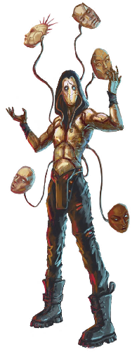

# Infomorphs

<!--sort-->

## Agent

Popular with network security specialists, penetration testers, and hackers, this infomorph is optimized for infosec roles.

<blockquote class="indent stat-list">

### Agent

- **Cost:** 2&nbsp;MP • **Avail:** 100

---

- **WT:** 8 • **DUR:** 40 • **DR:** 80
- **Insight** 4, **Moxie** 0, **Vigor** 0, **Flex** 0

---

- **Ware:** Enhanced Security, E-Veil, Mnemonics
- **Morph Traits:** Digital Speed, Exotic Morphology (Level 3)

</blockquote>

| **AGENT**                                                                                                                                                                           |
| :---------------------------------------------------------------------------------------------------------------------------------------------------------------------------------- |
| **Njál:** The virtual sensorium on these is top notch. When you’re in the mesh, you can feel the code.                                                                              |
| **Qi:** Maybe a bit too much. I had an admin try to crash me while I was rooting their box, and as some of my subroutines failed it felt like my skin was unpleasantly peeling off. |

## Digimorph

Digimorphs are bare-bones mind emulations, though customizable and widely used. By default, an ego that evacuates (or is forked from) a cyberbrain is run on a digimorph, unless another infomorph option is available.

<blockquote class="indent stat-list">

### Digimorph

- **Cost:** 0&nbsp;MP • **Avail:** 100

---

- **WT:** 5 • **DUR:** 25 • **DR:** 50
- **Insight** 0, **Moxie** 0, **Vigor** 0, **Flex** 0

---

- **Ware:** Mnemonics
- **Morph Traits:** Digital Speed, Exotic Morphology (Level 3)

</blockquote>

| **DIGIMORPH**                                                                |
| :--------------------------------------------------------------------------- |
| **Cacophonous:** Weird how this morph makes you feel ... naked. And exposed. |
| **Njál:** Yeah, the haptics on these are almost non-existent.                |

## Djinn

Djinn are high-end infomorphs with a number of perks.

<blockquote class="indent stat-list">

### Djinn

- **Cost:** 5&nbsp;MP • **Avail:** 70

---

- **WT:** 8 • **DUR:** 40 • **DR:** 80
- **Insight** 4, **Moxie** 2, **Vigor** 0, **Flex** 0

---

- **Ware:** Auto Backup, Defrag, Mnemonics, Oracles, Stress Control, Stabilizer
- **Morph Traits:** Digital Speed, Exotic Morphology (Level 3)

</blockquote>

| **DJINN**                                                                                                                                                                  |
| :------------------------------------------------------------------------------------------------------------------------------------------------------------------------- |
| **Qi:** These are the yachts of infomorphs. If you spot someone driving a djinn, odds are they have money.                                                                 |
| **Njál:** In contrast to the digimorph, the haptics on these are top notch. There’s a big market for djinn rentals among long-distance lovers who use the mesh to hook up. |
| **Cacophonous:** It’s definitely the type of morph that CEOs and VIPs will grab if they need to go virtual, just to feel elevated over all of the other mesh rabble.       |

## Echo

Echo morphs are designed for covert infiltration and social engineering.

<blockquote class="indent stat-list">

### Echo

- **Cost:** 5&nbsp;MP • **Avail:** 30

---

- **WT:** 7 • **DUR:** 35 • **DR:** 70
- **Insight** 3, **Moxie** 3, **Vigor** 0, **Flex** 0

---

- **Ware:** Circadian Regulation, Copylock, E-Veil, Fake Brainprint, Mimicry Module, Mnemonics, Skillware
- **Morph Traits:** Digital Speed, Exotic Morphology (Level 3)

</blockquote>

| **ECHO**                                                                                                          |
| :---------------------------------------------------------------------------------------------------------------- |
| **Kylleran:** Given the rise of infomorph workers and communities, the desire for infomorph spies was inevitable. |
| **Qi:** Social engineers love these, but corporate internal security teams love them more.                        |

## Ikon

Designed for online performers, media icons, and social networkers, this infomorph is coded to enhance charisma and social skills.

<blockquote class="indent stat-list">

### Ikon

- **Cost:** 1&nbsp;MP • **Avail:** 100

---

- **WT:** 6 • **DUR:** 30 • **DR:** 60
- **Insight** 1, **Moxie** 3, **Vigor** 0, **Flex** 0

---

- **Ware:** Copylock, Memory Lock, Mnemonics
- **Morph Traits:** Digital Speed, Exotic Morphology (Level 3)

</blockquote>

| **IKON**                                                                                                                                 |
| :--------------------------------------------------------------------------------------------------------------------------------------- |
| **Zahiri:** Some introverts take on infomorphs like this to improve their people skills, but it just cranked my social anxiety up to 11. |
| **Psychscaper:** There are models with tweaks to lower inhibitions and heighten serenity.                                                |
| **Rivet:** I tried a model made by GlamorOS! that claims to boost musicality. My pitch, harmony, and rhythm were all noticably improved. |

## Neo

Neo infomorphs are commonly assigned to hypercorp virtual work forces.

<blockquote class="indent stat-list">

### Neo

- **Cost:** 2&nbsp;MP • **Avail:** 100

---

- **WT:** 6 • **DUR:** 30 • **DR:** 60
- **Insight** 1, **Moxie** 1, **Vigor** 0, **Flex** 1

---

- **Ware:** Copylock, Memory Lock, Mnemonics, Skillsoft (2, any), Skillware
- **Morph Traits:** Digital Speed, Exotic Morphology (Level 3)

</blockquote>

| **NEO**                                                                                                                                                                                                                                                                                                                                                                             |
| :---------------------------------------------------------------------------------------------------------------------------------------------------------------------------------------------------------------------------------------------------------------------------------------------------------------------------------------------------------------------------------- |
| **Cryptid:** Remember how when these came out they made a big deal about how you could customize your avatar and experience, and then every virtual office in existence immediately implemented policies restricting you to the most boring look and interface imaginable?                                                                                                          |
| **Callosum:** This one is often assigned to indentures. It’s common to modify the code. Usually it’s low-level stuff — cognitive limiters and endorphine synthesizers to make you work fast and stupid — but Cognite and others experiment with “loyalty enhancement” tweaks, including tailored anxiety disorder analogues that make you nervous if you think about shirking work. |
| **Nezumi:** If this is true, it would explain why Cognite snapped up a bunch of those Nine Lives guys during that recent dust-up on Legba.                                                                                                                                                                                                                                          |
| **Scent.In.Hell:** Horse shit, this is just typical anarchist propaganda meant to smear hypercorps.                                                                                                                                                                                                                                                                                 |

## Operator

This infomorph is ideal for professions that involve drone remote operation, whether maintenance bot fleets, surveillance drones, or fighter craft and combat machines.

<blockquote class="indent stat-list">

### Operator

- **Cost:** 2&nbsp;MP • **Avail:** 100

---

- **WT:** 7 • **DUR:** 35 • **DR:** 70
- **Insight** 3, **Moxie** 0, **Vigor** 0, **Flex** 1

---

- **Ware:** Drone Rig, Mnemonics, Oracles
- **Morph Traits:** Digital Speed, Exotic Morphology (Level 3)

</blockquote>

| **OPERATOR**                                                                                                                                     |
| :----------------------------------------------------------------------------------------------------------------------------------------------- |
| **Jinx:** The drone-rig simsense on these really varies in quality, from hi-def “in-the-action” to sluggish “watching-the-action via telescope.” |

## Sage

Sages are mid-range infomorphs favored by researchers and IT workers.

<blockquote class="indent stat-list">

### Sage

- **Cost:** 1&nbsp;MP • **Avail:** 100

---

- **WT:** 6 • **DUR:** 30 • **DR:** 60
- **Insight** 2, **Moxie** 0, **Vigor** 0, **Flex** 2

---

- **Ware:** Mnemonics, Oracles
- **Morph Traits:** Digital Speed, Exotic Morphology (Level 3)

</blockquote>

| **SAGE**                                                                                                           |
| :----------------------------------------------------------------------------------------------------------------- |
| **Rivet:** The Argonauts distribute an open-source sage that comes pre-loaded with different scientific libraries. |
| **Lovelace:** That’s way better than the spyware loaded on every sage I’ve been given for remote office jobs.      |

## Spectre

Spectres are the top tier of infosec infomorphs.

<blockquote class="indent stat-list">

### Spectre

- **Cost:** 6&nbsp;MP • **Avail:** 60

---

- **WT:** 8 • **DUR:** 40 • **DR:** 80
- **Insight** 6, **Moxie** 2, **Vigor** 0, **Flex** 0

---

- **Ware:** Copylock, Defrag, Drone Rig, E-Veil, Enhanced Security, Fault Tolerance, Mnemonics
- **Morph Traits:** Digital Speed, Exotic Morphology (Level 3)

</blockquote>

| **SPECTRE**                                                                                                                                                                                                                                         |
| :-------------------------------------------------------------------------------------------------------------------------------------------------------------------------------------------------------------------------------------------------- |
| **Yemaja:** Maybe uploads don’t feel it as much as infolife, but the type of infomorph you choose to process your mind-state makes a drastic difference. The difference between a digimorph and a spectre is like that between a case and a savant. |
| **Qi:** In my experience, if you run into spectre defenders while hacking a system, you’re in for a lot of trouble.                                                                                                                                 |

<!--sort-end-->

